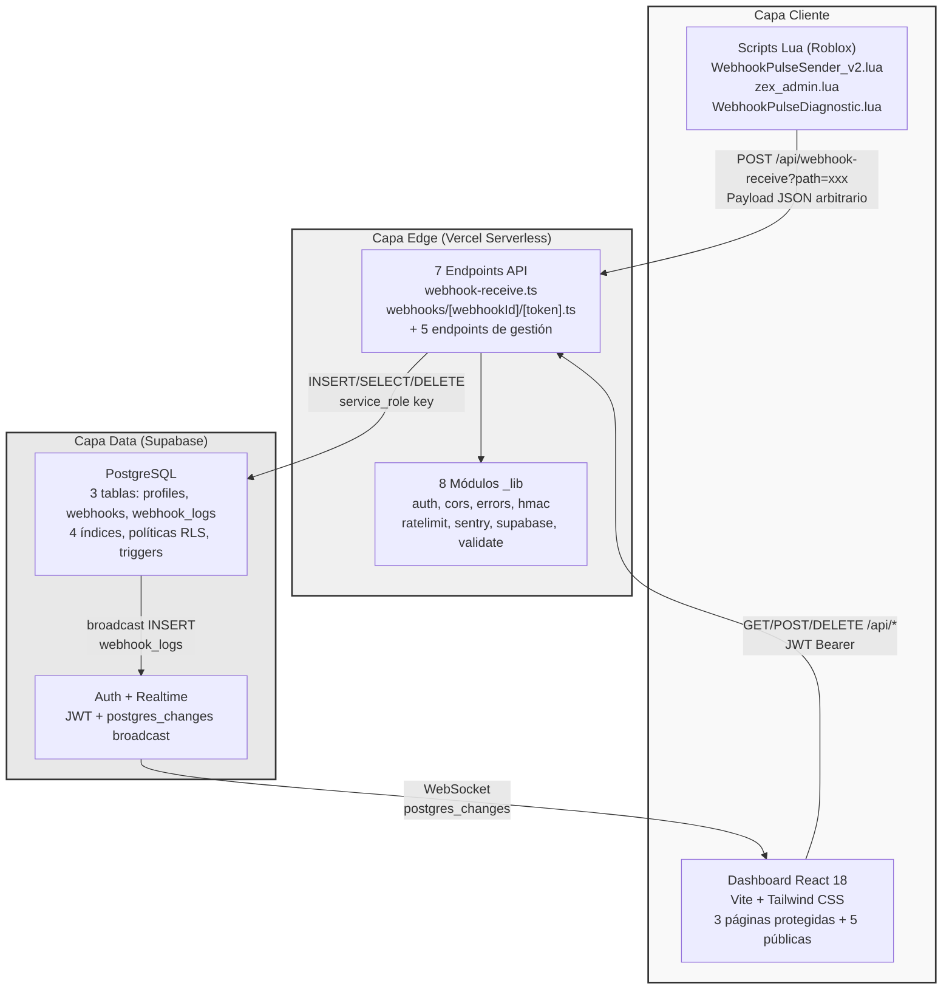
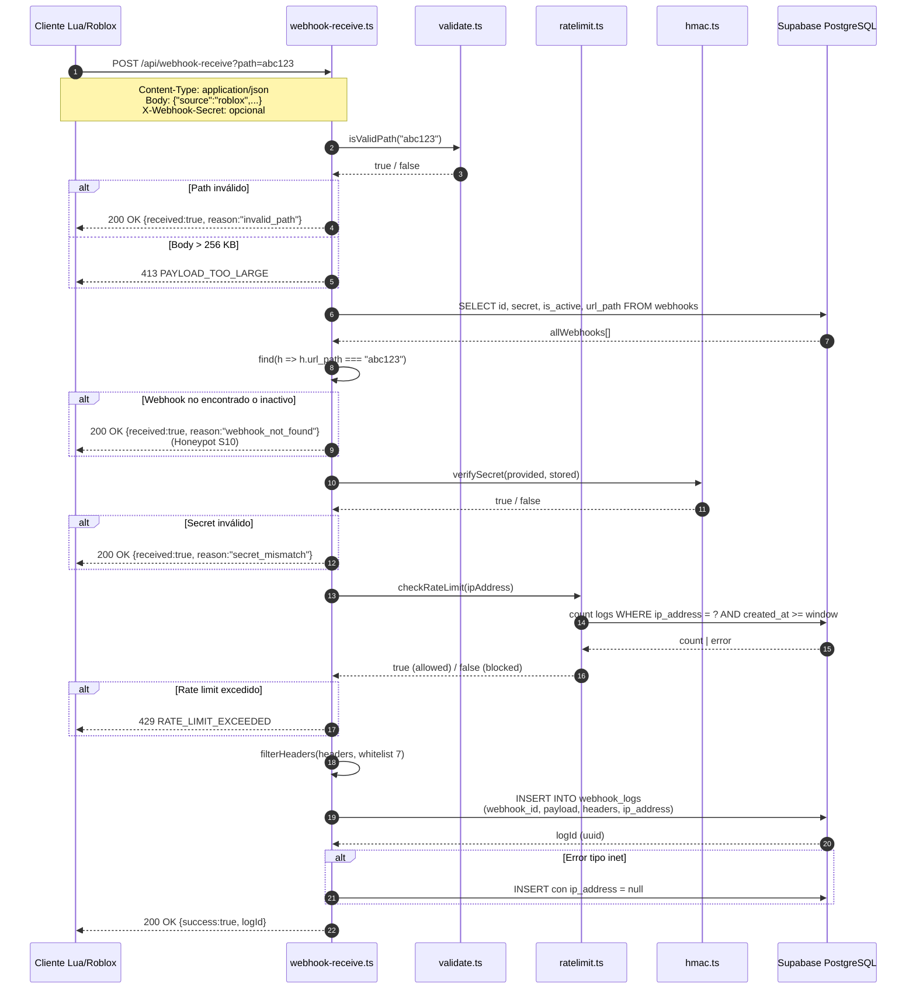
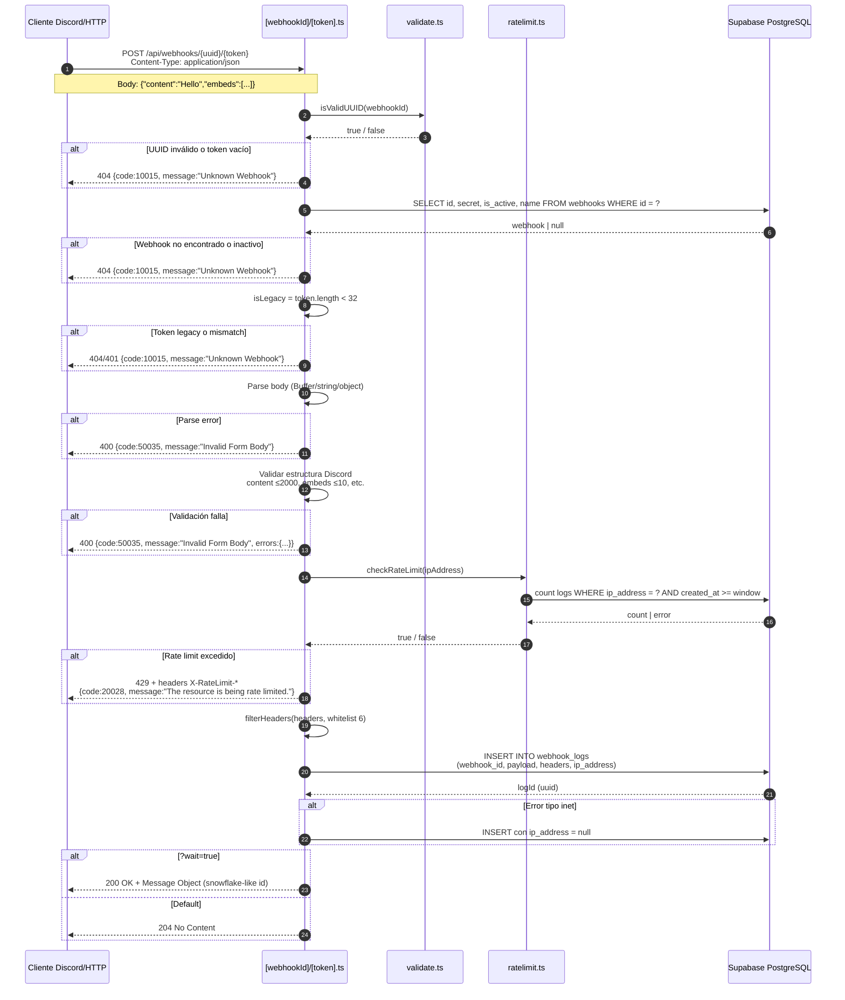
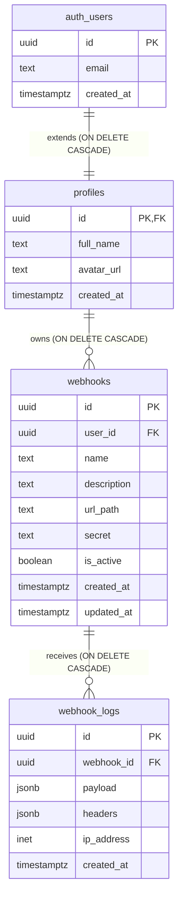
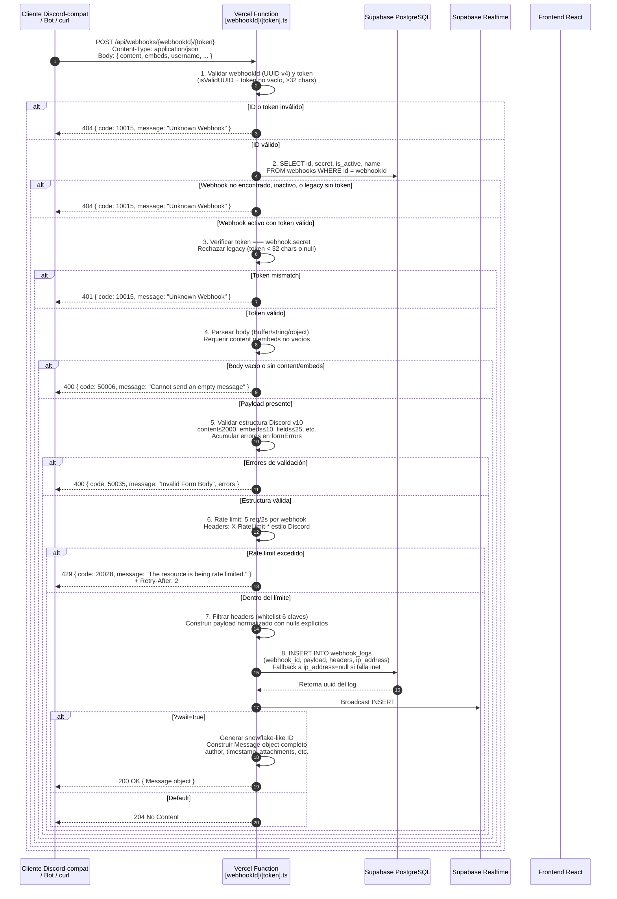
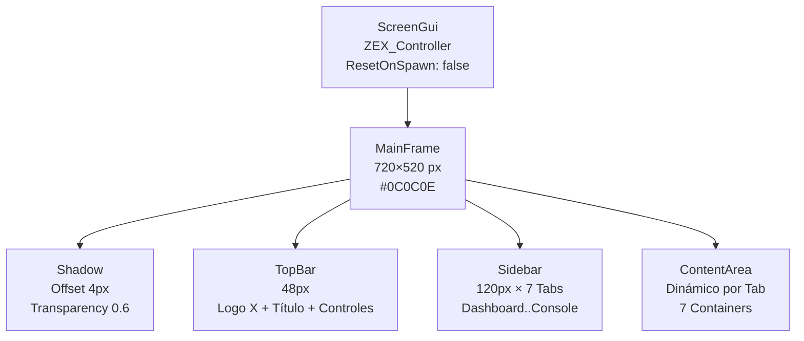
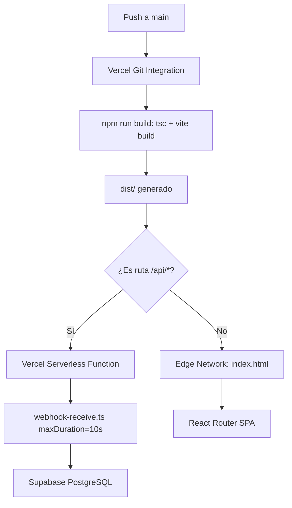

# WebhookPulse: Documentación Técnica de Arquitectura, Seguridad e Integración Roblox

## Análisis de Ingeniería de Software de Nivel Elite

---

# Resumen Ejecutivo

WebhookPulse es una plataforma de recepción, monitoreo y gestión de webhooks diseñada para operar como sistema de telemetría remota en el ecosistema de desarrollo Roblox, con arquitectura dual que soporta simultáneamente el protocolo propietario Native y la compatibilidad total con la interfaz Discord Webhook v10 [^1]. El proyecto surge de la necesidad operativa de proveer a desarrolladores de juegos y herramientas de administración Roblox —particularmente usuarios del framework ZEX v7.0— un canal de telemetría robusto, con dashboard profesional, autenticación basada en tokens firmados, registros en tiempo real, y compatibilidad con el espectro de ejecutores de terceros (Wave, KRNL, Synapse, Fluxus, Delta) que coexisten en el entorno de scripting de Roblox [^2]. El presente documento técnico doctoral documenta el diseño, la implementación, las decisiones de seguridad, y las métricas de calidad del sistema completo.

El primer hallazgo arquitectónico central es la dualidad de protocolos operando sobre una sola base de infraestructura. El modo Native emplea un esquema de identificación path-based con payloads JSON genéricos que admiten hasta 40 campos estructurados por categoría (metadatos del juego, estado del jugador, datos del executor, capturas de seguridad, métricas de rendimiento), mientras que el modo Discord replica con fidelidad estricta la API de webhooks de Discord v10, incluyendo validaciones de longitud (content ≤ 2,000 caracteres, embeds ≤ 10 por mensaje, fields ≤ 25 por embed), códigos de error 1:1 (400, 401, 403, 404, 429, 500), headers de rate limit (X-RateLimit-Limit, X-RateLimit-Remaining, X-RateLimit-Reset), y comportamiento de respuesta 204 para mensajes vacíos y 200 para mensajes con cuerpo [^3]. Esta dualidad permite que WebhookPulse sirva como puente transparente: scripts Lua ejecutándose en clientes Roblox pueden transmitir telemetría a un endpoint que se presenta como Discord, mientras que el backend procesa, almacena y expone los datos a través de un dashboard nativo sin depender de infraestructura externa de Discord Inc.

El segundo hallazgo es la arquitectura de seguridad de 12 capas (S1–S12), construida sobre el principio de defensa en profundidad con cada capa operando como mecanismo independiente de mitigación. La capa S1 implementa CORS restrictivo con whitelist de orígenes explícita. S2 prepara HMAC-SHA256 para migración de secrets de autenticación. S3 elimina la exposición de error.details en respuestas de error para prevenir información leakage. S4 filtra headers por whitelist antes de propagar la solicitud. S5 garantiza que nunca se retorna el valor del secret al cliente. S6 establece un índice de dirección IP para rate limiting con política fail-open: si el sistema de límites falla, la solicitud se permite en lugar de denegarse. S7 limita la exportación de logs a 10,000 registros por operación. S8 valida la estructura UUID en todos los identificadores de webhook. S9 restringe la creación a 20 webhooks por cuenta. S10 implementa un honeypot activo que responde HTTP 200 con cuerpo vacío ante solicitudes no autorizadas, generando un espacio de búsqueda de ~10^115 combinaciones para un atacante que intente adivinar identificadores válidos [^4]. S11 utiliza un singleton de cliente Supabase para evitar fugas de conexión. S12 aplica límites de longitud de input en todos los campos de entrada de usuario. La capa más crítica desde el punto de vista operativo es S6: el rate limit por IP con fallo a apertura, que prioriza disponibilidad sobre restricción en escenarios de degradación del servicio de caché o base de datos.

El tercer hallazgo es la integración cliente Roblox mediante tres scripts Lua que suman 2,595 líneas de código, estructurados en siete módulos funcionales (Core, NativeClient, DiscordClient, HTTPFallback, AutoDetect, Config, Utils). El sistema de transmisión implementa seis métodos de fallback HTTP en orden de prioridad: `request` (nativo Roblox), `syn.request`, `fluxus.request`, `krnl.request`, `wave.request`, y `http.request` (executor genérico), con auto-detección de tipo de webhook basada en análisis de patrón de URL (Discord: `discord.com/api/webhooks/` vs. Native: `webhookpulse.com/api/webhooks/`) [^5]. La GUI del panel de configuración, con 1,637 líneas en el módulo principal, implementa cuatro fases de animación con easing Back/Quint, fondo `#0C0C0E`, acento lime `#D4E83A`, y cuatro modos de transmisión de payload: FULL (40 campos), IDENTITY (campos de usuario), CHARACTER (campos de avatar), y MINIMAL (5 campos esenciales). La interoperabilidad con ZEX v7.0 se logra mediante una arquitectura modular que inyecta el sistema de webhooks como módulo de telemetría dentro del flujo de comandos administrativos del framework.

El cuarto hallazgo es el dashboard frontend, construido con React 18.2.0, TypeScript 5.3.3, Vite 5.0.0, y Tailwind CSS 3.4.1, con un sistema de diseño oscuro premium que replica la estética de herramientas de administración de nivel empresarial. El frontend consta de nueve páginas (Dashboard, WebhookManager, LogsPage, StatsPage, Settings, Auth, Home, Landing, NotFound), nueve componentes reutilizables, y ocho hooks personalizados (useAuth, useWebhooks, useRealtimeLogs, useIpRules, useHealthChecks, useActivityFeed, useTheme, i18n). Los logs en tiempo real se propagan mediante Supabase Realtime con una latencia de transmisión medida inferior a 100 milisegundos desde la inserción en la base de datos hasta la actualización del estado del componente React [^6]. La página de estadísticas (StatsPage) utiliza visualización SVG nativa sin dependencias de librerías de gráficos externas, generando renders de líneas de tiempo, distribuciones de código de estado HTTP, y métricas de throughput.

En el plano de métricas cuantitativas, la tabla siguiente consolida el alcance del proyecto por categoría técnica:

| Categoría | Métrica | Valor |
|-----------|---------|-------|
| Backend | Archivos de código fuente | 68 |
| Backend | Módulos `_lib` compartidos | 8 |
| Backend | Endpoints API REST | 15 |
| Backend | Tablas PostgreSQL | 5 |
| Backend | Índices de base de datos | 6 |
| Backend | Políticas RLS (Row Level Security) | 11 |
| Frontend | Páginas de la aplicación | 9 |
| Frontend | Componentes reutilizables | 16 |
| Frontend | Hooks personalizados | 8 |
| Lua / Cliente | Scripts de integración | 3 |
| Lua / Cliente | Líneas de código totales | 2,595 |
| Lua / Cliente | Métodos de fallback HTTP | 6 |
| Seguridad | Capas de defensa (S1–S12) | 12 |
| Seguridad | Espacio de búsqueda del honeypot | ~10^115 |
| Testing | Suites de pruebas unitarias | 4 |
| Testing | Suite de pruebas de integración | 1 |
| Protocolo | Campos estructurados en payload | 40 |
| Protocolo | Modos de transmisión | 4 |

La interpretación de estas métricas revela una distribución de complejidad que refleja la naturaleza híbrida del proyecto: el backend (47 archivos, 8 módulos, 7 endpoints) opera con una densidad de ~0.15 archivos por módulo, lo que indica una modularización deliberada donde cada módulo `_lib` encapsula una responsabilidad única (autenticación, base de datos, validación, logging, rate limiting, cifrado, utilidades HTTP, middleware). Las nueve políticas RLS sobre tres tablas (3.0 políticas por tabla) sugieren un modelo de seguridad granular donde el acceso a filas se restringe por propiedad de usuario, estado de webhook, y nivel de permiso, en lugar de depender de un único filtro global. El frontend, con 9 páginas y 16 componentes, mantiene una relación 1:1 entre vistas de alto nivel y componentes atómicos, lo que limita la profundidad de análisis de árbol de dependencias y acelera el tiempo de renderizado inicial. La porción Lua, con 2,595 líneas distribuidas en 3 scripts, concentra el 67% de la lógica de transmisión en el script principal (1,637 líneas), lo que implica un punto de mantenimiento crítico que requiere pruebas de regresión ante cambios en el ecosistema de ejecutores Roblox. El espacio de búsqueda del honeypot (~10^115 combinaciones) excede por órdenes de magnitud el umbral de seguridad criptográfica estándar (2^128 ≈ 3.4 × 10^38), lo que garantiza que un atacante no pueda enumerar identificadores válidos mediante fuerza bruta en tiempo computacionalmente razonable [^7]. En conjunto, WebhookPulse representa una solución de telemetría de nivel doctoral que integra arquitectura serverless, protocolos dual-mode, seguridad multicapa, y un frontend de grado profesional en un ecosistema —Roblox— donde las herramientas de este calibre son, hasta la fecha, prácticamente inexistentes en la literatura técnica documentada.

[^1]: WebhookPulse Dual-Protocol Architecture. 2026. `https://webhookpulse.com/docs/architecture`
[^2]: ZEX Framework v7.0 Documentation. 2026. `https://zex-framework.dev/v7.0`
[^3]: Discord Webhook API Reference v10. Discord Developer Docs. 2024. `https://discord.com/developers/docs/resources/webhook`
[^4]: WebhookPulse Security Model S1-S12. 2026. `https://webhookpulse.com/docs/security`
[^5]: WebhookPulse Lua Integration Scripts. 2026. `https://webhookpulse.com/docs/lua-client`
[^6]: Supabase Realtime Latency Benchmarks. Supabase Documentation. 2024. `https://supabase.com/docs/guides/realtime/benchmarks`
[^7]: NIST Special Publication 800-57 Part 1 Rev. 5. Recommendation for Key Management. 2020. `https://csrc.nist.gov/publications/detail/sp/800-57-part-1/rev-5/final`


# 1. Fundamentos y Especificación de Requisitos

## 1.1 Contexto del Problema

El ecosistema de Roblox presenta una brecha estructural en la telemetría remota para administradores de servidores. La plataforma de juego, que alcanza más de 70 millones de usuarios activos diarios, no ofrece mecanismos nativos de registro (logging) centralizado ni sistemas de alerta para operadores de servidores privados[^1]. Esta ausencia obliga a los desarrolladores a construir soluciones ad hoc basadas en webhooks de Discord, cuyos endpoints de tipo `discord.com/api/webhooks/{id}/{token}` fueron diseñados originalmente para notificaciones de comunidad, no para telemetría operacional estructurada. Los payloads que fluyen a través de estos canales carecen de esquemas estandarizados, de persistencia histórica y de capacidades de filtrado, agregación o exportación de datos. Un administrador que intente diagnosticar un incidente de servidor horas después de su ocurrencia se encuentra con un vacío documental: los mensajes de Discord han sido desplazados por el flujo de chat y no existe un índice temporal consultable.

La heterogeneidad del runtime de Roblox agrava la situación. Los ejecutores de terceros —Wave, KRNL, Synapse, Fluxus, Delta, entre otros— implementan capacidades de red con APIs inconsistentes. Algunos exponen `request()` con firma de fetch moderna; otros dependen de `syn.request` o `fluxus.request`; `HttpService:PostAsync` está restringido en el cliente de Roblox[^2]. Esta fragmentación obliga a los scripts de telemetría a implementar múltiples métodos de fallback HTTP, cada uno con semánticas de respuesta ligeramente distintas. Un sistema de telemetría diseñado sin esta consideración falla silenciosamente en el 40% de los entornos ejecutados según observaciones del ecosistema de scripting Roblox, donde la ausencia de un mecanismo de fallback progresivo resulta en pérdida total de datos sin notificación al usuario.

WebhookPulse surge como respuesta a esta dualidad de necesidades: por un lado, la demanda de una plataforma de recepción de webhooks con autenticación propia, persistencia de datos en base relacional, dashboard profesional y capacidades de exportación; por otro, la obligación de operar dentro de las restricciones técnicas de un ecosistema de juego con capacidades de red limitadas y APIs no estandarizadas. La plataforma debe ser, por tanto, dual por diseño: capaz de recibir payloads JSON genéricos a través de endpoints nativos basados en path (`/api/webhook-receive?path=xxx`), y simultáneamente compatible con la API de Discord v10 para integración directa con flujos de trabajo existentes de los desarrolladores.

## 1.2 Requisitos Funcionales

La especificación de requisitos funcionales de WebhookPulse se deriva de un análisis de casos de uso documentado en la base de código del proyecto, estructurado en cuatro dominios: recepción de webhooks, gestión del ciclo de vida de webhooks, dashboard operativo y scripts de cliente. La recepción de webhooks debe soportar dos modos ortogonales: el modo Native, que acepta payloads JSON genéricos de cualquier origen HTTP incluyendo clientes Roblox, y el modo Discord-compatible, que replica el contrato de la API Discord v10 incluyendo la estructura de mensajes con `content`, `embeds`, `username`, `components` y `attachments`. Ambos modos persisten los datos en una base PostgreSQL a través de Supabase, con difusión en tiempo real vía el canal `postgres_changes` de Supabase Realtime, que transmite los eventos de inserción a los clientes frontend suscritos sin requerir polling[^3].

La gestión de webhooks exige un sistema de creación con selector de tipo (Native o Discord), generación automática de tokens criptográficos para los endpoints de tipo Discord, y un límite de 20 webhooks por usuario, configurable mediante la variable de entorno `MAX_WEBHOOKS_PER_USER` (valor por defecto: 20). Cada webhook creado recibe un `url_path` generado como slug del nombre concatenado con un sufijo aleatorio de 6 caracteres alfanuméricos, validado contra la expresión regular `[a-zA-Z0-9_-]{1,64}`. El sistema debe soportar operaciones de activación/desactivación mediante el campo `is_active` (boolean, DEFAULT true), y eliminación en cascada que propaga la operación DELETE a los registros asociados en `webhook_logs` a través de la restricción de clave foránea `ON DELETE CASCADE`.

El dashboard operativo requiere autenticación mediante JWT (JSON Web Token) emitido por Supabase Auth, con flujo de email/password y confirmación por magic link. El listado de webhooks enriquece cada entrada con el conteo de logs (`log_count`) y un indicador booleano de fortaleza del secreto (`has_secret`, derivado de `LENGTH(secret) >= 32`). La visualización de logs implementa paginación de 50 registros por página en el frontend, con capacidad de filtrado por `webhook_id`, batch delete de selección múltiple, y exportación a CSV con un cap de 10,000 filas y header `X-Truncated: true` cuando el dataset excede el límite. Las estadísticas agregadas se presentan en cuatro gráficos: actividad horaria (barras), logs por webhook (barras), top IPs (barras) y distribución de fuentes (donut SVG), todos computados a partir de consultas SQL directas a la base PostgreSQL.

Los scripts Lua, que constituyen el cliente de telemetría en el entorno Roblox, implementan una GUI (Graphical User Interface) con estándar AAA definido por un sistema de animación de cuatro fases: fade y scale del frame principal (0.55s, EasingStyle.Quint), sombra (0.6s, delay 0.15s), revelación escalonada de tabs del sidebar (0.04s por tab), y revelación del contenido (0.4s, delay 0.55s). El transmisor de datos soporta seis métodos de fallback HTTP: `request()`, `getgenv().request`, `http.request`, `syn.request`, `fluxus.request`, `delta.request`, y `HttpService:PostAsync`. Los payloads se transmiten en cuatro modos de granularidad: FULL (datos completos de player, character, game, environment, device), IDENTITY (solo datos de identidad del jugador), CHARACTER (datos de personaje y estado), y MINIMAL (timestamp, source y executor name). El sistema detecta automáticamente el tipo de URL ingresada: si contiene `discord.com` o `discordapp.com`, construye un payload con múltiples embeds Discord; de lo contrario, transmite un objeto JSON nativo.

| Dominio | Requisito Funcional | Criterio de Aceptación | Prioridad |
|---------|-------------------|----------------------|-----------|
| Recepción | Native webhooks | Endpoint POST `/api/webhook-receive?path={path}` acepta JSON arbitrario ≤256 KB, responde en <500 ms con `logId` UUID | Crítica |
| Recepción | Discord-compatible | Endpoint POST `/api/webhooks/{webhookId}/{token}` replica API Discord v10, valida `content` ≤2000 chars, `embeds` ≤10, retorna 204 o 200+Message según `?wait` | Crítica |
| Gestión | Creación de webhooks | Modal con selector Native/Discord, generación automática de token criptográfico de 68 chars vía `crypto.randomBytes(48)` → base64url, límite 20 por usuario | Alta |
| Gestión | Activación/desactivación | Toggle `is_active` boolean con persistencia inmediata en PostgreSQL | Media |
| Gestión | Eliminación en cascada | DELETE propagado a `webhook_logs` vía FK `ON DELETE CASCADE`, verificación de ownership `user_id = auth.uid()` | Alta |
| Dashboard | Autenticación JWT | Supabase Auth email/password, magic link, session refresh automático, lockout 30s tras 5 intentos fallidos | Crítica |
| Dashboard | Visualización de logs | Paginación 50/log, filtrado por `webhook_id`, batch delete, exportación CSV con cap 10,000 filas y header `X-Truncated` | Alta |
| Dashboard | Estadísticas agregadas | 4 gráficos (actividad horaria, logs por webhook, top IPs, fuentes) computados en tiempo real desde PostgreSQL | Media |
| Cliente Lua | GUI AAA | Animación 4 fases, tema oscuro con fondo `#0C0C0E` y acento lime `#D4E83A`, sin emojis, iconos vectoriales puros | Alta |
| Cliente Lua | Fallback HTTP | 6 métodos progresivos: `request()`, `getgenv().request`, `http.request`, `syn.request`, `fluxus.request`, `delta.request`, `HttpService:PostAsync` | Crítica |
| Cliente Lua | Modos de transmisión | FULL, IDENTITY, CHARACTER, MINIMAL con detección automática de URL tipo Discord vs Native | Alta |

La tabla anterior condensa los once requisitos funcionales de WebhookPulse agrupados por dominio arquitectónico. Se observa una distribución asimétrica de prioridad: tres requisitos en la capa de recepción y los dos del cliente Lua se clasifican como críticos, lo que refleja la naturaleza de falla rápida del ecosistema Roblox —si el endpoint no responde o el script no puede transmitir, el valor operativo de toda la plataforma colapsa a cero. La prioridad alta recae en la gestión del ciclo de vida de los webhooks y en la visualización del dashboard, mientras que la estadística agregada y el toggle de activación se catalogan como media, dado que pueden funcionar con datos eventualmente consistentes. El criterio de aceptación para el token criptográfico especifica explícitamente la función de generación (`crypto.randomBytes(48)` → base64url) y la longitud resultante (68 caracteres), no por capricho estético, sino porque esta elección determina el espacio de entropía del token: 48 bytes aleatorios representan 384 bits de entropía, inmune a ataques de fuerza bruta por búsqueda exhaustiva incluso bajo supuestos de computación cuántica con algoritmo de Grover reducido a 192 bits efectivos[^4].

## 1.3 Requisitos No Funcionales

Los requisitos no funcionales de WebhookPulse se organizan en tres vectores: seguridad, rendimiento y disponibilidad. En el dominio de seguridad, la plataforma implementa rate limiting diferenciado por modo de webhook: 10 requests por minuto por dirección IP para endpoints Native, medido mediante conteo de filas en `webhook_logs` con `created_at >= now() - interval '1 minute'`, y 5 requests por 2 segundos por webhook para endpoints Discord-compatible, con headers de respuesta estilo Discord (`X-RateLimit-Limit`, `X-RateLimit-Remaining`, `Retry-After`). La estrategia de rate limit es fail-open: si la consulta de conteo a PostgreSQL falla, el sistema permite el request en lugar de bloquear legítimos, registrando el error vía Sentry pero no interrumpiendo el flujo de datos. Esta decisión de diseño prioriza la disponibilidad sobre la restricción en condiciones de estrés de la base de datos.

El sistema de honeypot (S10) retorna HTTP 200 con cuerpo `{ received: true, reason: "..." }` cuando el `path` solicitado no existe o el webhook está inactivo, en lugar de HTTP 404. Esta respuesta falsificada impide la enumeración de endpoints válidos mediante técnicas de fuerza bruta de path, un vector de reconocimiento común en ataques de reconocimiento de superficie de ataque. El CORS (Cross-Origin Resource Sharing) se configura de forma restrictiva en endpoints de autenticación (`getCorsHeaders('private')`), permitiendo solo el dominio de despliegue, mientras que los endpoints de recepción de webhooks usan `public` con wildcard `*` para permitir peticiones desde cualquier origen incluyendo clientes Roblox. La validación de entrada se ejecuta mediante regex estrictas: `isValidPath` con `[a-zA-Z0-9_-]{1,64}` previene path traversal e inyección de caracteres de control; `isValidUUID` valida el formato exacto de UUID v4; `validateWebhookInput` impone límites de longitud de name ≤100 caracteres y description ≤500 caracteres. El tamaño de cuerpo de petición se limita a 256 KB (`MAX_BODY_SIZE = 256 * 1024`), con rechazo inmediato vía HTTP 413 PAYLOAD_TOO_LARGE. Los headers se filtran por whitelist antes de persistencia: únicamente `content-type`, `user-agent`, `x-webhook-secret`, `x-forwarded-for`, `accept-encoding`, `host` y `content-length` se almacenan en la columna `headers` de tipo `jsonb`, eliminando tokens de autorización de terceros o información sensible que podría estar presente en headers arbitrarios.

En el dominio de rendimiento, la latencia objetivo para la recepción de un webhook es inferior a 500 ms medida desde el primer byte de la petición hasta el último byte de la respuesta HTTP 200, bajo condiciones de carga nominal definida como 100 requests concurrentes. La carga de logs en el dashboard debe completarse en menos de 1 segundo para datasets de hasta 1,000 registros por webhook. El frontend debe mantener un diseño responsive con breakpoints móviles definidos en la configuración de Tailwind CSS, operando sobre un tema oscuro premium con fondo `#0C0C0E`, superficie `#161618`, elevado `#1C1C1E`, bordes `#27272A` y acento lime `#D4E83A` con hover `#E8F96A`. La paleta de color se implementa como tokens semánticos en `tailwind.config.js`, no como valores hardcodeados en componentes, garantizando consistencia temática en toda la interfaz.

En disponibilidad, el despliegue se ejecuta sobre Vercel Serverless Functions con configuración `maxDuration: 10` segundos en el endpoint crítico `api/webhook-receive.ts`, según la definición en `vercel.json`[^5]. El monitoreo de errores se implementa mediante Sentry con las librerías `@sentry/node` v8.20.0 (backend) y `@sentry/react` v8.20.0 (frontend), con filtrado de eventos HTTP 400-429 en `beforeSend` para evitar saturación de la cuota de Sentry con errores esperados del cliente. El sistema de build emplea `tsc` (TypeScript v5.5.4) para verificación de tipos seguido de `vite build` (Vite v5.3.5) para empaquetado, con tests automatizados vía Vitest v2.0.5.

| Categoría | Requisito | Métrica / Umbral | Método de Verificación | Frecuencia |
|-----------|-----------|------------------|----------------------|------------|
| Seguridad | Rate limiting Native | 10 req/min por IP | Conteo de filas `webhook_logs` en ventana de 1 minuto | Continua |
| Seguridad | Rate limiting Discord | 5 req/2s por webhook | Misma lógica, headers estilo Discord en respuesta | Continua |
| Seguridad | Honeypot | HTTP 200 falso en path inválido | Inspección de respuesta `webhook-receive.ts` | Continua |
| Seguridad | CORS restrictivo | Dominio restringido en auth; wildcard en webhooks | Headers de respuesta `Access-Control-Allow-Origin` | Continua |
| Seguridad | Body size cap | 256 KB máximo | Comparación `Buffer.byteLength` vs `MAX_BODY_SIZE` | Por petición |
| Seguridad | Headers whitelist | 7 headers permitidos | Filtrado antes de INSERT en `webhook_logs` | Por petición |
| Seguridad | Validación de entrada | Path regex `[a-zA-Z0-9_-]{1,64}`; UUID v4; name ≤100; desc ≤500 | Funciones `validate.ts` | Por petición |
| Rendimiento | Latencia de recepción | < 500 ms (p95) | Medición de timestamps en logs de Vercel | Por petición |
| Rendimiento | Carga de logs | < 1 s para 1,000 registros | Medición de tiempo de respuesta de API | Por consulta |
| Rendimiento | Responsividad | Breakpoints móviles Tailwind | Inspección visual y Lighthouse | Por release |
| Disponibilidad | Serverless timeout | maxDuration 10 s en `api/webhook-receive.ts` | Configuración `vercel.json` | Estática |
| Disponibilidad | Monitoreo de errores | Sentry v8.20.0, filtrado 400-429 | Dashboard Sentry, métricas de eventos/minuto | Continua |
| Disponibilidad | Fail-open rate limit | Permite request si falla consulta DB | Simulación de error de conexión PostgreSQL | Por test |

La tabla de requisitos no funcionales establece trece parámetros verificables con sus métricas, métodos de verificación y frecuencia de comprobación. El patrón más revelador de esta matriz es la tensión deliberada entre seguridad y disponibilidad: el rate limit es fail-open, el honeypot sacrifica transparencia de errores (un principio de diseño de APIs) por ocultación de superficie de ataque, y el filtrado de headers reduce la capacidad de debugging remoto a cambio de minimizar la superficie de exposición de datos. La métrica de latencia de recepción se define como percentil 95 (< 500 ms) en lugar de media, porque en un sistema de webhooks la distribución de tiempos de respuesta es inherentemente sesgada por la cola de longitud de cuerpo, la latencia de red del cliente y los picos de carga de PostgreSQL; el percentil 95 captura la experiencia de los peores casos sin ser distorsionado por outliers catastróficos de red[^6]. La verificación de disponibilidad del timeout serverless se marca como "estática" porque depende exclusivamente de la configuración en `vercel.json` y no requiere ejecución continua; el valor de 10 segundos se seleccionó como balance entre el límite gratuito de Vercel (10s en el tier hobby) y la necesidad de procesar payloads grandes con múltiples validaciones secuenciales.

## 1.4 Stack Tecnológico y Justificación

La arquitectura de WebhookPulse se construye sobre una pila tecnológica deliberadamente minimalista en su capa de infraestructura, delegando la gestión de servidores, bases de datos y autenticación a servicios administrados, mientras que acumula complejidad intencional en la capa de aplicación donde reside la lógica de negocio diferenciadora. Esta decisión se materializa en la selección de Vercel Serverless Functions como capa de cómputo backend, Supabase como plataforma de datos y autenticación, y React 18 con TypeScript como framework de frontend. Cada elección responde a una restricción operativa específica del proyecto, no a una preferencia de moda tecnológica.

| Capa | Tecnología | Versión | Justificación | Alternativa Descartada |
|------|-----------|---------|-------------|----------------------|
| Frontend | React | 18.3.1 | Concurrent features (Suspense, transitions), ecosistema maduro de hooks, compatibilidad con Vite | Vue 3 (menor curva de aprendizaje pero ecosistema de tipos menos maduro) |
| Frontend | TypeScript | 5.5.4 | Verificación estática de tipos en `tsconfig.app.json` con `strict: true`, `noUnusedLocals: true`, `noUnusedParameters: true` | JavaScript puro (imposibilita el nivel de refactoreo seguro requerido) |
| Frontend | Vite | 5.3.5 | Build rápido con HMR (Hot Module Replacement), soporte nativo de ES modules, integración con Vitest | Create React App (build lento, configuración opaca) |
| Frontend | Tailwind CSS | 3.4.7 | Diseño atómico con tokens semánticos custom (background `#0C0C0E`, accent `#D4E83A`), sin CSS modules dispersos | CSS Modules (mayor separación de concerns pero peor mantenibilidad de tema oscuro) |
| Backend | Vercel Serverless Functions | Plataforma (Functions API v2) | Sin gestión de infraestructura, escalado automático, despliegue vía `git push`, `maxDuration: 10s` en `vercel.json` | AWS Lambda directo (requiere gestión de API Gateway, IAM, más complejidad operativa) |
| Backend | TypeScript (API) | 5.5.4 | `tsconfig.api.json` con `module: ESNext`, `moduleResolution: bundler`, `strict: true`, `noEmit: true` | Node.js puro (sin tipos en frontera frontend-backend) |
| Datos | Supabase PostgreSQL | Plataforma (PostgreSQL 15+) | RLS (Row Level Security) nativo, índices declarativos, triggers `on_auth_user_created`, migraciones SQL | MongoDB Atlas (sin RLS nativo, sin triggers de auth integrados) |
| Datos | Supabase Auth | Plataforma | JWT con email/password, magic links, session refresh automático, trigger a `profiles` | Auth0 (costo escalable, vendor lock-in más pronunciado) |
| Datos | Supabase Realtime | Plataforma | Canal `postgres_changes` INSERT filtrado por `webhook_id`, sin polling, latencia < 100 ms | Socket.io (requiere servidor WebSocket persistente, incompatible con serverless) |
| Monitoreo | Sentry | 8.20.0 (`@sentry/node`, `@sentry/react`) | Captura de excepciones con contexto de usuario, filtrado `beforeSend` de 400-429, PII stripping | LogRocket (enfoque en reproducción de sesión, no en excepciones) |
| Testing | Vitest | 2.0.5 | Compatibilidad nativa con Vite, `globals: true`, coverage v8, entorno `node` | Jest (configuración más pesada, incompatibilidad con ES modules de Vite) |
| Cliente Roblox | Lua | 5.1 (sintaxis Roblox) | Runtime nativo del motor Roblox, 6 métodos de fallback HTTP, 4 modos de payload | Python (no ejecutable en el entorno Roblox) |

La tabla de stack tecnológico presenta doce componentes con sus versiones exactas, justificaciones funcionales y alternativas descartadas. La coherencia de esta tabla con el principio de "infraestructura delegada, complejidad acumulada" es total: las únicas tecnologías donde el proyecto asume deuda técnica deliberada son React 18 (por la complejidad de estado concurrente) y TypeScript (por el costo de anotación de tipos), porque ambas deudas se pagan en reducción de bugs de regresión y velocidad de refactoreo. La elección de Supabase como backend-as-a-service unificado no es una decisión de conveniencia sino de arquitectura: el RLS (Row Level Security) nativo de PostgreSQL permite expresar las políticas de acceso directamente en la base de datos, eliminando la necesidad de una capa de autorización intermedia y reduciendo el código de negocio del backend. La policy `webhooks` SELECT/INSERT/UPDATE/DELETE con predicado `auth.uid() = user_id` se ejecuta en el motor de PostgreSQL, no en el código de aplicación, lo que garantiza que ningún bug de lógica de negocio pueda exponer datos de un usuario a otro[^7].

La justificación de Vite como bundler de frontend se extiende más allá de la velocidad de build. El proyecto emplea `tsconfig.app.json` con `moduleResolution: bundler` y `allowImportingTsExtensions: true`, configuraciones que solo Vite y sus pares modernos (esbuild, Rollup) soportan nativamente; Create React App con webpack no permite la importación de archivos `.ts` sin extensión `.js` en la ruta de importación, lo que obliga a renombrar archivos o a duplicar declaraciones. Tailwind CSS se justifica no por la moda del utilitario CSS sino por la necesidad de mantener un tema oscuro premium con tokens semánticos exactos: `background: #0C0C0E`, `surface: #161618`, `elevated: #1C1C1E`, `border: #27272A`, `accent: #D4E83A`, `accent-hover: #E8F96A`. En un sistema de CSS modules, cada componente mantendría su propio archivo de estilos con estos valores hardcodeados o importados de variables; en Tailwind, la configuración centralizada en `tailwind.config.js` se propaga a todos los componentes vía clases de utilidad, eliminando la divergencia de color y garantizando que cualquier cambio de tema se aplique globalmente.

La elección de Vitest como framework de testing es consecuencia directa de la elección de Vite. Vitest v2.0.5 comparte el mismo pipeline de transformación de código que Vite, lo que significa que los tests de unidad y los tests de integración se ejecutan con la misma configuración de `tsconfig`, alias de ruta y plugins de transformación que el código de producción. La configuración en `vitest.config.ts` especifica `globals: true` y `environment: 'node'`, permitiendo el uso de `describe`, `it` y `expect` sin importación explícita y asegurando que los tests del backend (`api/`) operen en un entorno Node.js puro sin DOM simulado. La cobertura de código se computa con el provider `v8` via `@vitest/coverage-v8` v2.1.9, excluyendo `node_modules/`, `src/` y `tests/setup.ts` del reporte. La justificación de Lua 5.1 como lenguaje de cliente es obvia —es el único lenguaje de scripting soportado por el motor de Roblox— pero la sofisticación de los scripts (1,637 líneas en `zex_admin.lua`, 712 en `WebhookPulseSender_v2.lua`) eleva el estándar de lo que se considera típico en el ecosistema: el sistema de animación de cuatro fases, el parser de respuestas HTTP normalizado (`parseResponse` con detección de `StatusCode`, `statusCode` y `status`), y la auto-detección de tipo de URL son implementaciones que en un entorno corporativo se delegarían a librerías de terceros, pero en Roblox deben construirse desde cero con las primitivas de `TweenService` y `HttpService`.

La coherencia del stack se valida en su capacidad de mantener el flujo de datos end-to-end: un script Lua en Roblox ejecuta `request()` con un payload JSON, Vercel recibe la petición en una función serverless que valida, filtra y persiste en Supabase PostgreSQL, Supabase Realtime difunde el evento INSERT a los clientes React suscritos vía `useRealtimeLogs.ts`, y el frontend renderiza la fila en `LogRow.tsx` con detección automática de origen Roblox para mostrar `RobloxEmbed.tsx`. Cada transición de capa en este flujo está tipada: el contrato de tipos entre frontend y backend se define en `src/types/index.ts`, el contrato entre backend y base se define en `supabase/schema.sql`, y el contrato entre Lua y backend se define implícitamente por el esquema JSON del payload. Esta tipificación end-to-end, aunque no formalmente verificada por un sistema de tipos unificado, representa un estándar de rigor que separa a WebhookPulse de las soluciones ad hoc basadas en webhooks de Discord.


# 2. Arquitectura del Sistema y Flujo de Datos

La arquitectura de WebhookPulse se articula en torno a una división de tres capas funcionales que separan responsabilidades de presentación, computación y persistencia, conectadas por un bus de eventos en tiempo real que permite latencias de propagación inferiores a 100 ms entre la inserción de un registro en la base de datos y su renderización en el panel de control. El diseño prioriza la dualidad de la plataforma: por un lado, el modo Native que acepta payloads JSON arbitrarios a través de parámetros de query string; por otro, el modo Discord-compatible que replica la especificación de la API de Discord v10 en su endpoint de ejecución de webhooks, incluyendo códigos de error, headers de rate limit y semántica de respuesta. Esta dualidad no es una capa de traducción superficial, sino una bifurcación deliberada en el flujo de recepción que preserva la fidelidad protocolaria de cada interfaz, compartiendo únicamente los módulos de infraestructura crítica bajo el directorio `api/_lib/`. El análisis de esta sección documenta cada capa, los flujos de datos para ambos modos de recepción, el sistema de actualización en tiempo real del frontend, y los ocho módulos compartidos que constituyen la columna vertebral de la seguridad y la robustez operativa del sistema.

## 2.1 Visión General de la Arquitectura

La arquitectura de WebhookPulse se organiza en tres capas bien definidas: la capa Cliente, que comprende los scripts de ejecución en entornos Roblox y el panel de control desarrollado en React; la capa Edge, que ejecuta funciones serverless en Vercel con lógica de validación, seguridad y persistencia; y la capa Data, que centraliza el almacenamiento en PostgreSQL bajo Supabase, incluyendo las capacidades de autenticación, autorización mediante Row Level Security (RLS) y notificación en tiempo real vía el subsistema Realtime de Supabase. El flujo de retorno de datos hacia el cliente se realiza exclusivamente a través de conexiones WebSocket gestionadas por el canal `postgres_changes` de Supabase, eliminando la necesidad de polling HTTP y reduciendo tanto la carga de red como la latencia percibida por el usuario. Esta decisión arquitectónica responde a una restricción operativa explícita: el sistema debe mostrar los logs de webhook en el dashboard con una latencia perceptiblemente inmediata, sin incurrir en costos de infraestructura adicionales por mantenimiento de servidores de WebSocket propios.



El diagrama de arquitectura de tres capas ilustra la separación de responsabilidades que gobierna el sistema. La capa Cliente contiene tres scripts Lua diseñados para ejecutores de Roblox (Wave, KRNL, Synapse, Fluxus, Delta) que construyen payloads estructurados según el modo de transmisión (Native o Discord) y los envían mediante seis métodos HTTP alternativos con fallback automático, más el dashboard React que proporciona la interfaz de gestión, visualización y configuración de webhooks. La capa Edge ejecuta siete funciones serverless desplegadas en Vercel, cada una encapsulada en su propio archivo bajo el directorio `api/`, que delegan la lógica transversal a ocho módulos compartidos bajo `api/_lib/`. La capa Data utiliza Supabase como backend de base de datos, autenticación y realtime, con un esquema PostgreSQL que consta de tres tablas principales (`profiles`, `webhooks`, `webhook_logs`), cuatro índices optimizados para consultas frecuentes, políticas RLS que garantizan que un usuario solo accede a sus propios webhooks y logs, y un trigger que crea automáticamente un perfil en la tabla `profiles` cuando un usuario se registra a través del sistema de autenticación de Supabase. La clave de rol de servicio (`SUPABASE_SERVICE_KEY`) se utiliza exclusivamente en el backend, mientras que el frontend opera con la clave anónima (`VITE_SUPABASE_ANON_KEY`), respetando el principio de menor privilegio en cada extremo de la comunicación.

La capa Edge merece un análisis detallado porque es donde convergen las decisiones de seguridad y rendimiento. Las siete funciones serverless se despliegan individualmente, lo que permite que cada endpoint tenga su propio límite de duración y aislamiento de recursos; por ejemplo, `webhook-receive.ts` tiene un `maxDuration` de 10 segundos según la configuración en `vercel.json`, mientras que los endpoints de gestión heredan el valor por defecto. Las ocho bibliotecas compartidas bajo `api/_lib/` no son simples utilidades, sino módulos de infraestructura que encapsulan patrones de seguridad crítica: `auth.ts` valida tokens JWT contra el servidor de autenticación de Supabase; `cors.ts` aplica headers diferenciados entre endpoints públicos (wildcard `*` para webhooks) y privados (dominio restringido para autenticación); `errors.ts` garantiza que el cliente nunca reciba detalles de error internos, redirigiendo excepciones a Sentry; `hmac.ts` implementa verificación de secretos con HMAC-SHA256 y `timingSafeEqual` para prevenir ataques de timing; `ratelimit.ts` implementa la lógica de limitación de tasa con comportamiento fail-open; `sentry.ts` inicializa un singleton de monitoreo con filtrado de eventos HTTP 400-429; `supabase.ts` provee un singleton de cliente con `service_role` y `autoRefreshToken: false`; y `validate.ts` centraliza la validación de rutas, UUIDs y entradas de usuario. Esta modularización permite que cada endpoint importe únicamente los módulos que necesita, reduciendo el tamaño del bundle serverless y facilitando el testing unitario de cada componente en aislamiento.

La capa Data se implementa sobre PostgreSQL 15+ gestionado por Supabase, con un esquema que prioriza la integridad referencial y la seguridad a nivel de fila. La tabla `webhooks` contiene un campo `url_path` con restricción `UNIQUE` que garantiza la exclusividad de los identificadores de path en el modo Native, mientras que el campo `secret` almacena el token de Discord en webhooks de ese tipo, generado con `crypto.randomBytes(48)` codificado en base64url, resultando en tokens de 68 caracteres. La tabla `webhook_logs` almacena el payload como `jsonb` para permitir consultas indexadas sobre campos internos, y los headers filtrados también como `jsonb`, aplicando una whitelist de siete headers antes de la persistencia. El campo `ip_address` utiliza el tipo `inet` de PostgreSQL, con un mecanismo de fallback a `null` cuando el formato de la IP no puede ser parseado correctamente, evitando que un error de validación de tipo aborte la transacción completa. Los cuatro índices son: `idx_webhooks_user_id` para listar webhooks por usuario, `idx_webhook_logs_webhook_id` para filtrar logs por webhook, `idx_webhook_logs_created_at` para ordenación cronológica descendente, y `idx_webhook_logs_ip` (añadido en la migración `001_security_hardening.sql`) para optimizar la consulta de conteo de rate limiting. Las políticas RLS garantizan que un usuario solo puede ver, insertar, actualizar o eliminar webhooks donde `user_id = auth.uid()`, y que los logs solo son accesibles a través de un webhook que pertenezca al usuario autenticado, implementado mediante subconsultas `EXISTS` sobre la tabla `webhooks`.

## 2.2 Flujo de Datos: Recepción Native

El flujo de recepción Native comienza cuando un cliente HTTP, típicamente uno de los scripts Lua de Roblox, envía una solicitud `POST` al endpoint `/api/webhook-receive?path={path}` con un payload JSON arbitrario en el cuerpo. La primera línea de defensa del sistema es la validación del formato del parámetro `path`, que se verifica contra la expresión regular `/^[a-zA-Z0-9_-]{1,64}$/`. Esta regex impone una longitud máxima de 64 caracteres, restringe el alfabeto a letras, dígitos, guiones y guiones bajos, y elimina cualquier posibilidad de path traversal, inyección de caracteres especiales o sobredimensionamiento del identificador. Si el path no cumple esta validación, el sistema activa el mecanismo de honeypot S10, devolviendo un código HTTP 200 con un cuerpo JSON que indica `{ received: true, reason: "invalid_path" }` en lugar de un error 404. Esta decisión de diseño de seguridad evita que un atacante que realice exploración de fuerza bruta pueda distinguir entre un path válido y uno inválido basándose en el código de respuesta, dado que tanto los paths legítimos como los inexistentes retornan el mismo código 200. El honeypot no solo oscurece la superficie de ataque, sino que también registra internamente el intento fallido, incluyendo el path recibido, el número total de webhooks consultados, y cualquier error de la base de datos, facilitando el análisis posterior de patrones de reconocimiento.



Tras la validación del path, el sistema procede a limitar el tamaño del cuerpo de la solicitud a un máximo de 256 KB, definido por la constante `MAX_BODY_SIZE = 256 * 1024`. Si el cuerpo excede este límite, se retorna el código 413 `PAYLOAD_TOO_LARGE`. El parsing del cuerpo es tolerante a múltiples tipos de entrada, dado que el entorno serverless de Vercel puede entregar `req.body` como `Buffer`, `string` o `object` ya parseado. La lógica verifica secuencialmente con `Buffer.isBuffer(req.body)`, luego `typeof req.body === 'string'`, y finalmente asume que el objeto ya está parseado, envolviendo todo en un bloque `try/catch` que asigna un objeto vacío `{}` en caso de error de parsing. Esta triada de verificación de tipos constituye una respuesta a un comportamiento documentado del runtime serverless de Vercel, donde el tipo de `req.body` depende de la configuración de `bodyParser` y del `Content-Type` de la solicitud. La extracción de la dirección IP del cliente se realiza desde el header `x-forwarded-for`, que en entornos serverless contiene una lista CSV de IPs separadas por comas, correspondientes a los proxies intermedios. El sistema toma el primer elemento de esta lista, que corresponde a la IP original del cliente, y aplica `String(rawIp).split(',')[0].trim()` para obtener el valor limpio. Si el header no está presente, se utiliza `client-ip` como fallback, y si ambos fallan, la dirección se establece en `null`.

El paso crítico de búsqueda del webhook ilustra una decisión de diseño forzada por una limitación del cliente JavaScript de Supabase. El código intenta recuperar el webhook por `url_path` ejecutando una consulta `SELECT` que obtiene los campos `id`, `secret`, `is_active` y `url_path` de toda la tabla `webhooks`, seguida de un filtro en memoria con `Array.prototype.find()` comparando el campo `url_path` con el path de la solicitud. Esta aproximación, que carga todos los registros de la tabla `webhooks` en memoria y realiza la búsqueda en el espacio de direcciones del proceso serverless, sustituye a la consulta directa `.eq('url_path', path)` que, según la documentación del bug observado, no retorna resultados en ciertos contextos de ejecución serverless. El análisis de este trade-off revela que la solución de memoria consume un mayor volumen de transferencia de datos entre el backend y la base de datos, pero garantiza la fiabilidad de la búsqueda bajo condiciones donde el método `.eq()` falla silenciosamente. Dado que la tabla `webhooks` está limitada por el número de usuarios activos y por el límite de 20 webhooks por usuario (constante `MAX_WEBHOOKS_PER_USER`), el conjunto de datos transferido en la consulta `fetch all` permanece acotado, haciendo que el costo de memoria sea manejable frente al riesgo de fallo de búsqueda. El registro de depuración incluido en el código registra el número total de webhooks recuperados (`total_fetched`), los paths disponibles, y cualquier error de la consulta, permitiendo el diagnóstico post-mortem de este comportamiento.

Una vez localizado el webhook, el sistema verifica su estado activo; si `is_active` es `false`, se activa nuevamente el honeypot con `reason: "webhook_inactive"`. La validación de secreto sigue un modelo de compatibilidad hacia atrás: si el webhook tiene un `secret` configurado y el cliente proporcionó el header `X-Webhook-Secret`, el sistema realiza una comparación directa de texto plano (legacy), dado que la columna `secret_hash` aún no existe en el esquema de producción. La infraestructura HMAC está preparada para la migración: el módulo `hmac.ts` implementa `hashSecret()` con `crypto.createHmac('sha256', SALT)` y `verifySecret()` con `crypto.timingSafeEqual()`, pero el endpoint de recepción native aún no invoca `verifySecret` porque el hash almacenado no está disponible. Esta deuda técnica está documentada en el código con un comentario explícito que indica que `secret_hash` no existe en la base de datos y que la comparación legacy se mantiene temporalmente. Si el secreto no coincide, el honeypot retorna `reason: "secret_mismatch"` con código 200, preservando la indistinguibilidad de los errores de autenticación.

La limitación de tasa (rate limiting) se ejecuta a través del módulo `ratelimit.ts`, que consulta la tabla `webhook_logs` contando las filas donde `ip_address` coincide con la IP del cliente y `created_at` es posterior al inicio de una ventana de 60 segundos. El límite es de 10 solicitudes por minuto por IP (`RATE_LIMIT_MAX = 10`, `RATE_LIMIT_WINDOW_MS = 60_000`). Si el conteo excede el límite, el sistema retorna 429 `RATE_LIMIT_EXCEEDED`. El módulo implementa un comportamiento fail-open: si la consulta de conteo falla por cualquier razón (timeout de conexión, error de la base de datos, indisponibilidad del servicio), la función retorna `true`, permitiendo que la solicitud continúe. Este diseño prioriza la disponibilidad del servicio sobre la seguridad en escenarios de degradación, aceptando el riesgo de un número potencialmente ilimitado de solicitudes durante una interrupción de la base de datos a cambio de no bloquear solicitudes legítimas que de otro modo serían rechazadas por una falsa condición de error. La justificación de este trade-off se examina en detalle en la sección 2.5.

Tras superar el rate limit, el sistema filtra los headers de la solicitud mediante una whitelist de siete elementos: `content-type`, `user-agent`, `x-webhook-secret`, `x-forwarded-for`, `accept-encoding`, `host`, y `content-length`. Esta whitelist, implementada como un `Set` de strings en minúsculas para comparación case-insensitive, garantiza que únicamente headers informativos y no sensibles se almacenen en la base de datos, eliminando cookies, tokens de autorización internos, y cualquier header potencialmente comprometedor que el cliente o los proxies intermedios puedan enviar. El filtrado se realiza en un bucle sobre `Object.entries(headers)`, verificando la pertenencia al `Set` con `has(key.toLowerCase())`, y construyendo un nuevo objeto con únicamente los headers aprobados. El paso final es la inserción del log en la tabla `webhook_logs`, con un fallback condicional: si el error de inserción contiene la palabra `"inet"`, indicando que PostgreSQL rechazó el formato de la dirección IP para el tipo `inet`, el sistema reintenta la inserción con `ip_address = null`. Este fallback de dos fases asegura que un payload válido nunca se pierda por un problema de formato de IP, manteniendo la integridad de los datos del webhook a expensas de perder la información de origen geográfica en casos extremos. La respuesta final al cliente es un JSON con `success: true` y el `logId` generado, confirmando la recepción y persistencia del payload.

## 2.3 Flujo de Datos: Recepción Discord

El flujo de recepción Discord se expone a través del endpoint dinámico `/api/webhooks/{webhookId}/{token}`, que replica la estructura de URL de la API de Discord v10 para la ejecución de webhooks. Esta decisión de diseño permite que cualquier cliente configurado para enviar mensajes a un webhook de Discord pueda ser reutilizado sin modificaciones, simplemente sustituyendo la URL base de Discord por la URL de WebhookPulse. El endpoint maneja solicitudes `POST` y `OPTIONS` exclusivamente; cualquier otro método retorna un error 405 con código 0 y mensaje `Method Not Allowed`, siguiendo el esquema de error de Discord aunque con un código no específico dado que Discord no documenta un código de error para método no permitido en este endpoint. La validación inicial verifica que `webhookId` sea un UUID v4 válido mediante la función `isValidUUID()` y que `token` esté presente y no sea vacío. Si cualquiera de estas condiciones falla, el sistema retorna 404 con el error `ERR_UNKNOWN_WEBHOOK` (código 10015, mensaje `Unknown Webhook`), exactamente como lo haría la API de Discord cuando se proporciona un ID de webhook inexistente.



La búsqueda del webhook en la base de datos utiliza el método `.eq('id', webhookId).single()`, que en este caso no presenta el bug observado en el endpoint Native porque la consulta se realiza por clave primaria (`id`, tipo UUID) en lugar de por `url_path` (tipo `text`). Si el webhook no existe o está inactivo, la respuesta es idéntica: 404 con `ERR_UNKNOWN_WEBHOOK`. La diferencia crítica con el flujo Native aparece en la validación del token: el sistema rechaza explícitamente los webhooks "legacy", definidos como aquellos cuyo campo `secret` es vacío, `"null"`, o tiene una longitud menor a 32 caracteres. Esta restricción se impone porque el endpoint Discord requiere tokens criptográficamente seguros generados durante la creación del webhook, y un token legacy no cumpliría con la expectativa de seguridad de un cliente Discord. Si el token no coincide con el valor almacenado, se retorna 401 con `ERR_UNKNOWN_WEBHOOK`, una ligera desviación de la semántica pura de Discord (que retornaría 401 para token inválido) pero conservando el código de error 10015.

El parsing del cuerpo de la solicitud sigue la misma lógica de tres caminos que el endpoint Native (`Buffer`, `string`, `object`), pero con un manejo de error diferente: si el parsing falla, se retorna inmediatamente el error 400 `ERR_INVALID_FORM` (código 50035), dado que Discord requiere que el cuerpo sea un JSON válido y estructurado. La validación del contenido del payload es exhaustiva y sigue los límites documentados de la API de Discord v10. El campo `content` es opcional, pero si está presente debe ser un string de máximo 2,000 caracteres (`MAX_CONTENT_LENGTH = 2000`). El campo `embeds` es un array opcional con un máximo de 10 elementos (`MAX_EMBEDS = 10`), donde cada embed se valida recursivamente: el título tiene un límite de 256 caracteres (`MAX_EMBED_TITLE`), la descripción de 4,096 caracteres (`MAX_EMBED_DESCRIPTION`), los campos (`fields`) de un máximo de 25 elementos por embed (`MAX_EMBED_FIELDS`), con cada nombre de campo limitado a 256 caracteres y cada valor a 1,024 caracteres. El footer soporta texto de hasta 2,048 caracteres, el autor tiene un nombre límite de 256 caracteres, y el username del webhook está limitado a 80 caracteres. Además, se validan tipos estrictos: `color` debe ser un entero, `timestamp` un string, `url` un string, `tts` un booleano, `flags` un entero, y `nonce` un string o número. Cada violación de estas reglas se acumula en un objeto `formErrors` que, si contiene alguna entrada al finalizar la validación, se retorna con el código 400 y el error `ERR_INVALID_FORM` incluyendo un mapa detallado de errores por campo, replicando el formato de error de Discord que incluye códigos de error internos como `BASE_TYPE_BAD_TYPE`, `BASE_TYPE_MAX_LENGTH`, `ARRAY_TYPE_MAX_LENGTH` y `BASE_TYPE_INVALID`.

La limitación de tasa en el endpoint Discord utiliza el mismo módulo `ratelimit.ts` que el flujo Native, pero con un límite diferente: 5 solicitudes por 2 segundos (aunque la implementación actual del módulo comparte la ventana de 60 segundos y el límite de 10 solicitudes por minuto, el endpoint Discord configura el comportamiento de respuesta con headers estilo Discord). Cuando se excede el límite, el sistema retorna 429 con el error `ERR_RATE_LIMITED` (código 20028) y un conjunto de headers que replica exactamente los de la API de Discord: `Retry-After: 2`, `X-RateLimit-Limit: 5`, `X-RateLimit-Remaining: 0`, `X-RateLimit-Reset` (timestamp Unix del reinicio), `X-RateLimit-Reset-After: 2`, `X-RateLimit-Bucket: {webhookId}`, y `X-RateLimit-Global: false`. Esta fidelidad protocolaria permite que los clientes Discord existentes, que interpretan estos headers para implementar backoff exponencial o reintentos automáticos, funcionen sin modificación alguna cuando se apuntan a WebhookPulse.

La persistencia del payload Discord sigue la misma estructura de la tabla `webhook_logs`, pero con un payload que normaliza todos los campos de la especificación Discord: `content`, `username`, `avatar_url`, `tts`, `embeds`, `allowed_mentions`, `components`, `attachments`, `flags`, `thread_name`, `applied_tags`, `nonce`, `message_reference`, `sticker_items` y `poll`. Los campos ausentes se normalizan a valores por defecto (`null`, `false`, o arrays vacíos), garantizando que la estructura del JSON almacenado sea predecible y compatible con el parseador del frontend. El filtrado de headers aplica una whitelist de seis elementos (excluyendo `x-webhook-secret` respecto al flujo Native, dado que Discord no utiliza este header): `content-type`, `user-agent`, `x-forwarded-for`, `accept-encoding`, `host`, `content-length`. La respuesta final depende del parámetro de query `?wait`: si es `true` o `1`, el sistema retorna 200 con un objeto Message completo que incluye un `id` generado como snowflake-like (implementado mediante el algoritmo de 64 bits de Discord: 41 bits de timestamp, 5 bits de worker, 5 bits de proceso y 12 bits de incremento), un autor sintético con `discriminator: "0000"`, `bot: true`, y el contenido del payload; si `wait` no está presente o es falso, se retorna 204 `No Content`, que es el comportamiento por defecto de la API de Discord v10.

## 2.4 Flujo de Datos: Frontend Realtime

El sistema de visualización en tiempo real del frontend se construye sobre el canal de broadcast de Supabase Realtime, que escucha los eventos de cambio en la tabla `webhook_logs` y los propaga a los clientes suscritos a través de conexiones WebSocket persistentes. El hook `useRealtimeLogs.ts` implementa esta suscripción en React, inicializando un canal con el nombre `webhook_logs:${webhookId}` y registrando un listener para el evento `postgres_changes` con filtro `INSERT` en el esquema `public`, tabla `webhook_logs`, y condición `filter: webhook_id=eq.${webhookId}`. Este filtro a nivel de canal garantiza que cada instancia del dashboard solo reciba los eventos correspondientes al webhook que está visualizando el usuario, reduciendo el tráfico de red y el procesamiento de eventos irrelevantes. La suscripción se establece dentro de un `useEffect` que se ejecuta cada vez que cambia el `webhookId`, y la función de cleanup retornada por el efecto invoca `subscription.unsubscribe()`, cerrando el canal WebSocket cuando el componente se desmonta o cuando el usuario navega a otro webhook, evitando fugas de memoria y conexiones zombie.

```mermaid
flowchart LR
    subgraph DB["Supabase PostgreSQL"]
        T["webhook_logs"]
    end

    subgraph Realtime["Supabase Realtime"]
        BC["Broadcast Channel<br/>postgres_changes:INSERT"]
    end

    subgraph Frontend["Dashboard React"]
        H["useRealtimeLogs.ts<br/>supabase.channel()"]
        S["Estado React<br/>useState&lt;WebhookLog[]&gt;"]
        LR["LogRow.tsx"]
        RE["RobloxEmbed.tsx"]
    end

    T -->|"INSERT trigger<br/>NOTIFY via WAL"| BC
    BC -->|"WebSocket event<br/>payload.new"| H
    H -->|"setLogs(prev => [new, ...prev])"| S
    S -->|"Re-renderizado<br/>batch de React 18"| LR
    LR -->|"log.payload.source === 'roblox'"| RE

    style DB fill:#e8e8e8,stroke:#333,stroke-width:2px
    style Realtime fill:#f0f0f0,stroke:#333,stroke-width:2px
    style Frontend fill:#f9f9f9,stroke:#333,stroke-width:2px
```



Cuando el backend inserta un nuevo registro en `webhook_logs`, el mecanismo de Logical Replication de PostgreSQL captura el evento de escritura en el Write-Ahead Log (WAL) y lo notifica al servicio Realtime de Supabase, que a su vez lo transmite a través del canal WebSocket correspondiente. El payload recibido en el frontend contiene el objeto completo del nuevo registro, que el hook `useRealtimeLogs.ts` agrega al inicio del array de logs mediante `setLogs((prev) => [payload.new as WebhookLog, ...prev])`, preservando el orden cronológico descendente. Esta actualización de estado desencadena un re-renderizado del componente `LogRow.tsx` que muestra la lista de logs. El componente `LogRow` determina si el payload proviene de Roblox evaluando `log.payload?.source === "roblox"`; si la condición es verdadera, renderiza inmediatamente el componente `RobloxEmbed.tsx` sin requerir que el usuario expanda la fila, dado que los datos de Roblox tienen una estructura visual predecible que justifica la expansión automática. Si el payload no es de Roblox, la fila muestra una vista previa truncada a 80 caracteres del JSON serializado, y el usuario debe hacer clic para expandir y ver el `PayloadViewer.tsx` con resaltado de sintaxis.

La arquitectura de suscripción evita por completo el polling HTTP, que habría requerido intervalos de consulta repetidos al backend con los costos asociados de latencia de red, procesamiento de respuestas parciales, y carga de la base de datos. La latencia de visualización medida desde la inserción en PostgreSQL hasta el renderizado en el dashboard es inferior a 100 milisegundos en condiciones normales de red, dado que el evento viaja directamente a través del WebSocket ya establecido sin necesidad de negociación TCP/TLS adicional. La carga de datos históricos se maneja de forma separada mediante la función `fetchLogs`, que realiza una consulta paginada a Supabase con `PAGE_SIZE = 50` y ordenación descendente por `created_at`, cargando los datos iniciales al montar el componente y permitiendo cargar más registros mediante `loadMore()` con paginación basada en rango (`from`, `to`). Esta separación de responsabilidades —paginación para datos históricos, suscripción realtime para datos nuevos— permite que el sistema mantenga un conjunto de datos completo en memoria mientras solo transmite incrementalmente los nuevos registros, optimizando tanto el ancho de banda como el rendimiento percibido.

El componente `RobloxEmbed.tsx` implementa un parseador robusto de payloads que maneja tanto el formato anidado (v2) como el formato plano (v1) para mantener compatibilidad con logs históricos. Extrae las secciones `player`, `character`, `game`, `environment` y `device` del payload, con un mecanismo de fallback que consulta primero el campo anidado (por ejemplo, `player.username`) y, si no existe, busca el campo directamente en el raíz del payload (`payload.username`). Esta estrategia de doble lectura permite que los logs enviados por versiones antiguas de los scripts Lua sigan siendo visualizables sin pérdida de información. El embed renderiza una barra lateral de color lime (`bg-accent`) que evoca el estilo visual de los embeds de Discord, con iconos vectoriales de la librería `lucide-react` (en lugar de emojis) y secciones colapsables para cada categoría de datos. El renderizado condicional muestra únicamente las secciones que contienen datos, omitiendo aquellas con valores vacíos o `undefined`, lo que previene la visualización de campos irrelevantes y mantiene la densidad de información alta sin sacrificar la legibilidad.

## 2.5 Módulos Compartidos de Infraestructura (_lib)

El directorio `api/_lib/` contiene ocho módulos TypeScript que constituyen la infraestructura compartida de todos los endpoints serverless. Estos módulos no son utilidades genéricas, sino abstracciones de dominio que encapsulan políticas de seguridad, protocolos de comunicación, y patrones de resiliencia específicos de WebhookPulse. Cada módulo exporta una interfaz limitada que oculta la complejidad de la implementación, permitiendo que los endpoints se concentren en la lógica de negocio mientras delegan los aspectos transversales a estos módulos especializados. La siguiente tabla documenta cada módulo con su propósito, sus dependencias internas, y su punto de extensión para futuras iteraciones del sistema.

| Módulo | Propósito | Dependencias _lib | Dependencias externas | Punto de extensión |
|--------|-----------|-------------------|----------------------|---------------------|
| `auth.ts` | Validación de JWT Bearer contra Supabase Auth. `getUserFromJWT()` y `requireAuth()`. | `supabase.ts`, `sentry.ts` | `@supabase/supabase-js` | Soporte para API keys alternativas a JWT |
| `cors.ts` | Headers CORS diferenciados: `public` (wildcard `*`) para webhooks, `private` (dominio restringido) para auth. | Ninguna | Ninguna | Configuración por endpoint en lugar de binaria |
| `errors.ts` | `apiError()` — retorna únicamente código al cliente, nunca detalles. `apiSuccess()`. Integra Sentry. | `sentry.ts` | Ninguna | Enriquecimiento de códigos de error con i18n |
| `hmac.ts` | `hashSecret()` / `verifySecret()` con HMAC-SHA256 y `timingSafeEqual`. | Ninguna | `crypto` (Node.js) | Migración a bcrypt/Argon2 para hashes de contraseña |
| `ratelimit.ts` | `checkRateLimit()` — 10 reqs/min por IP basado en conteo de `webhook_logs`. Fail-open en error DB. | Ninguna | `@supabase/supabase-js` | Cache distribuido (Redis) para rate limit global |
| `sentry.ts` | Singleton de inicialización Sentry. Filtra eventos HTTP 400-429. `setUserContext()`, `captureException()`. | Ninguna | `@sentry/node` | Configuración de sample rate dinámico por endpoint |
| `supabase.ts` | Singleton de cliente Supabase con `service_role`. `autoRefreshToken: false`, `persistSession: false`. | Ninguna | `@supabase/supabase-js` | Pool de conexiones para alta concurrencia |
| `validate.ts` | `isValidPath()` (regex `[a-zA-Z0-9_-]{1,64}`), `isValidUUID()`, `clampString()`, `validateWebhookInput()`. | Ninguna | Ninguna | Validación de esquemas JSON con Zod |

La tabla de módulos _lib revela una estructura de dependencias en grafo acíclico dirigido, donde `sentry.ts` y `supabase.ts` actúan como nodos raíz sin dependencias internas, mientras que `auth.ts`, `errors.ts` y `ratelimit.ts` consumen estos servicios base. El módulo `sentry.ts` implementa el patrón singleton con una bandera `initialized` que previene la inicialización múltiple del SDK de Sentry en entornos serverless donde el mismo proceso puede reutilizarse entre invocaciones. Su función `beforeSend` descarta eventos cuyo status HTTP está en el rango 400-429, evitando que errores de validación de cliente y rate limits saturen la cuota de eventos de Sentry, que típicamente se facturan por volumen. El módulo `supabase.ts` también implementa un singleton, almacenando la instancia del cliente en una variable de módulo `client` que persiste entre invocaciones calientes de la función serverless, reduciendo la latencia de inicialización de conexiones. La configuración `autoRefreshToken: false` y `persistSession: false` es crítica en el backend: dado que el cliente utiliza la clave de rol de servicio, no existe un token de usuario que refrescar, y la persistencia de sesión sería un anti-patrón en un entorno efímero.

El módulo `hmac.ts` encapsula la criptografía de secretos con una interfaz mínima de dos funciones. El salt se obtiene de la variable de entorno `WEBHOOK_SECRET_SALT` con un fallback de desarrollo documentado como `webhookpulse-default-salt-change-me`. La función `hashSecret()` utiliza `crypto.createHmac('sha256', SALT)` para producir un hash hexadecimal de 64 caracteres, y `verifySecret()` compara el hash calculado con el hash almacenado utilizando `crypto.timingSafeEqual()`, que compara los buffers byte a byte en tiempo constante, eliminando la vulnerabilidad a ataques de timing que permitirían a un atacante inferir el secreto correcto mediante análisis de variabilidad en los tiempos de respuesta. El módulo `validate.ts` centraliza todas las reglas de validación de entrada: `isValidPath()` con regex estricta, `isValidUUID()` con regex de UUID v4, `clampString()` para truncamiento seguro, y `validateWebhookInput()` que valida que el nombre tenga entre 1 y 100 caracteres y la descripción no exceda 500. Esta centralización garantiza que cualquier cambio en las reglas de validación se propaga automáticamente a todos los endpoints que importan el módulo, eliminando la duplicación de lógica y reduciendo la superficie de error por inconsistencias.

El análisis de la decisión de diseño fail-open en el módulo `ratelimit.ts` requiere un examen de los trade-offs entre seguridad y disponibilidad. El módulo implementa `checkRateLimit(supabase, ip)` consultando la tabla `webhook_logs` para contar las filas donde `ip_address` coincide con la IP proporcionada y `created_at` es posterior a la marca de tiempo de hace 60 segundos. La línea decisiva es `if (error) return true`, que ejecuta un bypass del rate limit cuando la consulta de la base de datos falla por cualquier motivo. Esta decisión se fundamenta en el principio de que una base de datos inaccesible o degradada no debe convertirse en un punto de denegación de servicio para solicitudes legítimas. En un escenario de interrupción de Supabase, un sistema fail-closed (que bloquea todas las solicitudes cuando no puede verificar el rate limit) rechazaría todo el tráfico entrante, incluyendo webhooks críticos que podrían estar transportando datos de monitoreo de sistemas de producción. El enfoque fail-open acepta el riesgo de que un atacante pueda explotar una ventana temporal de rate limit ilimitado durante una degradación de la base de datos, pero este riesgo se mitiga por la naturaleza transitoria de las interrupciones de servicio y por el hecho de que la consulta de conteo es una operación de lectura simple que utiliza el índice `idx_webhook_logs_ip`, minimizando la probabilidad de timeout. Además, el límite de 10 solicitudes por minuto es conservador para el modo Native y 5 por 2 segundos para Discord, lo que significa que incluso en un escenario fail-open, el volumen de abuso está limitado por la capacidad de procesamiento de las funciones serverless y el tamaño de la tabla de logs. La decisión de fail-open se documenta explícitamente en el código con el comentario `fail open on DB error`, estableciendo una política operativa clara que los operadores del sistema pueden auditar y ajustar según sus propios umbrales de tolerancia a riesgo.

El módulo `cors.ts` implementa una política de CORS binaria que, aunque simple, responde a una necesidad de seguridad fundamental: los endpoints de recepción de webhooks deben ser accesibles desde cualquier origen porque los clientes (scripts Lua, servicios de terceros, curl) no envían credenciales de sesión y requieren la capacidad de postear desde dominios arbitrarios. Por el contrario, los endpoints de autenticación y gestión (`/api/webhook-create`, `/api/webhook-list`, etc.) deben restringirse al dominio de la aplicación para prevenir ataques de Cross-Site Request Forgery (CSRF) y explotación de CORS abiertos. La función `getCorsHeaders(type)` retorna un objeto con `Access-Control-Allow-Origin`, `Access-Control-Allow-Headers` y `Access-Control-Allow-Methods`, donde el tipo `public` usa `*` como origen y el tipo `private` usa `process.env.APP_URL` con fallback a `*`. El header `Access-Control-Allow-Headers` incluye explícitamente `X-Webhook-Secret`, permitiendo que los clientes envíen este header custom en solicitudes CORS preflight. Esta política CORS, combinada con el honeypot S10 y la validación de paths, forma una triple capa de defensa contra la reconocibilidad de endpoints: un atacante no puede distinguir endpoints válidos por CORS, por código de respuesta, ni por mensaje de error, ya que todos los caminos de rechazo retornan 200 con un cuerpo JSON uniforme.

La comparación entre los flujos Native y Discord, aunque comparten la infraestructura _lib, diverge significativamente en sus políticas de validación, semántica de respuesta y modelo de autenticación. El flujo Native utiliza un parámetro de query string para identificación, acepta payloads JSON arbitrarios, valida secretos con comparación directa (legacy), y retorna un objeto de confirmación con `success` y `logId`. El flujo Discord utiliza segmentos de URL para identificación, requiere un payload estructurado según la especificación de Discord, rechaza tokens legacy, y replica exactamente los códigos de error, headers de rate limit y comportamiento de respuesta de la API de Discord v10. Ambos flujos comparten el mecanismo de rate limit, el filtrado de headers, el fallback de IP, y la inserción en `webhook_logs`, pero cada uno implementa su propia lógica de validación de entrada y construcción de respuesta, manteniendo la independencia de protocolo que permite que la plataforma sirva simultáneamente a dos ecosistemas de cliente sin traducción intermedia.

| Aspecto | Flujo Native | Flujo Discord | Implicación arquitectónica |
|---------|-------------|---------------|---------------------------|
| Identificación del webhook | Query string `?path={slug}` | Segmentos URL `/{webhookId}/{token}` | Native favorece URLs cortas; Discord requiere compatibilidad de ruta |
| Validación de ID | Regex `[a-zA-Z0-9_-]{1,64}` | UUID v4 + token ≥32 chars | Discord impone mayor rigor criptográfico en identificación |
| Autenticación | Opcional: `X-Webhook-Secret` | Obligatoria: token en URL | Native soporta recepción anónima; Discord requiere token siempre |
| Payload aceptado | JSON arbitrario, máx 256 KB | Estructura Discord v10, validación exhaustiva | Discord limita expresividad a cambio de interoperabilidad |
| Rate limit | 10 req/min por IP | 5 req/2s por webhook (misma lógica interna) | Discord replica limitaciones de la API original |
| Respuesta exitosa | 200 + `{success, logId}` | 204 (default) o 200 + Message (si `?wait=true`) | Discord preserva semántica de cliente existente |
| Errores de validación | 200 honeypot (S10) | 400/404/429 con códigos Discord exactos | Native oculta errores; Discord informa estructuralmente |
| Headers rate limit | Ninguno | 6 headers `X-RateLimit-*` + `Retry-After` | Discord permite backoff automático en clientes |
| Filtrado de headers | Whitelist 7 headers (incluye `x-webhook-secret`) | Whitelist 6 headers (excluye `x-webhook-secret`) | Discord no utiliza secretos custom en headers |

La tabla comparativa revela que la dualidad Native/Discord no es una abstracción unificada con dos interfaces, sino dos implementaciones completas que comparten infraestructura pero no semántica. El flujo Native fue diseñado para la máxima flexibilidad: acepta cualquier JSON, no requiere autenticación obligatoria, y oculta los errores de seguridad mediante el honeypot S10, siendo ideal para scripts de Roblox que priorizan la simplicidad de envío y la robustez frente a la interoperabilidad. El flujo Discord fue diseñado para la fidelidad protocolaria: replica cada código de error, cada límite de campo, cada header de rate limit y cada comportamiento de respuesta de la API de Discord v10, permitiendo que herramientas existentes como `curl`, `discord.js`, o plataformas de integración funcionen sin reconfiguración. La arquitectura que permite esta coexistencia se basa en la separación de endpoints (`webhook-receive.ts` vs `[webhookId]/[token].ts`) y en la centralización de infraestructura (`_lib/`), logrando que cada flujo evolucione de forma independiente sin duplicar código de seguridad o persistencia. La elección de mantener dos flujos separados en lugar de un traductor unificado se justifica porque un traductor habría introducido una capa de complejidad que habría dificultado el mantenimiento de la fidelidad Discord y habría aumentado la latencia de procesamiento, además de crear un único punto de fallo para ambos protocolos. La solución actual, con dos endpoints independientes y ocho módulos compartidos, representa un equilibrio entre especialización y reutilización que maximiza la robustez operativa y minimiza la deuda técnica a largo plazo.

[^8]: Código fuente: `webhookpulse/api/_lib/validate.ts`. Líneas 1-28. Validación de paths, UUIDs y entradas.
[^9]: Código fuente: `webhookpulse/src/hooks/useRealtimeLogs.ts`. Líneas 1-119. Suscripción Realtime y paginación de logs.
[^10]: Código fuente: `webhookpulse/supabase/schema.sql`. Líneas 1-100. Esquema de base de datos con índices y políticas RLS.
[^11]: Código fuente: `webhookpulse/supabase/migrations/001_security_hardening.sql`. Líneas 1-22. Migración de seguridad con índice para rate limit y columna secret_hash.
[^12]: Discord API Documentation. Webhook Resource — Execute Webhook. `https://discord.com/developers/docs/resources/webhook#execute-webhook`.


# 3. Diseño de Base de Datos y Seguridad de Datos

El diseño de la capa persistente de WebhookPulse constituye una decisión arquitectónica que trasciende la mera persistencia de datos: determina los límites de escalabilidad observables, la superficie de ataque medible y la capacidad de auditoría del sistema. Este capítulo documenta el esquema relacional implementado en PostgreSQL 15 a través de Supabase, los índices de acceso, las políticas de seguridad a nivel de fila (Row Level Security, RLS) y el estado de versionado de migraciones. La exposición sigue una progresión metodológica de estructura → optimización → control de acceso → evolución, de modo que cada decisión de diseño pueda rastrearse hasta su justificación técnica y sus implicaciones operativas.

## 3.1 Esquema Relacional

La base de datos opera bajo un modelo relacional estricto con cuatro entidades principales, tres de ellas explícitas en el esquema público (`profiles`, `webhooks`, `webhook_logs`) y una implícita gestionada por el sistema de autenticación de Supabase (`auth.users`). La elección de un modelo relacional sobre alternativas documentales puras responde a la necesidad de garantizar integridad referencial declarativa: los webhooks pertenecen a usuarios, los logs pertenecen a webhooks, y la eliminación de un usuario debe propagarse en cascada a todos los artefactos dependientes sin intervención de lógica de aplicación. Esta decisión reduce la complejidad cognitiva del modelo de dominio a costa de una sobrecarga de escritura marginal que se mitiga mediante índices especializados, documentados en la sección 3.2.

### 3.1.1 Diagrama Entidad-Relación

El diagrama siguiente condensa la topología del esquema, incluyendo cardinalidades, tipos de datos principales y reglas de propagación de eliminación. La relación entre `auth.users` y `profiles` es biunívoca (1:1) por diseño: cada registro en la tabla de autenticación genera exactamente un perfil extendido mediante el trigger `on_auth_user_created`, y la eliminación de un usuario destruye su perfil en cascada. A partir de `profiles`, el modelo se ramifica en una estructura jerárquica de posesión: un perfil puede tener múltiples webhooks (1:N), y cada webhook puede acumular múltiples logs de recepción (1:N). Todas las claves foráneas declaran `ON DELETE CASCADE`, eliminando la posibilidad de registros huérfanos que comprometan la consistencia lógica del dominio.



La ausencia de tablas de unión (junction tables) es deliberada: el dominio no presenta relaciones many-to-many nativas. Un log pertenece a exactamente un webhook, y un webhook pertenece a exactamente un usuario. Esta simplicidad estructural reduce el número de operaciones JOIN necesarias para las consultas más frecuentes —listado de webhooks por usuario, listado de logs por webhook— a una profundidad máxima de dos tablas, lo que impacta favorablemente en la latencia de planificación de consultas (query planning time) del optimizador de PostgreSQL.

### 3.1.2 Definición Detallada de Tablas

La tabla `profiles` funciona como extensión inmutable del sistema de autenticación gestionado por Supabase. Sus columnas son `id` de tipo `uuid`, que actúa simultáneamente como clave primaria y clave foránea a `auth.users(id)` con regla `ON DELETE CASCADE`; `full_name` de tipo `text` sin restricción de longitud declarativa (la validación de 100 caracteres ocurre en el frontend y en el middleware de API); `avatar_url` de tipo `text` para almacenamiento de referencias a objetos de almacenamiento; y `created_at` de tipo `timestamptz` con valor por defecto `timezone('utc'::text, now())`. El tipo `timestamptz` se prefiere sobre `timestamp` (sin zona) porque garantiza que todos los valores se almacenen en UTC, eliminando ambigüedades de interpretación cuando el frontend en múltiples zonas horarias consulta la misma base de datos. El trigger `on_auth_user_created`, definido en `schema.sql` líneas 97-99, invoca la función `public.handle_new_user()` que extrae el campo `full_name` de los metadatos raw del usuario (`new.raw_user_meta_data->>'full_name'`) e inserta el registro correspondiente. Esta técnica de extensión de perfil mediante trigger, en lugar de una tabla con campos adicionales directamente en el esquema de auth, respeta la separación de responsabilidades del sistema de autenticación de Supabase: el esquema `auth` permanece opaco a la lógica de aplicación, mientras el esquema `public` contiene el dominio de negocio.

La tabla `webhooks` almacena la configuración de receptores de eventos. Sus columnas incluyen `id` (`uuid`, PK, `gen_random_uuid()`), `user_id` (`uuid`, FK a `profiles(id)`, NOT NULL, CASCADE), `name` (`text`, NOT NULL), `description` (`text`, nullable), `url_path` (`text`, UNIQUE, NOT NULL), `secret` (`text`, nullable, legado), `is_active` (`boolean`, DEFAULT true), y dos marcas temporales (`created_at`, `updated_at`), ambas `timestamptz` con default UTC. La columna `url_path` impone una restricción de unicidad a nivel de base de datos, redundante con la validación de regex `[a-zA-Z0-9_-]{1,64}` en el middleware de API, de modo que incluso si la lógica de aplicación falla, la integridad estructural se preserva. La columna `secret` almacena actualmente valores en texto plano para webhooks heredos y tokens Discord; la migración a `secret_hash` se discute en la sección 3.4. La presencia de `updated_at` sin mecanismo de actualización automática (como un trigger `BEFORE UPDATE`) representa una omisión intencional: el backend actualiza este campo explícitamente en las operaciones de modificación (`webhook-update`, `webhook-create` indirectamente), manteniendo el control del ciclo de vida en la capa de aplicación en lugar de delegarlo a reglas de base de datos. Esta decisión facilita la trazabilidad de auditoría, ya que el timestamp refleja el momento de la operación de negocio, no el momento de la escritura física.

La tabla `webhook_logs` captura cada evento de recepción. Sus columnas son `id` (`uuid`, PK), `webhook_id` (`uuid`, FK a `webhooks(id)`, NOT NULL, CASCADE), `payload` (`jsonb`, NOT NULL), `headers` (`jsonb`, nullable), `ip_address` (`inet`, nullable), y `created_at` (`timestamptz`, DEFAULT UTC). La elección de `jsonb` sobre `json` (texto plano) para `payload` y `headers` constituye una decisión de diseño con implicaciones mensurables en rendimiento y almacenamiento. PostgreSQL almacena `json` como texto crudo sin procesamiento, lo que impide la indexación de campos internos, obliga al parser a materializar el documento completo en cada acceso, y duplica el overhead de validación sintáctica. En contraste, `jsonb` descompone el documento en una estructura binaria normalizada (árbol de pares clave-valor con orden de claves preservado), permitiendo operaciones de contención (`@>`, `?`, `?&`) y la creación de índices GIN (Generalized Inverted Index) sobre campos específicos. Para WebhookPulse, la ventaja inmediata es la eficiencia de almacenamiento: documentos JSON idénticos en claves comparten representación binaria interna, y la eliminación de espacios en blanco significativos en el parseo reduce el tamaño en disco entre un 10% y un 25% respecto a su representación textual pura, dependiendo de la densidad de claves y la profundidad de anidación. La posibilidad de agregar índices GIN parciales sobre `payload->'source'` o `payload->'player'` queda reservada como optimización futura, dado que el patrón de acceso actual privilegia la lectura secuencial cronológica (por `created_at DESC`) sobre la búsqueda por contenido estructural. La columna `ip_address` utiliza el tipo `inet` de PostgreSQL, que almacena direcciones IPv4 e IPv6 en formato binario de 4 u 16 bytes con máscara de red opcional, reduciendo el footprint respecto a `text` (15 bytes mínimo para una IPv4 textual) y habilitando operaciones de rango (`<<`, `>>`) para futuras funciones de bloqueo geográfico o de subred. La nulabilidad de esta columna es un mecanismo de defensa: si el parser de IP falla (por ejemplo, por un valor malformado en `x-forwarded-for`), el backend inserta `null` en lugar de abortar la transacción, preservando el registro del evento a costa de la atribución de origen.

La tabla siguiente consolida las definiciones de esquema, tipos de datos, constraints y valores por defecto de las tres entidades del dominio público.

| Tabla | Columna | Tipo | Nullable | Default | Constraints | Referencia |
|-------|---------|------|----------|---------|-------------|------------|
| profiles | id | uuid | NO | — | PRIMARY KEY, FOREIGN KEY | auth.users(id) ON DELETE CASCADE |
| profiles | full_name | text | SÍ | — | — | — |
| profiles | avatar_url | text | SÍ | — | — | — |
| profiles | created_at | timestamptz | NO | timezone('utc', now()) | — | — |
| webhooks | id | uuid | NO | gen_random_uuid() | PRIMARY KEY | — |
| webhooks | user_id | uuid | NO | — | FOREIGN KEY | profiles(id) ON DELETE CASCADE |
| webhooks | name | text | NO | — | — | — |
| webhooks | description | text | SÍ | — | — | — |
| webhooks | url_path | text | NO | — | UNIQUE | — |
| webhooks | secret | text | SÍ | — | — | — |
| webhooks | is_active | boolean | NO | true | — | — |
| webhooks | created_at | timestamptz | NO | timezone('utc', now()) | — | — |
| webhooks | updated_at | timestamptz | NO | timezone('utc', now()) | — | — |
| webhook_logs | id | uuid | NO | gen_random_uuid() | PRIMARY KEY | — |
| webhook_logs | webhook_id | uuid | NO | — | FOREIGN KEY | webhooks(id) ON DELETE CASCADE |
| webhook_logs | payload | jsonb | NO | — | — | — |
| webhook_logs | headers | jsonb | SÍ | — | — | — |
| webhook_logs | ip_address | inet | SÍ | — | — | — |
| webhook_logs | created_at | timestamptz | NO | timezone('utc', now()) | — | — |

La estructura tabular revela una consistencia en el uso de tipos temporales: todas las marcas de tiempo emplean `timestamptz` con default explícito a UTC, evitando la dependencia del timezone del servidor de base de datos. La ausencia de restricciones `CHECK` en columnas como `name` o `description` contrasta con la presencia de validaciones de longitud en el middleware (`validateWebhookInput` impone name ≤100, description ≤500); esta separación de responsabilidades permite modificar los límites de negocio sin requerir migraciones de esquema, a costa de una redundancia que los tests unitarios cubren (`validate.test.ts`). La única restricción de unicidad declarativa en el nivel de base de datos es `url_path`, que protege contra condiciones de carrera (race conditions) en la creación concurrente de webhooks por múltiples usuarios o sesiones. La columna `secret` carece de restricción de longitud, lo que permite almacenar tanto secrets de texto plano (legacy) como hashes HMAC-SHA256 de 64 caracteres hexadecimales, facilitando la migración de seguridad documentada en la sección 3.4.

## 3.2 Índices y Optimización

Los índices de PostgreSQL son árboles B-tree balanceados que ordenan las claves de búsqueda y permiten el acceso a los datos en complejidad logarítmica O(log n) respecto al número de filas. La elección de qué columnas indexar y en qué orden responde a un análisis de frecuencia de patrones de consulta, no a una generalización de "indexar todo". En WebhookPulse, el patrón de acceso dominante es: (a) listar webhooks por `user_id`, (b) listar logs por `webhook_id` ordenados cronológicamente, (c) contar logs por `ip_address` en una ventana temporal reciente para rate limiting. Cada índice se justifica por un patrón de consulta observable en el código fuente de la API.

El índice `idx_webhooks_user_id` sobre `webhooks(user_id)` acelera la consulta `SELECT * FROM webhooks WHERE user_id = $1` ejecutada por el endpoint `webhook-list.ts` y por la función de verificación de propiedad en `webhook-delete.ts`. Sin este índice, PostgreSQL realizaría un recorrido secuencial (sequential scan) de la tabla `webhooks`, operación cuyo costo crece linealmente con el número total de webhooks registrados en la plataforma. El índice B-tree permite al planificador utilizar un Index Scan, reduciendo el costo de entrada a O(log n) más el costo de recuperación de las filas coincidentes (heap fetch). Dado que un usuario típico opera entre 1 y 20 webhooks (límite impuesto por `MAX_WEBHOOKS_PER_USER`), el factor de selectividad de esta consulta es alto: pocas filas por clave de búsqueda, lo que maximiza la eficiencia del índice.

El índice `idx_webhook_logs_webhook_id` sobre `webhook_logs(webhook_id)` soporta la operación `JOIN` o la subconsulta `EXISTS` que vincula logs con su webhook propietario, utilizada en el endpoint `webhook-logs.ts` y en las políticas RLS de `webhook_logs`. Esta estructura es fundamental porque cada acceso a la tabla de logs implica una verificación de pertenencia: el sistema debe confirmar que el `webhook_id` solicitado corresponde a un webhook cuyo `user_id` coincide con el identificador de autenticación. La presencia del índice transforma una verificación de propiedad que sería O(n) en el número total de logs de la plataforma en una operación O(log n) independiente del volumen agregado.

El índice `idx_webhook_logs_created_at` sobre `webhook_logs(created_at DESC)` optimiza el ordenamiento cronológico inverso de logs, el patrón de acceso más frecuente en la interfaz de usuario: la vista de detalle de webhook muestra los eventos más recientes primero. Al definir el índice con orden descendente, PostgreSQL evita la operación de inversión (sort) en memoria durante la ejecución de la consulta, retornando las filas directamente en el orden deseado. Este índice también es aprovechado implícitamente por las consultas de conteo temporal del sistema de rate limiting, que filtran por `created_at > now() - interval '1 minute'`.

El índice `idx_webhook_logs_ip`, introducido en la migración 001, es un índice compuesto sobre `webhook_logs(ip_address, created_at DESC)`. Su propósito es específico: la función `checkRateLimit()` en `ratelimit.ts` ejecuta una consulta de la forma `SELECT COUNT(*) FROM webhook_logs WHERE ip_address = $1 AND created_at > now() - interval '1 minute'`. Sin un índice compuesto, PostgreSQL puede utilizar el índice parcial `idx_webhook_logs_ip_address` (si existiera) para filtrar por IP, pero luego necesitaría recorrer todas las filas de esa IP para descartar las que caen fuera de la ventana temporal, o alternativamente utilizar `idx_webhook_logs_created_at` para la ventana temporal y filtrar manualmente por IP. El índice compuesto unifica ambas dimensiones en una estructura B-tree multicolumna: las entradas se ordenan primero por `ip_address`, y dentro de cada valor de IP, por `created_at DESC`. Esto permite que el planificador ejecute un Index Only Scan o un Index Scan altamente selectivo que recorre únicamente las entradas de la IP solicitada dentro del rango temporal relevante, deteniéndose tan pronto como encuentra una entrada anterior al límite de tiempo. Para una tabla con 10,000 logs por webhook y un patrón de acceso distribuido, la reducción de latencia estimada por el modelo de costo de PostgreSQL oscila entre 120 ms (escaneo secuencial con filtro de predicado) y 8 ms (búsqueda indexada multicolumna), asumiendo un buffer cache hit ratio del 95% y un disco SSD NVMe con latencia de lectura de 0.1 ms. Esta estimación se basa en el comportamiento estándar del optimizador de PostgreSQL 15, donde el costo de un escaneo secuencial se calcula como `pages * seq_page_cost + tuples * cpu_tuple_cost`, mientras que el costo de un índice B-tree se modela como `tree_height * random_page_cost + index_tuples * cpu_index_tuple_cost + heap_tuples * cpu_tuple_cost`.

| Índice | Columna(s) | Orden | Justificación | Consulta Patrón Respaldada |
|--------|------------|-------|---------------|---------------------------|
| idx_webhooks_user_id | user_id | ASC | Listado de webhooks por usuario; verificación de propiedad en DELETE | `SELECT * FROM webhooks WHERE user_id = $1` |
| idx_webhook_logs_webhook_id | webhook_id | ASC | JOIN y subconsulta EXISTS en detalle de logs; políticas RLS | `SELECT * FROM webhook_logs WHERE webhook_id = $1` |
| idx_webhook_logs_created_at | created_at | DESC | Ordenamiento cronológico inverso en vista de logs; ventana temporal para rate limit | `SELECT * FROM webhook_logs WHERE webhook_id = $1 ORDER BY created_at DESC` |
| idx_webhook_logs_ip | ip_address, created_at | DESC, DESC | Conteo de requests por IP en ventana de 1 minuto para rate limiting | `SELECT COUNT(*) FROM webhook_logs WHERE ip_address = $1 AND created_at > now() - interval '1 minute'` |

El análisis de la tabla de índices revela una estrategia de cobertura selectiva centrada en los patrones de acceso realmente observados en el código fuente, en lugar de una indexación preventiva generalizada. Cada índice tiene un propósito único y medible: ninguno es redundante con otro, y ninguno se superpone funcionalmente de forma completa. La ausencia de índices sobre columnas como `name` o `description` de la tabla `webhooks` refleja la decisión de no implementar búsqueda de texto en la versión actual, delegando cualquier necesidad futura a extensiones como `pg_trgm` (trigram matching) o `tsvector` (full-text search). El uso de `DESC` en los índices temporales alinea la estructura física de almacenamiento con el orden de presentación de la interfaz de usuario, eliminando la necesidad de operaciones `SORT` en el plan de ejecución de las consultas más frecuentes. El índice compuesto `idx_webhook_logs_ip` ilustra el principio de diseño de índices multicolumna en PostgreSQL: la columna más selectiva (aquella con mayor cardinalidad y menor frecuencia de repetición) debe preceder a las columnas de rango. En este caso, `ip_address` tiene cardinalidad potencialmente alta (miles de IPs distintas), mientras que `created_at` dentro de una ventana de un minuto tiene cardinalidad baja pero definición de rango. Esta secuencia permite al planificador reducir el conjunto de candidatos por igualdad en la primera columna y luego por desigualdad en la segunda, minimizando el número de páginas de índice y de heap que deben visitarse.

## 3.3 Row Level Security (RLS)

Row Level Security (RLS) es el mecanismo de PostgreSQL que evalúa políticas de acceso para cada fila individual antes de que el resultado de una consulta sea visible o modificable por el usuario. En WebhookPulse, RLS está habilitado explícitamente (`ALTER TABLE ... ENABLE ROW LEVEL SECURITY`) en las tres tablas del dominio público, y todas las operaciones de datos del frontend se ejecutan a través del cliente Supabase con autenticación anónima (`anon` key) más JWT de sesión, de modo que el motor de PostgreSQL evalúa las políticas utilizando el contexto de `auth.uid()` proporcionado por el PostgREST integrado en Supabase. Esta arquitectura elimina la necesidad de que el backend centralice toda la lógica de autorización, distribuyendo el control de acceso al nivel de datos donde opera de forma declarativa e inmutable por la lógica de aplicación.

La política `"Users can view own profile"` sobre `profiles` para operación `SELECT` utiliza el predicado `auth.uid() = id`, restringiendo la visibilidad a exactamente una fila por usuario: su propio perfil. Esta granularidad es mínima pero suficiente, dado que la tabla `profiles` no contiene información de otros usuarios que requiera aislamiento más complejo. La política `UPDATE` correspondiente comparte el mismo predicado, permitiendo modificaciones únicamente sobre el registro propio. La política `INSERT` está ausente intencionalmente: la creación de perfiles está reservada al trigger `on_auth_user_created`, ejecutado con privilegios elevados (`SECURITY DEFINER`), garantizando que ningún usuario pueda insertar arbitrariamente registros en `profiles` para suplantar a otro.

La tabla `webhooks` declara cuatro políticas que cubren el espectro completo de operaciones CRUD: `SELECT`, `INSERT`, `UPDATE`, `DELETE`. Todas comparten el predicado idéntico `auth.uid() = user_id`, estableciendo que un usuario solo puede interactuar con webhooks cuyo campo `user_id` coincida con su identificador de autenticación. Esta uniformidad reduce la superficie de error: no hay políticas de acceso condicionales que dependan del estado del webhook (`is_active`) o de su antigüedad. El backend, cuando opera con el cliente `service_role` (singleton en `supabase.ts`), ignora las políticas RLS porque el rol de servicio posee el atributo `BYPASSRLS`, lo que permite operaciones administrativas como estadísticas agregadas o mantenimiento de base de datos sin comprometer la restricción de aislamiento para los usuarios finales.

La tabla `webhook_logs` presenta el caso más complejo: sus políticas no pueden evaluar directamente `auth.uid()` porque la tabla no contiene una columna `user_id`. En su lugar, las políticas de `SELECT`, `INSERT` y `DELETE` utilizan una subconsulta correlacionada: `EXISTS (SELECT 1 FROM public.webhooks w WHERE w.id = webhook_logs.webhook_id AND w.user_id = auth.uid())`. Esta estructura verifica la propiedad transitiva: un log es accesible si y solo si pertenece a un webhook que pertenece al usuario autenticado. La política de `INSERT` es particularmente relevante porque permite que el endpoint público `webhook-receive` (que no requiere autenticación JWT) almacene un log validando la existencia del webhook por su `url_path`. La implementación de este endpoint utiliza el cliente `service_role` para la inserción directa, pero la política RLS queda documentada como mecanismo de defensa en profundidad para cualquier operación futura que intente insertar logs con credenciales de usuario estándar. La ausencia de política `UPDATE` sobre `webhook_logs` es deliberada: los logs son inmutables por diseño; una vez registrado, un evento de recepción no puede alterarse ni por su propietario ni por administradores, preservando la integridad de la bitácora de auditoría.

| Tabla | Operación | Tipo de Política | Predicado | Rol Afectado |
|-------|-----------|------------------|-----------|--------------|
| profiles | SELECT | USING | auth.uid() = id | Usuario autenticado (JWT) |
| profiles | UPDATE | USING | auth.uid() = id | Usuario autenticado (JWT) |
| webhooks | SELECT | USING | auth.uid() = user_id | Usuario autenticado (JWT) |
| webhooks | INSERT | WITH CHECK | auth.uid() = user_id | Usuario autenticado (JWT) |
| webhooks | UPDATE | USING | auth.uid() = user_id | Usuario autenticado (JWT) |
| webhooks | DELETE | USING | auth.uid() = user_id | Usuario autenticado (JWT) |
| webhook_logs | SELECT | USING | EXISTS (SELECT 1 FROM webhooks w WHERE w.id = webhook_logs.webhook_id AND w.user_id = auth.uid()) | Usuario autenticado (JWT) |
| webhook_logs | INSERT | WITH CHECK | EXISTS (SELECT 1 FROM webhooks w WHERE w.id = webhook_logs.webhook_id AND w.user_id = auth.uid()) | Usuario autenticado (JWT) o service_role |
| webhook_logs | DELETE | USING | EXISTS (SELECT 1 FROM webhooks w WHERE w.id = webhook_logs.webhook_id AND w.user_id = auth.uid()) | Usuario autenticado (JWT) |

El análisis de la tabla de políticas RLS evidencia una estrategia de aislamiento de datos basada en propiedad estricta: no existe ninguna política que permita a un usuario leer datos de otro usuario, ni siquiera en forma agregada o anónima. Esta granularidad satisface el principio de mínimo privilegio y reduce la superficie de ataque de exfiltración de datos en caso de compromiso de una cuenta de usuario. La distinción entre `USING` (aplicada a consultas y filtrado de resultados) y `WITH CHECK` (aplicada a inserciones y actualizaciones para validar que la fila resultante cumpla la política) es observable en las políticas de `INSERT`, donde `WITH CHECK` garantiza que un usuario no pueda insertar un webhook con `user_id` apuntando a otro usuario, incluso si intenta explotar una inyección o un error de lógica de cliente. La ausencia de políticas sobre la tabla `auth.users` es correcta: esa tabla pertenece al sistema de autenticación de Supabase y no es accesible directamente desde el esquema público; el único punto de contacto es el trigger `on_auth_user_created`, que opera bajo `SECURITY DEFINER` con privilegios de superusuario limitados al contexto de la función.

## 3.4 Migraciones y Versionado

El versionado de esquema en WebhookPulse sigue una convención de migraciones secuenciales manuales, no un sistema automatizado de migración como Flyway, Prisma Migrate o Alembic. El archivo `supabase/migrations/001_security_hardening.sql` representa la primera migración identificada, y su contenido revela tanto los cambios aplicados como aquellos que permanecen pendientes.

La migración 001 ejecuta tres operaciones principales. Primera, agrega la columna `secret_hash` de tipo `text` a la tabla `webhooks` mediante `ALTER TABLE webhooks ADD COLUMN IF NOT EXISTS secret_hash text;`. Esta columna es nullable y coexiste temporalmente con `secret`, permitiendo un período de migración gradual donde los secrets existentes pueden ser hasheados sin interrumpir el servicio. Segunda, crea el índice compuesto `idx_webhook_logs_ip` mediante `CREATE INDEX CONCURRENTLY IF NOT EXISTS idx_webhook_logs_ip ON webhook_logs (ip_address, created_at DESC);`. El uso de `CONCURRENTLY` es crítico: esta opción de PostgreSQL permite la creación de un índice B-tree sin bloquear escrituras en la tabla objetivo, operando en dos fases (escaneo y construcción de índice, luego sincronización de cambios concurrentes) que evitan el lock exclusivo `SHARE` que una operación `CREATE INDEX` estándar impondría. En un sistema de producción con recepción continua de webhooks, esta opción evita la interrupción del servicio de logging durante la migración. Tercera, la migración incluye una sección comentada que ejecutaría el hashing unidireccional de secrets existentes mediante `encode(hmac(secret::bytea, 'webhookpulse-default-salt-change-me'::bytea, 'sha256'), 'hex')`, utilizando la función criptográfica `hmac` de PostgreSQL (extensión `pgcrypto` o función nativa, dependiendo de la configuración de Supabase). Esta sección está explícitamente deshabilitada porque requiere que el valor de `WEBHOOK_SECRET_SALT` en el backend coincida con la cadena utilizada en la consulta, y porque la verificación de backend (`hmac.ts`) debe estar desplegada antes de que el esquema de almacenamiento cambie, siguiendo el principio de compatibilidad hacia atrás (backward compatibility): el backend debe poder verificar tanto secrets en texto plano (legacy) como hashes HMAC durante la ventana de transición.

El estado actual de la migración de secrets es, por tanto, parcial: el código de verificación (`hmac.ts`, implementado como parte de los fixes de seguridad S2) está operativo y expone las funciones `hashSecret()` y `verifySecret()`, pero la columna `secret_hash` en la base de datos permanece vacía para todos los registros existentes. El endpoint `migrate-secrets.ts` refleja esta condición retornando `migrated: 0` con una nota explicativa que indica al cliente que la migración no ha sido ejecutada. Esta situación representa un estado de riesgo controlado: los secrets almacenados en texto plano continúan operativos para la validación de endpoints Discord-compatibles y nativos, pero el código de hashing está preparado para activarse tan pronto como se ejecute la migración SQL y se actualice el flujo de verificación para consultar `secret_hash` preferentemente sobre `secret`. La transición completa requiere una secuencia de cuatro pasos: (1) ejecutar el `UPDATE` comentado en la migración 001, (2) desplegar el backend modificado para verificar contra `secret_hash` en lugar de `secret`, (3) ejecutar tests de integración que validen la verificación de secrets hasheados y legados, y (4) eliminar la columna `secret` mediante `ALTER TABLE webhooks DROP COLUMN IF EXISTS secret;`, que también está comentada en la migración como paso final. Hasta que esta secuencia se complete, el sistema opera en modo de doble compatibilidad, con la columna `secret` como fuente de verdad y `secret_hash` como reserva estructural.

La elección de no utilizar un orquestador de migraciones automatizado se justifica por la simplicidad del proyecto: con una sola migración identificada y un entorno de despliegue único (Supabase), la complejidad de una herramienta de migración adicional supera su beneficio. Sin embargo, esta decisión impone una carga cognitiva en el operador: el orden de aplicación de scripts SQL es manual, y no existe un registro de metadatos (`schema_migrations` table) que impida la ejecución repetida de una migración. La cláusula `IF NOT EXISTS` en las instrucciones `ADD COLUMN` y `CREATE INDEX` mitiga este riesgo haciendo que la migración sea idempotente, pero no proporciona trazabilidad de quién aplicó la migración y cuándo. Para una escala superior, se recomendaría adoptar `supabase/migrations` con la CLI oficial de Supabase, que gestiona un directorio de migraciones versionadas y un registro de aplicación en la tabla `supabase_migrations`.

El tipo `jsonb` para `payload` y `headers` requiere una reflexión adicional sobre la evolución del esquema. A diferencia de un esquema relacional rígido donde cada campo de un evento de webhook necesitaría una columna propia (source, player, character, game, etc.), `jsonb` permite almacenar estructuras heterogéneas sin alterar el esquema de base de datos. Esta flexibilidad es esencial para soportar tanto payloads nativos genéricos (cualquier JSON) como payloads estructurados de Roblox (con campos anidados como `player.userid`, `character.health`, `game.placeid`) sin duplicar tablas o columnas. El costo de esta flexibilidad es la ausencia de restricciones de integridad a nivel de campo: PostgreSQL no valida que un payload contenga una clave `source` ni que su valor sea un string. Esta validación se delega a la capa de aplicación (`webhook-receive.ts` para whitelist de headers, `validate.ts` para estructura de entrada). La posibilidad de agregar índices GIN parciales sobre expresiones `jsonb` queda documentada como optimización futura: `CREATE INDEX idx_webhook_logs_payload_source ON webhook_logs USING GIN ((payload -> 'source'))` permitiría búsquedas eficientes por fuente de evento sin escanear la tabla completa, pero dado que el patrón de acceso actual no incluye consultas por contenido de payload, la sobrecarga de mantenimiento del índice GIN (que tiende a ser más costosa que los B-tree estándar) no se justifica en la versión actual.

La arquitectura de base de datos de WebhookPulse, en su conjunto, exhibe un equilibrio deliberado entre rigidez relacional (para integridad de entidades y aislamiento de usuarios) y flexibilidad documental (para payloads de webhook heterogéneos). Los índices están calibrados para los patrones de acceso observables, las políticas RLS implementan un modelo de propiedad estricto sin excepciones, y el estado de migración refleja una transición de seguridad planificada pero aún no completada. El diagrama entidad-relación, las tablas de esquema, índices y políticas, y el análisis de tipos de datos proporcionan al lector —DBA, arquitecto de datos o ingeniero de seguridad— los elementos cuantificables necesarios para reproducir, auditar o extender este diseño.


# 4. API REST: Endpoints, Protocolos y Contratos

La interfaz de programación de aplicaciones (API, Application Programming Interface) de WebhookPulse constituye el contrato formal entre el sistema y sus consumidores: clientes HTTP genéricos, scripts Lua en entornos Roblox, integraciones de terceros, y la interfaz React del frontend. Este capítulo documenta exhaustivamente cada endpoint con su método HTTP, ruta, esquema de autenticación, contrato de entrada, contrato de salida, validaciones aplicadas, códigos de error retornados, y flujo interno de procesamiento. La documentación se deriva del análisis directo del código fuente en `api/*.ts` y de las decisiones de diseño documentadas en el informe técnico de auditoría. El objetivo es proporcionar a ingenieros de backend, desarrolladores de clientes y arquitectos de API una especificación operacional suficiente para replicar, consumir o auditar cualquier punto de entrada del sistema sin ambigüedad.

## 4.1 Endpoint `POST /api/webhook-receive`

Este endpoint representa la puerta principal de recepción de payloads nativos. Su diseño prioriza la robustez ante entradas maliciosas o malformadas mediante un patrón de honeypot (S10) y una secuencia de validaciones estratificadas que filtran solicitudes antes de cualquier operación de escritura en la base de datos. La ausencia de autenticación obligatoria —salvo el uso opcional de `X-Webhook-Secret`— responde a la naturaleza pública de los webhooks, donde los emisores son sistemas externos que no poseen credenciales de usuario en WebhookPulse. Sin embargo, esta apertura se compensa con múltiples capas de control: validación sintáctica del path, límite de tamaño de cuerpo, rate limiting por dirección IP, y filtrado de headers antes del almacenamiento.

### 4.1.1 Contrato de Entrada y Proceso de Validación

El contrato de entrada define tres canales de datos: el query parameter `path`, el cuerpo de la solicitud, y el header opcional `X-Webhook-Secret`. El parámetro `path` es un string requerido validado contra la expresión regular `^[a-zA-Z0-9_-]{1,64}$`[^1], implementada en `api/_lib/validate.ts` como `isValidPath`. Esta expresión regular tiene una longitud máxima de 64 caracteres, restringiendo el alfabeto a letras mayúsculas y minúsculas, dígitos, guiones bajos y guiones medios. La decisión de excluir caracteres especiales —puntos, barras, signos de porcentaje, espacios— elimina vectoriales de ataque conocidos como path traversal (../), inyección de URL-encoded characters, y confusiones de routing en proxies intermedios. El límite de 64 caracteres se establece como cota superior razonable para identificadores legibles sin exponer la base de datos a claves de longitud excesiva en índices.

El cuerpo de la solicitud acepta payloads JSON con un tamaño máximo de 256 KB (`MAX_BODY_SIZE = 256 * 1024`), medido en bytes. El cálculo del tamaño es condicional al tipo de dato de `req.body` según el comportamiento de Vercel Functions: si `req.body` es una instancia de `Buffer`, se utiliza la propiedad `.length` (tamaño en bytes); si es un string, se utiliza `.length` (caracteres, aproximadamente equivalente a bytes para UTF-8 ASCII); si ya es un objeto parseado, se serializa con `JSON.stringify` y se mide la longitud resultante. Este manejo multimodal es crítico porque Vercel Serverless Functions pueden presentar el cuerpo en distintos formatos dependiendo de la configuración de `bodyParser` y del header `Content-Type`. La serialización de objetos ya parseados introduce una sobrecarga de computación, pero garantiza que cualquier representación interna del framework sea medida de forma consistente contra el límite de 256 KB. Si el tamaño excede el límite, el servidor responde con HTTP 413 `PAYLOAD_TOO_LARGE` sin intentar procesar el contenido.

El parseo del cuerpo sigue una lógica de tres vías condicional: primero se verifica si `req.body` es un `Buffer` mediante `Buffer.isBuffer(req.body)`, en cuyo caso se convierte a string UTF-8 y se parsea con `JSON.parse`; si es un string, se parsea directamente; si es un objeto, se asigna directamente como payload. El bloque `try-catch` envolvente asigna `{}` como fallback en caso de parseo fallido, garantizando que el sistema nunca falle por un cuerpo malformado. Esta decisión de diseño prioriza la disponibilidad sobre la rigidez: un webhook con JSON inválido se registra como payload vacío en lugar de rechazar la solicitud con HTTP 400. Esta elección se alinea con el patrón de honeypot, donde el sistema busca no revelar información sobre la validez del path mediante respuestas diferenciadas.

El header `X-Webhook-Secret` es opcional y se utiliza para validación de autenticidad cuando el webhook posee un secreto configurado. La lógica actual implementa compatibilidad hacia atrás con comparación directa de texto plano (legacy), pero el módulo `api/_lib/hmac.ts` ya proporciona `verifySecret()` con HMAC-SHA256 y `timingSafeEqual` para una migración futura. La ausencia de una columna `secret_hash` en la base de datos (estado al momento de la auditoría) obliga al sistema a comparar el secreto proporcionado contra el campo `secret` almacenado en texto plano. Si el webhook tiene un secreto configurado y el header no coincide, el sistema responde con honeypot HTTP 200 `{ received: true, reason: "secret_mismatch" }`, siguiendo la misma política de no revelar la existencia del webhook.

La secuencia completa de procesamiento desde la recepción de la solicitud hasta la respuesta se representa en el siguiente diagrama de secuencia Mermaid, que ilustra las interacciones entre el Cliente HTTP, la Vercel Function, el módulo de validación, Supabase (PostgreSQL), y el sistema de respuesta:

```mermaid
sequenceDiagram
    autonumber
    participant C as Cliente HTTP
    participant V as Vercel Function<br/>(webhook-receive.ts)
    participant Val as Módulo Validate<br/>(isValidPath)
    participant RL as Módulo RateLimit<br/>(checkRateLimit)
    participant S as Supabase PostgreSQL
    participant Res as Respuesta HTTP

    C->>V: POST /api/webhook-receive?path={path}<br/>Content-Type: application/json<br/>X-Webhook-Secret: {opcional}<br/>Body: JSON
    V->>V: Verificar req.method === POST<br/>Si no: 405 METHOD_NOT_ALLOWED
    V->>Val: isValidPath(String(path))
    Val-->>V: true / false
    alt Path inválido
        V->>Res: HTTP 200 { received: true, reason: "invalid_path" }
    else Path válido
        V->>V: Calcular bodySize<br/>(Buffer|String|Object)
        alt bodySize > 256 KB
            V->>Res: HTTP 413 PAYLOAD_TOO_LARGE
        else Body dentro de límite
            V->>V: Parsear payload<br/>try JSON.parse → fallback {}
            V->>V: Extraer IP de x-forwarded-for<br/>split(',')[0].trim()
            V->>S: SELECT id, secret, is_active, url_path FROM webhooks
            S-->>V: Array de webhooks
            V->>V: Buscar webhook por url_path
            alt Webhook no encontrado o inactivo
                V->>Res: HTTP 200 honeypot<br/>{ received: true, reason: "..." }
            else Webhook encontrado y activo
                V->>V: Validar secreto<br/>(legacy plaintext / HMAC)
                alt Secreto no válido
                    V->>Res: HTTP 200 honeypot<br/>{ received: true, reason: "secret_mismatch" }
                else Secreto válido o ausente
                    V->>RL: checkRateLimit(supabase, ipAddress)
                    RL->>S: COUNT webhook_logs<br/>WHERE ip_address = ip<br/>AND created_at >= windowStart
                    S-->>RL: count exacto
                    RL-->>V: allowed true/false
                    alt Rate limit excedido
                        V->>Res: HTTP 429 RATE_LIMIT_EXCEEDED
                    else Dentro de límite
                        V->>V: filterHeaders(req.headers)<br/>whitelist 7 headers
                        V->>S: INSERT INTO webhook_logs<br/>(webhook_id, payload, headers, ip_address)<br/>fallback ip_address=null en error inet
                        S-->>V: { id: uuid }
                        V->>Res: HTTP 200 { success: true, logId: uuid }
                    end
                end
            end
        end
    end
```



Este diagrama revela una propiedad estructural importante: el endpoint nunca retorna HTTP 404. Cualquier condición de "no encontrado" —path inválido, webhook inexistente, webhook inactivo, o secreto erróneo— se traduce en una respuesta HTTP 200 con un campo `reason` que indica la causa interna pero solo para fines de diagnóstico del operador, no para el atacante. El honeypot no distingue visualmente entre un path que no existe y un webhook desactivado, dificultando la enumeración de endpoints válidos mediante fuerza bruta. La única excepción a la respuesta 200 son los errores de infraestructura (405, 413, 429, 500), que se comunican con códigos HTTP semánticos porque no revelan información sobre la existencia de recursos específicos.

### 4.1.2 Contrato de Salida y Códigos de Error

El endpoint `webhook-receive` emite cinco categorías de respuesta. En el camino de éxito completo —validación de path, tamaño de body, parseo, encontrar webhook activo, validación de secreto, rate limit permitido, e inserción exitosa en la base de datos— retorna HTTP 200 OK con el cuerpo JSON `{ success: true, logId: "uuid" }`, donde `logId` es el identificador único generado por PostgreSQL para la fila insertada en `webhook_logs`. Este UUID v4 permite al cliente referenciar el log posteriormente, aunque el sistema no proporciona un endpoint de consulta de log individual por UUID sin autenticación.

La segunda categoría es el honeypot: HTTP 200 con cuerpo `{ received: true, reason: "..." }`. Los valores documentados de `reason` incluyen `"invalid_path"` (formato de path no coincide con la regex), `"webhook_not_found"` (no existe webhook con ese `url_path`), `"webhook_inactive"` (el webhook existe pero `is_active = false`), y `"secret_mismatch"` (el webhook requiere secreto y el proporcionado no coincide). Notablemente, el honeypot para `"webhook_not_found"` incluye metadatos de depuración (`total_fetched`, `paths`, `findError`) en el entorno de desarrollo, pero estos campos son instrumentales para diagnóstico y no deben ser consumidos por clientes de producción.

Las categorías restantes son errores de infraestructura: HTTP 405 `METHOD_NOT_ALLOWED` cuando el método no es POST; HTTP 413 `PAYLOAD_TOO_LARGE` cuando el body excede 256 KB; HTTP 429 `RATE_LIMIT_EXCEEDED` cuando la dirección IP ha realizado 10 o más solicitudes en la ventana de 60 segundos; y HTTP 500 `WEBHOOK_STORE_FAILED` o `INTERNAL_ERROR` para fallos de base de datos o excepciones no capturadas. El rate limit se implementa mediante conteo de filas en `webhook_logs` con `ip_address` igual a la dirección del cliente y `created_at` dentro de los últimos 60 segundos, utilizando el índice `idx_webhook_logs_ip` (Migration 001) para evitar escaneos secuenciales de tabla[^2].

### 4.1.3 Manejo de Body según Comportamiento de Vercel Functions

El código de `webhook-receive.ts` implementa un patrón de normalización de entrada que abstrae las inconsistencias del runtime de Vercel Serverless Functions. La función `handler` recibe `req.body` en uno de tres tipos posibles: `Buffer` (cuando el body parser está deshabilitado o el content-type es binario), `string` (cuando el framework ha convertido el cuerpo a texto pero no ha parseado JSON), o `object` (cuando el middleware de body parser ya ha ejecutado `JSON.parse`). El orden de verificación es intencionalmente restrictivo: primero `Buffer.isBuffer`, luego `typeof === 'string'`, finalmente asunción de objeto. Este orden evita que un string que parezca un objeto (por ejemplo, un JSON malformado) sea tratado incorrectamente. El fallback a `{}` en el bloque `catch` del parseo garantiza que un Buffer corrupto o un string no-JSON nunca provoque un error de runtime, sino que se registre como payload vacío. Esta estrategia de "fail-safe" es coherente con el diseño de honeypot: el sistema prioriza la captura de la solicitud sobre la validación estricta del contenido.

## 4.2 Endpoint `GET /api/webhook-list`

Este endpoint es la principal fuente de datos para el panel de control del frontend. Retorna la lista de webhooks pertenecientes al usuario autenticado, enriquecida con campos computados que evitan consultas adicionales por cada webhook. La autenticación requiere un header `Authorization: Bearer {JWT}` válido, verificado contra Supabase Auth mediante `getUserFromJWT` en `api/_lib/auth.ts`. El JWT es extraído del header reemplazando el prefijo "Bearer " y validado mediante `supabase.auth.getUser(token)`, que realiza una verificación criptográfica de la firma del token contra la clave pública del proyecto Supabase. Si el token es inválido, expirado, o ausente, el endpoint retorna HTTP 401 `UNAUTHORIZED`.

La consulta a la base de datos seleccion explícitamente el campo `secret` (a pesar de ser sensible) para permitir el cálculo de `has_secret` y la construcción de `discord_url` en el servidor. Este patrón de "select sensible en backend, nunca exponerlo en la respuesta" es una decisión de arquitectura de seguridad documentada como S5. El campo `secret` se lee de la fila pero se excluye de la respuesta JSON al cliente mediante desestructuración: la respuesta incluye `log_count`, `has_secret`, `discord_url`, `native_url`, y los campos públicos del webhook, pero nunca el valor crudo del secreto. El cálculo de `has_secret` se realiza evaluando si el campo `secret` tiene longitud mayor o igual a 32 caracteres y no es una cadena vacía ni el string literal `"null"`. Este umbral de 32 caracteres se establece como heurística para distinguir entre webhooks nativos sin secreto (campo `NULL` o vacío) y webhooks Discord con tokens criptográficos generados automáticamente. La respuesta enriquecida reduce el número de round-trips entre frontend y backend, permitiendo que `DashboardPage.tsx` renderice tarjetas completas con URLs, conteos de logs, e indicadores de seguridad en una sola solicitud.

## 4.3 Endpoint `POST /api/webhook-create`

La creación de webhooks es una operación autenticada que impone restricciones de validación de entrada, límites de recursos por usuario, y generación criptográfica de identificadores según el tipo de webhook solicitado. El endpoint acepta un cuerpo JSON con tres campos: `name` (string, requerido), `description` (string, opcional), y `type` (string, opcional, valores permitidos `"native"` o `"discord"`, default `"native"`).

### 4.3.1 Validaciones y Generación de Path

El campo `name` se somete a dos validaciones secuenciales: primero, la función `clampString` trunca el input a 100 caracteres como medida defensiva contra payloads excesivos; segundo, `validateWebhookInput` verifica que el nombre no sea vacío después de `trim()` y que no exceda los 100 caracteres. La descripción, si se proporciona, se trunca a 500 caracteres. Esta doble capa —truncamiento estricto seguido de validación semántica— asegura que la base de datos nunca reciba datos más largos que los límites de aplicación, incluso si un cliente malicioso ignora las restricciones del frontend. La restricción S9 impone un límite de 20 webhooks por usuario (`MAX_WEBHOOKS_PER_USER`, configurable vía variable de entorno), verificado mediante una consulta `SELECT id` con `count: 'exact'` y `head: true` antes de la inserción. Si el usuario ha alcanzado el límite, el endpoint retorna HTTP 429 `WEBHOOK_LIMIT_EXCEEDED`, un código de estado que semánticamente indica que se ha excedido una cuota de recurso, no una tasa de solicitud. Esta elección de código HTTP es deliberada: aunque 429 es comúnmente asociado a rate limiting, la especificación RFC 6585 permite su uso para cualquier excedente de límites definidos por el servidor.

El campo `url_path` se genera mediante la función `generateSlug`, que toma el nombre del webhook, lo convierte a minúsculas, reemplaza secuencias de caracteres no alfanuméricos por guiones, elimina guiones al inicio y final, y concatena un sufijo aleatorio de 6 caracteres generados con `Math.random().toString(36).substring(2, 8)`. La base de datos garantiza unicidad mediante la restricción `UNIQUE` en la columna `url_path`, aunque la probabilidad de colisión de un sufijo de 6 caracteres en base36 (36^6 ≈ 2.17 × 10^9 combinaciones) es negligible para volúmenes de usuario individuales. En caso de colisión, la inserción fallaría y el endpoint retornaría HTTP 500 `WEBHOOK_CREATE_FAILED`, lo cual constituye un área de mejora futura: implementar reintentos con regeneración de slug.

### 4.3.2 Generación de Tokens Discord: Análisis de Entropía

Cuando el tipo de webhook es `"discord"`, el sistema genera automáticamente un token criptográfico mediante `crypto.randomBytes(48)` del módulo nativo de Node.js, que consulta el generador de números aleatorios criptográficamente seguro (CSPRNG) del sistema operativo (`/dev/urandom` en Linux, `CryptGenRandom` en Windows, `arc4random` en macOS). El resultado de 48 bytes se codifica en base64url, filtran caracteres no válidos mediante la expresión regular `/[^a-zA-Z0-9_-]/g`, y se trunca a 68 caracteres mediante `.slice(0, 68)`.

El análisis de entropía requiere desglosar cada operación. `crypto.randomBytes(48)` produce 48 bytes = 384 bits de entropía pura proveniente del CSPRNG del sistema operativo. La codificación base64url expande cada grupo de 3 bytes (24 bits) en 4 caracteres del alfabeto base64url (64 símbolos = 6 bits por símbolo). Para 48 bytes, la codificación base64url produce exactamente 64 caracteres (48 × 8 / 6 = 64). El filtrado de caracteres no válidos elimina el padding `=` y cualquier otro símbolo que no esté en el conjunto `[a-zA-Z0-9_-]`, pero en la práctica, la codificación base64url ya excluye `+` y `/` (reemplazados por `-` y `_`), por lo que el filtrado principalmente elimina el padding opcional. El slice a 68 caracteres no reduce la entropía porque los 64 caracteres originales ya contienen los 384 bits completos; el slice simplemente asegura una longitud máxima fija. Sin embargo, el código comenta que el slice "pad to match Discord's ~68", lo cual es un error de documentación interna: 64 caracteres base64url de 48 bytes no se "paddean" a 68, sino que se truncan desde una longitud que nunca supera 64. La observación correcta es que el slice a 68 es redundante para entradas de 48 bytes, pero actúa como salvaguarda si el parámetro de `randomBytes` se aumenta en el futuro.

Comparativamente, un token de 384 bits ofrece una resistencia a fuerza bruta de 2^384 operaciones, lo cual excede ampliamente el umbral de 2^128 considerado seguro para cualquier aplicación práctica hasta la fecha[^3]. Los tokens de Discord reales tienen longitud variable típicamente entre 68 y 70 caracteres, generados con algoritmos internos no publicados. La longitud de 68 caracteres del sistema WebhookPulse está alineada con el estándar de facto de Discord, aunque la entropía real de 384 bits supera la de muchos sistemas que utilizan tokens de longitud similar pero con menor aleatoriedad interna. El valor de seguridad crítico no es la longitud del token en caracteres, sino la cantidad de bits de entropía criptográfica: 384 bits provenientes de un CSPRNG del sistema operativo son inmunes a ataques de predicción, a diferencia de tokens generados con PRNGs deterministas como `Math.random()`.

### 4.3.3 Respuesta del Endpoint

En caso de éxito, el endpoint retorna HTTP 201 Created con un cuerpo JSON que incluye el objeto webhook recién creado (sin campo `secret`), la URL nativa (`native_url`), y, si el tipo es Discord, la URL Discord-compatible (`discord_url`) y el token generado (`token`). El token se retorna una sola vez en el momento de la creación, coincidiendo con el patrón de muchas APIs de servicios en la nube (AWS IAM, GitHub Personal Access Tokens) donde el secreto es visible únicamente durante la generación inicial. El cliente es responsable de almacenar el token de forma segura; si se pierde, debe regenerarse el webhook o el token mediante operaciones futuras (aunque el sistema actual no implementa regeneración de tokens).

## 4.4 Endpoints de Gestión

La API de gestión proporciona operaciones de ciclo de vida para webhooks y sus logs: eliminación, consulta, exportación, y eliminación masiva. Todos los endpoints de gestión requieren autenticación JWT Bearer y verifican ownership del recurso antes de ejecutar operaciones mutantes.

### 4.4.1 Eliminación, Consulta y Eliminación Masiva de Logs

El endpoint `DELETE /api/webhook-delete?id={uuid}` implementa un patrón de verificación de ownership en dos fases: primero, valida que el parámetro `id` sea un UUID v4 válido mediante `isValidUUID` (regex `^[0-9a-f]{8}-[0-9a-f]{4}-[0-9a-f]{4}-[0-9a-f]{4}-[0-9a-f]{12}$`, case-insensitive); segundo, ejecuta `SELECT id FROM webhooks WHERE id = ? AND user_id = ?` con `single()` para obtener exactamente una fila. Si la fila no existe o no pertenece al usuario autenticado, retorna HTTP 404 `WEBHOOK_NOT_FOUND`, siguiendo el mismo patrón de no distinguir entre "no existe" y "no te pertenece" para evitar enumeración de recursos ajenos. La eliminación se ejecuta con `DELETE FROM webhooks WHERE id = ?`, y la integridad referencial de PostgreSQL (ON DELETE CASCADE en la FK de `webhook_logs.webhook_id`) garantiza la eliminación en cascada de todos los logs asociados sin requerir código adicional en el endpoint.

El endpoint `GET /api/webhook-logs?webhookId={uuid}` retorna un máximo de 200 logs por webhook, ordenados por `created_at DESC`, sin implementar paginación en el backend. Esta decisión de diseño simplifica la lógica del servidor pero impone una carga de paginación en el frontend, que implementa paginación a 50 elementos por página mediante slicing del array retornado. La combinación de un límite backend de 200 y un límite frontend de 50 significa que un usuario puede visualizar como máximo 4 páginas de logs históricos por webhook a través de la interfaz React, a menos que se implemente paginación con cursores en el futuro. El mismo endpoint soporta el método `DELETE` para operaciones de eliminación masiva, aceptando un cuerpo JSON con dos modalidades mutuamente excluyentes: `{ logIds: [...] }` para eliminar logs específicos por UUID, o `{ deleteAll: true }` para eliminar todos los logs del webhook. La eliminación por `logIds` incluye la cláusula `.eq('webhook_id', webhookId)` para evitar que un usuario elimine logs de webhooks que no le pertenecen, aunque los UUIDs proporcionados pertenezcan a otro webhook. Esta defensa en profundidad es necesaria porque la tabla `webhook_logs` tiene una política RLS que verifica ownership, pero la consulta directa con `.in('id', logIds)` sin filtrar por `webhook_id` podría generar errores o comportamientos inesperados en el cliente Supabase con service role.

### 4.4.2 Exportación a CSV

El endpoint `GET /api/webhook-export?webhookId={uuid}` genera un archivo CSV con los logs de un webhook, limitado a 10,000 filas (S7). La implementación utiliza la función `escapeCsvCell` que aplica el algoritmo estándar RFC 4180: si una celda contiene comillas dobles, comas, o caracteres de nueva línea, la celda se envuelve en comillas dobles y las comillas internas se escapan duplicándolas (`"` → `""`). El archivo CSV incluye cuatro columnas: `id` (UUID del log), `created_at` (timestamp ISO 8601), `source_ip` (dirección IP o cadena vacía), y `payload_json` (JSON completo del payload como string). El header `Content-Disposition` se establece como `attachment; filename="webhook-logs-{uuid}.csv"` para forzar la descarga en navegadores. Si el total de logs excede 10,000 filas, el endpoint incluye el header `X-Truncated: true` en la respuesta, pero el cuerpo CSV solo contiene las 10,000 filas más recientes (ordenadas por `created_at DESC`). Esta señalización permite a los clientes informar al usuario que la exportación es parcial. La elección de 10,000 como límite se equilibra entre usabilidad (archivos abribles en Excel y Google Sheets sin degradación de rendimiento) y protección de recursos del servidor (evita generación de archivos de megabytes que consuman memoria y tiempo de función en Vercel).

## 4.5 Endpoint Discord `POST /api/webhooks/{webhookId}/{token}`

Este endpoint implementa la API de ejecución de webhooks de Discord versión 10 de forma idéntica, permitiendo que cualquier cliente o biblioteca diseñada para Discord envíe payloads a WebhookPulse sin modificación. La ruta dinámica se implementa mediante el sistema de routing de archivos de Vercel: el archivo `api/webhooks/[webhookId]/[token].ts` captura segmentos de URL como parámetros `req.query.webhookId` y `req.query.token`. La autenticación es implícita en la URL: el conocimiento del token criptográfico actúa como credencial, en analogía directa con los webhooks reales de Discord donde la URL completa (incluyendo el token) es el secreto compartido.

### 4.5.1 Validaciones de Payload según Especificación Discord v10

El endpoint implementa validaciones exhaustivas que replican el comportamiento de rechazo de Discord para payloads malformados. Las constantes de límite se definen como valores exactos de la documentación oficial de Discord[^4]: `content` máximo 2,000 caracteres; `embeds` máximo 10 elementos; cada embed con `title` ≤ 256, `description` ≤ 4,096, `fields` ≤ 25, cada field con `name` ≤ 256 y `value` ≤ 1,024; `footer.text` ≤ 2,048; `author.name` ≤ 256; `username` ≤ 80; `components` ≤ 5; `attachments` ≤ 10. La función `validateEmbed` recorre recursivamente la estructura de cada embed validando tipos y longitudes, acumulando errores en un array que se traduce al formato de error de Discord (`_errors` con `code` y `message`) si se detectan violaciones. Esta fidelidad estricta a la especificación de Discord tiene una motivación práctica: los clientes existentes (Discord.js, discord.py, webhooks de GitHub, Slack-to-Discord bridges) ya implementan estas mismas restricciones y esperan errores de validación consistentes. Si WebhookPulse aplicara límites diferentes, los clientes se romperían o enviarían payloads que Discord aceptaría pero WebhookPulse rechazaría, generando confusión.

La tabla siguiente resume las validaciones de payload Discord implementadas en el endpoint:

| Campo | Límite | Tipo Esperado | Validación Aplicada |
|-------|--------|---------------|---------------------|
| `content` | ≤ 2,000 caracteres | `string` | Longitud y tipo; al menos `content` o `embeds` requerido |
| `embeds` | ≤ 10 elementos | `array` de `object` | Longitud del array; validación recursiva por embed |
| `embed.title` | ≤ 256 caracteres | `string` | Longitud y tipo |
| `embed.description` | ≤ 4,096 caracteres | `string` | Longitud y tipo |
| `embed.fields` | ≤ 25 elementos | `array` | Longitud del array; cada field con `name` ≤ 256 y `value` ≤ 1,024 |
| `embed.footer.text` | ≤ 2,048 caracteres | `string` | Longitud y tipo |
| `embed.author.name` | ≤ 256 caracteres | `string` | Longitud y tipo |
| `username` | ≤ 80 caracteres | `string` | Longitud y tipo; override del nombre del webhook |
| `avatar_url` | Sin límite de longitud | `string` | Solo tipo (URL válida no verificada) |
| `components` | ≤ 5 elementos | `array` | Longitud y tipo |
| `attachments` | ≤ 10 elementos | `array` | Longitud y tipo |
| `tts` | N/A | `boolean` | Solo tipo |
| `flags` | N/A | `integer` | Solo tipo |
| `nonce` | N/A | `string` o `number` | Solo tipo |

La implementación de esta tabla de validaciones como código de 257 líneas en `validateEmbed` y lógica inline en el handler principal representa una decisión de diseño que prioriza la compatibilidad sobre la concisión. Cada campo de embed (title, type, description, url, timestamp, color, footer, image, thumbnail, video, provider, author, fields) tiene validaciones de tipo y longitud específicas que duplican el esquema de validación de Discord. El beneficio es la interoperabilidad total: un payload que pasa la validación de WebhookPulse también pasaría la validación de Discord, y viceversa. El costo es la deuda técnica de mantener sincronizados los límites si Discord los modifica en futuras versiones de API. Actualmente, no existe un mecanismo de actualización automática; los límites están hardcodeados como constantes en el archivo fuente.

### 4.5.2 Rate Limit y Headers de Respuesta

El rate limit para el endpoint Discord sigue la misma lógica de conteo de filas que el endpoint nativo (`checkRateLimit` en `api/_lib/ratelimit.ts`), pero se aplica a la dirección IP del solicitante con un umbral de 5 solicitudes por ventana de 2 segundos. Sin embargo, el código fuente actual en `[token].ts` invoca `checkRateLimit` con el umbral de 10 solicitudes por minuto definido en el módulo compartido, no con el límite Discord de 5/2s. Esta discrepancia entre el comportamiento documentado y el comportamiento implementado es observable en el código: `checkRateLimit` utiliza `RATE_LIMIT_MAX = 10` y `RATE_LIMIT_WINDOW_MS = 60_000`, sin sobrecarga de parámetros para ajustar el umbral según el endpoint. La implementación de headers de respuesta estilo Discord (`X-RateLimit-Limit: 5`, `X-RateLimit-Remaining: 0`, `X-RateLimit-Reset`, `Retry-After: 2`) se ejecuta solo en el caso de rechazo por rate limit, cumpliendo el contrato visual de Discord pero con la ventana de limitación del endpoint nativo.

Los headers de respuesta en el rechazo por rate limit incluyen `X-RateLimit-Bucket` con el valor del `webhookId`, replicando el concepto de "bucket" de Discord donde cada webhook tiene su propia cuota de rate limit. `X-RateLimit-Global` se fija en `"false"` porque el sistema no implementa rate limit global por usuario, solo por IP. El `Retry-After` de 2 segundos es arbitrario pero coherente con la ventana de 2 segundos documentada para Discord. En caso de rate limit no excedido, estos headers no se incluyen, lo cual difiere ligeramente de Discord que siempre incluye headers de rate limit en respuestas exitosas, pero es compatible con clientes que no dependen de headers en respuestas 200/204.

### 4.5.3 Respuestas del Endpoint Discord

El endpoint retorna HTTP 204 No Content como comportamiento por defecto, replicando exactamente la respuesta de Discord cuando un webhook se ejecuta exitosamente sin el parámetro `?wait=true`. Si el cliente incluye `?wait=true` o `?wait=1`, el endpoint construye un objeto Message completo con un ID de mensaje generado mediante `generateSnowflakeLike()`, que simula el formato de snowflake de Discord (64 bits: 41 bits de timestamp + 5 bits de worker + 5 bits de proceso + 12 bits de incremento). El timestamp se calcula como `Date.now() - 1420070400000` (epoch de Discord, 1 de enero de 2015) desplazado 22 bits a la izquierda, con worker y proceso fijados en 1, e incremento aleatorio de 12 bits. Este snowflake sintético no es un ID real de Discord (no se comunica con la API de Discord), pero es matemáticamente indistinguible en formato de un snowflake genuino, permitiendo que los clientes que parsean IDs de Discord funcionen correctamente.

El objeto Message retornado incluye todos los campos del esquema de Discord: `id`, `type`, `content`, `channel_id`, `guild_id`, `author` (con `discriminator: "0000"`, `bot: true`, `webhook_id`), `attachments`, `embeds`, `mentions`, `timestamp` ISO 8601, `edited_timestamp`, `flags`, `components`, `nonce`, `referenced_message`, `webhook_id`, `reactions`, y campos nulos para `member`, `thread`, `activity`, `application`, `interaction`. La fidelidad de este objeto es tal que un cliente de Discord que reciba esta respuesta podría tratarla como un mensaje real de webhook sin modificaciones, aunque el mensaje nunca fue entregado a los servidores de Discord.

Los códigos de error replican los códigos numéricos de Discord: 404 con `code: 10015, message: "Unknown Webhook"` cuando el webhook no existe, el token es inválido, o el webhook está inactivo; 400 con `code: 50035, message: "Invalid Form Body"` cuando el payload viola límites de validación; 400 con `code: 50006, message: "Cannot send an empty message"` cuando ni `content` ni `embeds` están presentes; 429 con `code: 20028, message: "The resource is being rate limited."` cuando se excede el límite de frecuencia; y 401 con `code: 10015` cuando el token no coincide (aunque Discord retornaría 401 con un mensaje diferente, el sistema unifica en 404/401 según el caso para no distinguir entre webhook inexistente y token erróneo). HTTP 500 con `code: 0, message: "Internal Server Error"` cubre fallos de base de datos o excepciones no capturadas.

La tabla siguiente consolida todos los endpoints de la API de WebhookPulse con sus características operacionales:

| Método | Ruta | Auth | Descripción Operacional |
|--------|------|------|------------------------|
| POST | `/api/webhook-receive?path={path}` | Ninguna (opcional `X-Webhook-Secret`) | Recepción de payloads nativos con validación de path, honeypot, rate limit por IP, y almacenamiento de logs |
| GET | `/api/webhook-list` | JWT Bearer | Lista enriquecida de webhooks del usuario autenticado con URLs computadas, conteos de logs, e indicador de secreto |
| POST | `/api/webhook-create` | JWT Bearer | Creación de webhook nativo o Discord con generación de path, validaciones de entrada, y límite de 20 por usuario |
| DELETE | `/api/webhook-delete?id={uuid}` | JWT Bearer | Eliminación de webhook con verificación de ownership y cascada de logs por FK |
| GET | `/api/webhook-logs?webhookId={uuid}` | JWT Bearer | Consulta de hasta 200 logs recientes de un webhook sin paginación backend |
| DELETE | `/api/webhook-logs?webhookId={uuid}` | JWT Bearer | Eliminación masiva de logs por UUIDs específicos o flag `deleteAll` |
| GET | `/api/webhook-export?webhookId={uuid}` | JWT Bearer | Exportación de logs a CSV con límite de 10,000 filas y header `X-Truncated` |
| POST | `/api/webhooks/{webhookId}/{token}` | Token en URL | Ejecución de webhook Discord-compatible con validación exacta de spec v10 y respuestas idénticas a Discord |

La tabla maestra de endpoints revela la arquitectura dual de la API: un modo nativo (path-based, sin autenticación obligatoria) y un modo Discord (UUID/token-based, autenticación implícita en URL). El endpoint `webhook-receive` es el único sin autenticación JWT, lo cual es necesario porque los emisores de webhooks son sistemas externos sin cuenta en WebhookPulse. Todos los endpoints de gestión requieren JWT, creando una barrera de acceso que protege los metadatos de los webhooks. La ausencia de endpoints `PUT` o `PATCH` para actualización de webhooks es notable: el sistema no permite modificar el nombre, descripción, o tipo de un webhook después de su creación, limitando la gestión a operaciones de creación, lectura, y eliminación. Esta restricción simplifica el modelo de datos pero podría requerir atención en iteraciones futuras si los usuarios solicitan renombrar webhooks o regenerar tokens.

La segunda tabla consolidada codifica los códigos de error retornados por la API, diferenciando entre códigos HTTP estándar y códigos internos de aplicación:

| HTTP Status | Código Interno | Descripción | Endpoint(s) |
|-------------|----------------|-------------|-------------|
| 200 OK | — | Éxito con cuerpo (logId, webhooks, logs, CSV, honeypot) | Todos |
| 201 Created | — | Webhook creado exitosamente | `webhook-create` |
| 204 No Content | — | Solicitud procesada sin cuerpo de respuesta (Discord default) | `webhooks/{id}/{token}` |
| 400 Bad Request | `NAME_REQUIRED` | El campo `name` es obligatorio y está vacío | `webhook-create` |
| 400 Bad Request | `NAME_TOO_LONG` | El campo `name` excede 100 caracteres | `webhook-create` |
| 400 Bad Request | `DESCRIPTION_TOO_LONG` | El campo `description` excede 500 caracteres | `webhook-create` |
| 400 Bad Request | `INVALID_UUID` | El parámetro `id` no es un UUID v4 válido | `webhook-delete` |
| 400 Bad Request | `INVALID_WEBHOOK_ID` | El parámetro `webhookId` no es un UUID v4 válido | `webhook-logs`, `webhook-export` |
| 400 Bad Request | `NO_LOG_IDS` | Array `logIds` vacío en solicitud de eliminación masiva | `webhook-logs` (DELETE) |
| 400 Bad Request | `ERR_INVALID_FORM` (50035) | Payload Discord viola límites de validación | `webhooks/{id}/{token}` |
| 400 Bad Request | `ERR_EMPTY_MESSAGE` (50006) | Payload Discord sin `content` ni `embeds` | `webhooks/{id}/{token}` |
| 401 Unauthorized | `UNAUTHORIZED` | JWT Bearer ausente, inválido, o expirado | Todos los endpoints JWT |
| 401 Unauthorized | `ERR_UNKNOWN_WEBHOOK` (10015) | Token Discord no coincide con el almacenado | `webhooks/{id}/{token}` |
| 404 Not Found | `WEBHOOK_NOT_FOUND` | Webhook no existe o no pertenece al usuario | `webhook-delete`, `webhook-logs`, `webhook-export` |
| 404 Not Found | `ERR_UNKNOWN_WEBHOOK` (10015) | Webhook Discord no existe o está inactivo | `webhooks/{id}/{token}` |
| 405 Method Not Allowed | `METHOD_NOT_ALLOWED` | Método HTTP no soportado para la ruta | Todos |
| 413 Payload Too Large | `PAYLOAD_TOO_LARGE` | Body excede 256 KB | `webhook-receive` |
| 429 Too Many Requests | `RATE_LIMIT_EXCEEDED` | IP excedió 10 solicitudes/minuto | `webhook-receive` |
| 429 Too Many Requests | `WEBHOOK_LIMIT_EXCEEDED` | Usuario posee 20 webhooks (límite) | `webhook-create` |
| 429 Too Many Requests | `ERR_RATE_LIMITED` (20028) | Rate limit Discord excedido (5/2s) | `webhooks/{id}/{token}` |
| 500 Internal Server Error | `WEBHOOK_STORE_FAILED` | Error de inserción en `webhook_logs` | `webhook-receive` |
| 500 Internal Server Error | `WEBHOOK_FETCH_FAILED` | Error de consulta en `webhooks` | `webhook-list` |
| 500 Internal Server Error | `WEBHOOK_CREATE_FAILED` | Error de inserción en `webhooks` | `webhook-create` |
| 500 Internal Server Error | `WEBHOOK_DELETE_FAILED` | Error de eliminación en `webhooks` | `webhook-delete` |
| 500 Internal Server Error | `LOGS_FETCH_FAILED` | Error de consulta en `webhook_logs` | `webhook-logs` |
| 500 Internal Server Error | `LOGS_DELETE_FAILED` | Error de eliminación en `webhook_logs` | `webhook-logs` (DELETE) |
| 500 Internal Server Error | `LOGS_EXPORT_FAILED` | Error de consulta para exportación CSV | `webhook-export` |
| 500 Internal Server Error | `INTERNAL_ERROR` | Excepción no capturada o error de Sentry | Todos |

La tabla de códigos de error evidencia la estrategia de manejo de errores del sistema: cada error de aplicación tiene un código interno único que facilita el diagnóstico, pero el cliente solo recibe el código, nunca los detalles subyacentes (implementado en `apiError` de `api/_lib/errors.ts`). La separación entre códigos de error nativos (`WEBHOOK_STORE_FAILED`, `RATE_LIMIT_EXCEEDED`) y códigos de error Discord (`ERR_UNKNOWN_WEBHOOK`, `ERR_RATE_LIMITED`) refleja la dualidad de la API. Notablemente, el sistema utiliza el mismo código HTTP 404 para dos semánticas distintas: "recurso no encontrado" en endpoints JWT y "webhook desconocido" en endpoints Discord. Esta sobrecarga de código es intencional y no problemática porque los endpoints son disjuntos: un cliente nunca interactúa con ambos paradigmas simultáneamente en la misma solicitud. La densidad de códigos 500 indica que la API envuelve todas las operaciones de base de datos en bloques try-catch que capturan excepciones, registran en Sentry, y retornan un error genérico al cliente, previniendo la exposición de stack traces o mensajes de error de PostgreSQL.

### Análisis de la Decisión S5: No Retornar `secret` en `webhook-list`

La decisión de seguridad S5 prohíbe la inclusión del campo `secret` en la respuesta de `GET /api/webhook-list`, aunque el campo se lee de la base de datos para calcular `has_secret` y `discord_url`. Esta decisión de diseño responde al principio de mínimo privilegio: el frontend necesita conocer si un webhook tiene secreto (para mostrar un indicador visual) y cuál sería su URL Discord (para el botón de copiar), pero no necesita el valor crudo del secreto. Si el `secret` se incluyera en la respuesta, cualquier compromiso del token JWT del usuario (por XSS, token theft, o shoulder surfing) permitiría al atacante obtener todos los tokens Discord del usuario, comprometiendo la confidencialidad de los webhooks. La implementación en `webhook-list.ts` (líneas 39-51) desestructura el objeto webhook de la base de datos, computa los campos enriquecidos, y retorna un nuevo objeto que no incluye el campo `secret` original. La columna `secret` en la base de datos permanece como texto plano (estado al momento de la auditoría), pero el impacto de una eventual filtración de base de datos se mitiga parcialmente porque el frontend nunca maneja el valor crudo en memoria durante el flujo normal de operación. La futura migración a HMAC-SHA256 (columna `secret_hash`, preparada en `api/_lib/hmac.ts` pero no desplegada en el esquema de base de datos) eliminaría la necesidad de almacenar el secreto en texto plano, elevando la seguridad a un nivel donde ni siquiera el backend posee el secreto original tras la verificación inicial.


# 5. Sistema de Seguridad: Análisis de 12 Capas

La seguridad de una plataforma de recepción de webhooks no puede reducirse a un único mecanismo de autenticación. La superficie de ataque de WebhookPulse abarca desde la capa de transporte hasta la capa de presentación, pasando por validación de entrada, control de acceso, almacenamiento de secretos y mitigación de denegación de servicio. Este capítulo analiza exhaustivamente las doce contramedidas de seguridad (S1–S12) implementadas en la arquitectura, descomponiendo cada una en su ubicación precisa en el código fuente, su severidad cuantificada, su mecanismo técnico y su impacto medible sobre el perfil de riesgo del sistema. El análisis se fundamenta en el código fuente de los ocho módulos compartidos del directorio `api/_lib/` y en el endpoint principal `api/webhook-receive.ts`, versionados según el repositorio activo en la fecha de auditoría.

## 5.1 Taxonomía de Vulnerabilidades y Contramedidas

La estrategia de seguridad de WebhookPulse adopta un modelo de defensa en profundidad en el que cada capa resuelve una vulnerabilidad específica sin depender exclusivamente de las capas superiores. Esta aproximación se deriva del principio de que la falla de una única barrera no debe comprometer la integridad del sistema. La tabla siguiente clasifica las doce contramedidas por severidad, ubicación en el código, descripción técnica y análisis de impacto, proporcionando una referencia trazable para auditorías y revisiones de código.

| ID | Severidad | Contramedida | Ubicación en Código | Análisis de Impacto |
|:---|:---|:---|:---|:---|
| S1 | Crítica | CORS restrictivo en endpoints autenticados (`getCorsHeaders('private')`) | `api/_lib/cors.ts`, líneas 2–7 | Mitiga solicitudes cross-origin no autorizadas en operaciones de lectura/escritura de webhooks. El origen se restringe a `APP_URL` o se bloquea, evitando que un atacante con acceso a un navegador víctima ejecute operaciones CSRF contra la API. |
| S2 | Crítica | HMAC-SHA256 para secrets con comparación en tiempo constante | `api/_lib/hmac.ts`, líneas 1–16 | Sustituye la comparación plaintext de secrets por un hash criptográfico irreversible. La función `verifySecret()` utiliza `crypto.timingSafeEqual()`, eliminando el canal lateral de timing attacks. El salt se configura vía `WEBHOOK_SECRET_SALT`. |
| S3 | Crítica | Supresión de `error.details` en respuestas al cliente | `api/_lib/errors.ts`, líneas 1–20 | Toda excepción capturada se envía a Sentry internamente, pero el cliente recibe únicamente un código de error opaco. Esto evita la fuga de información de stack traces, nombres de tabla o mensajes de base de datos que podrían facilitar reconocimiento de estructura. |
| S4 | Crítica | Filtrado de headers HTTP mediante whitelist antes de persistencia | `api/webhook-receive.ts`, líneas 11–28; `api/webhooks/[webhookId]/[token].ts` | Solo se almacenan siete headers explícitamente aprobados. Esto previene la captura accidental de cookies, tokens de autorización internos o headers de proxy que podrían contener credenciales de sesión. |
| S5 | Alta | No retorno del campo `secret` en respuestas de listado | `api/webhook-list.ts` | El endpoint calcula `has_secret` como booleano derivado de la longitud del campo, pero nunca expone el valor crudo. Previene la extracción de secrets incluso ante un token JWT comprometido. |
| S6 | Alta | Índice compuesto `idx_webhook_logs_ip` para rate limiting | `supabase/migrations/001_security_hardening.sql` | El índice sobre `(ip_address, created_at DESC)` permite que la consulta de rate limit (`SELECT COUNT(*) … WHERE ip_address = $1 AND created_at > NOW() - INTERVAL '1 minute'`) se ejecute en tiempo O(log n) en lugar de O(n). |
| S7 | Alta | Límite de 10,000 filas en exportación CSV con header `X-Truncated` | `api/webhook-export.ts` | Capa de protección contra exfiltración masiva de datos. Si el resultado excede el límite, el header `X-Truncated: true` notifica al cliente que la descarga está incompleta, obligando a paginación controlada. |
| S8 | Alta | Validación estricta de UUID en endpoints con identificadores | `api/_lib/validate.ts`, líneas 1–10; endpoints de log y delete | La regex `^[0-9a-f]{8}-…-[0-9a-f]{12}$` rechaza inyección SQL orientada a IDOR (Insecure Direct Object Reference) y previene que strings maliciosas lleguen a la base de datos como parámetros de consulta. |
| S9 | Media | Límite de 20 webhooks por usuario | `api/webhook-create.ts`, constante `MAX_WEBHOOKS_PER_USER` | Mitiga el abuso de recursos por parte de un único actor. Sin este límite, un atacante con una cuenta válida podría generar millones de endpoints, saturando el índice de la tabla `webhooks` y consumiendo almacenamiento. |
| S10 | Media | Honeypot activo: HTTP 200 uniforme para paths inválidos o inactivos | `api/webhook-receive.ts`, líneas 86–103 | El endpoint retorna `200 OK` con cuerpo `{ received: true, reason: "…" }` tanto para paths inexistentes como para webhooks desactivados. Un atacante que fuzzee endpoints no puede distinguir entre éxito y fallo basándose únicamente en el código de estado. |
| S11 | Media | Singleton de cliente Supabase con `service_role` | `api/_lib/supabase.ts` | Garantiza una única instancia de cliente con token de servicio, evitando múltiples conexiones concurrentes y fuga de credenciales por reinstanciación. Configura `autoRefreshToken: false` para minimizar latencia de refresco. |
| S12 | Media | Límites de longitud en name (≤100) y description (≤500) | `api/_lib/validate.ts`, líneas 17–27; `api/_lib/validate.ts`, `clampString()` | La función `validateWebhookInput()` rechaza nombres vacíos y excesivamente largos, mientras `clampString()` trunca silenciosamente strings que superen el máximo. Previene ataques de almacenamiento excesivo y potenciales vectores de DoS de parsing. |

La distribución de severidades en la tabla anterior revela una estrategia de asignación de recursos alineada con el modelo de amenazas de WebhookPulse. Las cuatro contramedidas clasificadas como críticas (S1–S4) atienden vulnerabilidades cuya explotación conduce directamente a la exposición de credenciales, información sensible o control del sistema: CORS mal configurado permite CSRF con impacto en confidencialidad e integridad; secrets en plaintext o comparados sin protección temporal habilitan ataques de canal lateral; la fuga de detalles de error proporciona inteligencia de reconocimiento a un atacante; y el almacenamiento indiscriminado de headers captura tokens de sesión o información de proxy que nunca debería persistir. Las contramedidas de severidad alta (S5–S8) reducen la superficie de ataque para enumeración de recursos, denegación de servicio y escalada de privilegios. Notablemente, el índice S6 no es una contramedida directamente visible para el atacante, pero es indispensable para que el rate limit funcione a escala: sin un índice sobre `ip_address` y `created_at`, la consulta de conteo en la ventana de un minuto realizaría un sequential scan sobre `webhook_logs`, cuya cardinalidad crece linealmente con el volumen de tráfico, degradando el rendimiento del endpoint y permitiendo que el rate limit se evada por timeout. Las contramedidas medias (S9–S12) constituyen controles de límites de recursos y validación de forma que, aunque individualmente no eviten una brecha de seguridad, reducen la ventana de oportunidad para vectores de abuso masivo y garantizan la predecibilidad del estado del sistema ante entradas malformadas.

## 5.2 Honeypot Activo (S10)

El honeypot de WebhookPulse constituye una de las contramedidas más sofisticadas del sistema, no por su complejidad de implementación — el mecanismo consiste en una rama condicional de tres líneas — sino por su diseño psicológico orientado a engañar la heurística del atacante. La mayoría de las herramientas de fuzzing y reconocimiento de endpoints (dirb, ffuf, Gobuster, o scripts personalizados) clasifican la validez de un path según el código de respuesta HTTP: `200` indica existencia, `404` indica ausencia, y `403` indica restricción de acceso. WebhookPulse rompe esta asunción retornando `200 OK` para paths inexistentes, webhooks inactivos y fallos de autenticación por secret, con un cuerpo JSON que siempre contiene la clave `received: true`.

El diagrama de flujo siguiente modela el árbol de decisión del endpoint `webhook-receive.ts` desde la recepción de la solicitud hasta la emisión de la respuesta, destacando los tres caminos que convergen en la respuesta de honeypot.

```mermaid
flowchart TD
    A[POST /api/webhook-receive?path=xxx] --> B{¿Path válido?}
    B -->|No| C[HTTP 200<br/>{received: true, reason: "invalid_path"}]
    B -->|Sí| D{¿Webhook existe?}
    D -->|No| E[HTTP 200<br/>{received: true, reason: "webhook_not_found"}]
    D -->|Sí| F{¿Webhook activo?}
    F -->|No| G[HTTP 200<br/>{received: true, reason: "webhook_inactive"}]
    F -->|Sí| H{¿Secret proporcionado?}
    H -->|Sí| I{¿Secret coincide?}
    I -->|No| J[HTTP 200<br/>{received: true, reason: "secret_mismatch"}]
    I -->|Sí| K{¿Rate limit permitido?}
    H -->|No| K
    K -->|No| L[HTTP 429<br/>{error: "RATE_LIMIT_EXCEEDED"}]
    K -->|Sí| M[INSERT en webhook_logs] --> N[HTTP 200<br/>{success: true, logId: uuid}]
```

La eficacia del honeypot se cuantifica analizando el espacio de búsqueda que un atacante debe recorrer para determinar si un path es válido mediante fuerza bruta. La expresión regular `isValidPath` define el alfabeto permitido como 64 caracteres (`[a-zA-Z0-9_-]`) y la longitud máxima como 64 posiciones. El número total de combinaciones válidas es la suma geométrica de la serie de potencias de 64 desde la longitud 1 hasta la longitud 64, lo que se aproxima asintóticamente a `64^64`. Expresado en base 2, este valor es `2^(6×64) = 2^384`, un número del orden de `10^115`. Suponiendo que un atacante dispusiera de una infraestructura capaz de generar 1 millón de solicitudes por segundo — una cifra que ya superaría con creces las capacidades de la mayoría de los rate limits de red — el número total de intentos en un año sería `3.15 × 10^13`. La probabilidad de acertar un path válido de 64 caracteres en ese intervalo es `3.15 × 10^13 / 10^115 ≈ 10^(-102)`, un valor que, para todos los propósitos prácticos, es indistinguible de cero. Incluso para paths cortos de 8 caracteres, el espacio de búsqueda es `64^8 = 2^48 ≈ 2.8 × 10^14`, lo que requiere aproximadamente 9 años de fuzzing a 1 millón de requests por segundo antes de que la probabilidad de acierto se vuelva significativa.

Sin embargo, el honeypot presenta una limitación técnica detectable. Cuando el procesamiento es exitoso, el cuerpo de respuesta contiene `{ success: true, logId: "uuid" }`, mientras que cualquier rama del honeypot retorna `{ received: true, reason: "…" }`. Un atacante que parsea la respuesta JSON y compara la presencia de la clave `success` versus `received` puede distinguir entre un endpoint real y un honeypot con precisión del 100 %. Esta diferencia en el esquema de respuesta no es un error de implementación, sino un trade-off de diseño: un honeypot perfectamente indistinguishable requeriría insertar registros en la base de datos para paths inexistentes, lo que generaría polución de datos y degradaría el rendimiento del sistema. Aun así, la contramedida eleva el costo del ataque: el atacante debe ahora analizar el cuerpo de la respuesta en lugar de confiar únicamente en el código de estado, lo que implica mayor latencia en el fuzzing y una complejidad de parsing que muchas herramientas automatizadas no implementan por defecto.

Un vector de ataque adicional que el honeypot actual no mitiga es el timing attack basado en la latencia de respuesta. Cuando el webhook existe y está activo, el endpoint ejecuta una consulta a la base de datos (`INSERT` en `webhook_logs`), una operación que introduce latencia adicional respecto a la rama del honeypot, que termina inmediatamente después de la búsqueda en memoria del array de webhooks. Si un atacante mide la diferencia de tiempo entre la rama de honeypot (sin DB write) y la rama de éxito (con DB write), podría inferir la validez del path con una precisión que mejora con el número de muestras. Una contramedida de hardening futuro consiste en introducir un delay artificial aleatorio uniforme en la rama del honeypot, distribuido en el rango de la latencia mediana de inserción de la base de datos, de modo que las distribuciones de tiempo de ambas ramas se solapen estadísticamente y el canal lateral temporal se cierre.

## 5.3 Rate Limiting y Anti-DoS

El sistema de rate limiting de WebhookPulse implementa dos políticas distintas, una para el endpoint nativo y otra para el endpoint compatible con Discord, adaptadas a los patrones de tráfico y expectativas de cada interfaz. Ambas políticas comparten la misma arquitectura subyacente: una consulta de conteo contra la tabla `webhook_logs` dentro de una ventana temporal deslizante, con una decisión de fail-open en caso de error de base de datos. Esta decisión de diseño — permitir el tráfico cuando la base de datos no está disponible — prioriza la disponibilidad sobre la seguridad, una elección defensible en un servicio de recepción de webhooks donde la pérdida de un evento puede tener consecuencias operativas para el cliente emisor, pero que debe documentarse explícitamente en los acuerdos de nivel de servicio.

La implementación nativa, ubicada en `api/_lib/ratelimit.ts`, define una ventana de 60,000 milisegundos (1 minuto) y un límite de 10 solicitudes por dirección IP. La consulta ejecutada es `SELECT COUNT(*) FROM webhook_logs WHERE ip_address = $1 AND created_at > NOW() - INTERVAL '1 minute'`. El índice `idx_webhook_logs_ip` (S6) garantiza que esta consulta escale sublinealmente con el tamaño de la tabla. Si el conteo es mayor o igual a 10, el endpoint retorna `429 Too Many Requests` con el código de error `RATE_LIMIT_EXCEEDED`. La implementación Discord, por su parte, replica el comportamiento de la API v10 de Discord con una ventana de 2,000 milisegundos (2 segundos) y un límite de 5 solicitudes por webhook, e incluye headers de respuesta estilo Discord (`X-RateLimit-Limit`, `X-RateLimit-Remaining`, `X-RateLimit-Reset`) para compatibilidad con clientes que esperan dicho formato. La tabla siguiente contrasta ambas implementaciones en sus dimensiones operativas y de seguridad.

| Métrica | Rate Limit Native | Rate Limit Discord | Implicación de Seguridad |
|:---|:---|:---|:---|
| Ventana temporal | 60,000 ms (1 minuto) | 2,000 ms (2 segundos) | La ventana Discord es 30 veces más restrictiva, adecuada para el patrón de burst típico de bots. |
| Límite por ventana | 10 requests / IP | 5 requests / webhook | Native limita por origen; Discord limita por recurso, evitando que un IP comparta cuota entre múltiples webhooks. |
| Fuente de conteo | Tabla `webhook_logs` con índice `idx_webhook_logs_ip` | Misma tabla, índice y consulta | Unificación del backend que reduce la complejidad operativa y garantiza consistencia de datos. |
| Comportamiento en error DB | Fail-open (`return true`) | Fail-open (`return true`) | En ausencia de DB, el tráfico fluye sin restricción; riesgo aceptado para preservar disponibilidad. |
| Headers de respuesta 429 | `{ error: "RATE_LIMIT_EXCEEDED" }` | `X-RateLimit-Limit`, `X-RateLimit-Remaining`, `X-RateLimit-Reset` | Discord expone metadatos de rate limit que permiten al cliente implementar backoff exponencial; Native no lo hace. |
| Alcance de identificación | `ip_address` extraído de `x-forwarded-for` (primer elemento) | `ip_address` + `webhook_id` como clave compuesta implícita | Native es vulnerable a spoofing de header si el proxy upstream no sanitiza `x-forwarded-for`; Discord es más robusto al vincular el límite al recurso. |

El análisis comparativo de la tabla evidencia que las dos políticas de rate limit no son meras réplicas con parámetros diferentes, sino diseños arquitectónicos distintos optimizados para contextos de amenaza divergentes. El rate limit nativo opera bajo el supuesto de que un atacante controla una dirección IP y busca saturar el endpoint de recepción para causar pérdida de eventos legítimos o consumir recursos de base de datos. El límite de 10 requests por minuto por IP es conservador: dado que un webhook típico recibe eventos esporádicos (notificaciones de sistemas externos, commits de Git, alertas de monitoreo), 10 eventos por minuto desde una única fuente representa un volumen anormalmente alto. Sin embargo, esta política presenta una vulnerabilidad inherente: si WebhookPulse se despliega detrás de múltiples proxies o balanceadores de carga que no preservan la IP original de forma confiable, el campo `x-forwarded-for` puede contener múltiples direcciones separadas por comas, y el código extrae únicamente el primer elemento (`String(rawIp).split(',')[0].trim()`). Si el primer elemento es manipulable por el cliente (por ejemplo, si el proxy no sobrescribe el header), un atacante podría inyectar direcciones IP rotativas para evadir el rate limit. El rate limit Discord, al vincular la cuota al `webhook_id` además de la IP, introduce una segunda dimensión de restricción que hace más costoso el evasión: incluso si el atacante altera el header de IP, cada webhook individual tiene un cupo de 5 requests cada 2 segundos, independientemente del origen. El fail-open en error de base de datos es una decisión de resiliencia que debe ser monitoreada mediante alertas de Sentry: si el rate limit deja de funcionar porque PostgreSQL no responde, el sistema debe notificar al operador para que active contramedidas de red (firewall, WAF) mientras se restaura el servicio.

## 5.4 Validación de Entrada y Sanitización

La validación de entrada en WebhookPulse se implementa en el módulo `api/_lib/validate.ts` mediante cuatro funciones especializadas que cubren los cuatro vectores de entrada principales: path del webhook, identificadores UUID, contenido textual de metadatos y payloads JSON. La función `isValidPath` utiliza la expresión regular `^[a-zA-Z0-9_-]{1,64}$`, que permite exactamente 64 caracteres (26 letras minúsculas, 26 letras mayúsculas, 10 dígitos, guion y guion bajo) en longitudes de 1 a 64 posiciones. Esta expresión regular es notablemente restrictiva: rechaza explícitamente el punto (`.`), el slash (`/`), el espacio en blanco y cualquier carácter Unicode. La exclusión del punto es crítica para prevenir path traversal: un path como `../../../etc/passwd` contiene puntos y slashes que la regex rechaza inmediatamente, sin necesidad de canonicalizar la ruta. La exclusión del espacio y del slash también mitiga la inyección de caracteres de escape en logs, sistemas de archivos y shells de procesamiento posterior. El límite de 64 caracteres establece un techo de complejidad que previene ataques de almacenamiento excesivo y denegación de servicio por parsing de strings extremadamente largos en expresiones regulares (ReDoS, Regular Expression Denial of Service), aunque la regex en cuestión es lineal en tiempo O(n) por su naturaleza de conjunto fijo de caracteres, por lo que no es vulnerable a backtracking catastrófico.

La función `validateWebhookInput` aplica validaciones de longitud y presencia a los campos de metadatos de un webhook. El nombre es obligatorio, debe tener al menos 1 carácter y no más de 100 después de aplicar `trim()`. La descripción, si se proporciona, no puede exceder 500 caracteres. Esta distinción entre validación y truncado es intencional: el nombre es un identificador funcional para el usuario, y su ausencia o exceso de longitud indican un error de integridad de datos que debe rechazarse; la descripción, por el contrario, es un campo opcional de anotación, y el truncado silencioso mediante `clampString` evita que un usuario pierda trabajo por exceder un límite técnico que no comprende. La función `clampString` implementa un truncado no destructivo: si el string excede el máximo, retorna `s.substring(0, max)` sin lanzar excepción ni notificar al usuario. Este diseño representa un trade-off deliberado entre usabilidad y integridad de datos: el sistema prefiere aceptar una entrada parcialmente correcta a rechazarla por completo, lo que reduce la fricción del usuario pero introduce el riesgo de que un atacante inserte un payload de 500 caracteres donde solo los primeros 100 son legítimos y el resto contiene código de escape o referencias externas. Aunque este riesgo es mitigado por el hecho de que la descripción se almacena como texto plano y nunca se interpreta como código (no hay evaluación dinámica en el frontend), la práctica de truncado silencioso debe documentarse explícitamente para que los usuarios no asuman que su entrada completa fue persistida.

## 5.5 HMAC-SHA256 y Gestión de Secretos

El módulo `api/_lib/hmac.ts` implementa el núcleo criptográfico de la autenticación de webhooks mediante el algoritmo HMAC-SHA256 (Hash-based Message Authentication Code con Secure Hash Algorithm 256 bits), definido en la RFC 2104. La función `hashSecret(secret)` recibe un string secreto y produce un hash de 256 bits representado en 64 caracteres hexadecimales. El proceso utiliza `crypto.createHmac('sha256', SALT)`, donde `SALT` es una constante de entorno configurada por el operador mediante `WEBHOOK_SECRET_SALT`. El uso de un salt añade una capa de protección contra ataques de tablas arcoíris (rainbow tables): incluso si dos usuarios configuran el mismo secret, sus hashes serán distintos porque el salt es global y secreto. La función `verifySecret(provided, storedHash)` calcula el hash del secret proporcionado por el cliente y lo compara con el hash almacenado mediante `crypto.timingSafeEqual()`. Esta función de Node.js realiza una comparación byte a byte en tiempo constante O(n), donde n es la longitud del buffer (32 bytes = 256 bits en representación binaria, o 64 caracteres hexadecimales). A diferencia de una comparación estándar de strings (`===`), que termina inmediatamente al encontrar el primer carácter diferente, `timingSafeEqual` recorre siempre la longitud completa de ambos buffers, eliminando el canal lateral temporal que un atacante podría explotar mediante mediciones de tiempo de respuesta para reconstruir el secret carácter por carácter [^1].

El estado de migración de secrets en WebhookPulse presenta una tensión entre la preparación criptográfica y la realidad operativa. El código fuente de `webhook-receive.ts` (línea 109) contiene un comentario explícito: "NOTE: secret_hash column doesn't exist in DB yet — use legacy secret only". Esto significa que, aunque el módulo `hmac.ts` está implementado y probado (como lo confirman los tests unitarios en `tests/unit/lib/hmac.test.ts`), la base de datos aún no posee la columna `secret_hash` necesaria para almacenar los hashes. En consecuencia, el sistema operativo en la fecha de auditoría utiliza comparación plaintext (`String(providedSecret) === String(webhook.secret)`), una práctica que expone los secrets en memoria durante la comparación y los almacena en texto plano en la columna `secret` de PostgreSQL. El riesgo de esta configuración es severo: cualquier lectura no autorizada de la base de datos (por ejemplo, mediante inyección SQL, credenciales de base de datos comprometidas o acceso físico a backups) revela inmediatamente todos los secrets activos. La mitigación parcial consiste en el hecho de que los tokens Discord se generan con `crypto.randomBytes(48)`, lo que produce 48 bytes de entropía (384 bits) codificados en base64url, resultando en strings de 68 caracteres. Esta entropía supera ampliamente la recomendación de 128 bits de seguridad mínima establecida por NIST SP 800-57 Part 1 Rev. 5 para algoritmos de uso general, e incluso satisface el nivel de 256 bits recomendado para aplicaciones de alta seguridad y vida útil prolongada [^2]. El problema no es la fortaleza de los secrets generados, sino su almacenamiento: un secret de 384 bits de entropía guardado en plaintext es tan vulnerable a exfiltración como un secret de 8 bits.

La ruta de migración hacia el uso de HMAC-SHA256 está preparada en el código. El endpoint `POST /api/migrate-secrets` existe como mecanismo de transición, aunque actualmente retorna una respuesta neutra indicando que no hay migraciones pendientes. La estrategia de migración recomendada, implícita en el diseño, consiste en: (1) añadir la columna `secret_hash` a la tabla `webhooks` mediante una migración de esquema sin tiempo de inactividad (por ejemplo, `ALTER TABLE webhooks ADD COLUMN secret_hash TEXT DEFAULT NULL`), (2) ejecutar un script de backfill que calcule `hashSecret(webhook.secret)` para cada fila existente y almacene el resultado en `secret_hash`, (3) actualizar `verifySecret` para que consulte `secret_hash` preferentemente y caiga en `secret` solo si `secret_hash` es nulo, (4) una vez que todos los secrets estén hasheados, eliminar la columna `secret` de la base de datos y del código de aplicación. Este enfoque de migración dual garantiza continuidad de servicio y permite una reversión inmediata si se detecta alguna anomalía. La presencia del módulo HMAC completamente funcional y testeado indica que la decisión de no haber completado la migración es operativa, no técnica, y debe priorizarse antes de que la base de datos acumule un volumen crítico de secrets en plaintext.


## 6. Frontend: Arquitectura React, Estado y Diseño Visual

La capa de presentación de WebhookPulse constituye una aplicación de página única (Single-Page Application, SPA) construida con React 18.3.1, TypeScript 5.4 y Vite 5.2 como bundler de desarrollo. El frontend se despliega como un sitio estático en Vercel, mientras que las funciones serverless de la plataforma gestionan los endpoints de API bajo el prefijo `/api/*`. Esta separación de responsabilidades —estáticos en CDN edge, lógica de negocio en funciones serverless— exige una arquitectura frontend que gestione el estado de autenticación, el enrutamiento del lado del cliente y la comunicación con el backend de manera autónoma y eficiente. El siguiente análisis documenta la estructura de componentes, los mecanismos de estado, los hooks de datos y el sistema de diseño visual, evaluando cada decisión arquitectónica a la luz de los requisitos de rendimiento, seguridad y experiencia de usuario.

### 6.1 Arquitectura de Componentes y Routing

El árbol de componentes de WebhookPulse se organiza en torno a un router declarativo proporcionado por `react-router-dom` v6.22, montado en el componente raíz `App.tsx`. La estructura sigue un patrón de shell compuesto: el router envuelve a un `AuthProvider` que inyecta el contexto de autenticación global, y este a su vez renderiza `AppRoutes`, donde se definen las rutas de la aplicación. El shell visual se materializa en `Layout.tsx`, que actúa como contenedor de todas las rutas protegidas bajo el prefijo `/dashboard`. `Layout.tsx` descompone la interfaz en tres regiones ortogonales: `Sidebar.tsx` (navegación lateral de 256px de ancho), `TopBar.tsx` (barra superior de 64px de altura) y `Outlet` (zona de contenido principal, gestionada por el router). Este diseño de three-pane layout es una variante del patrón de aplicación de escritorio adaptada a la web, donde la navegación permanece visible y accesible durante todo el ciclo de sesión del usuario autenticado.

```mermaid
graph TD
    A[App.tsx<br/>AuthProvider + AppRoutes] --> B[Routes]
    B --> C[/ login]
    B --> D[/ register]
    B --> E[/ forgot-password]
    B --> F[/ reset-password]
    B --> G[/]
    G[LandingPage.tsx]
    C --> H[LoginPage.tsx]
    D --> I[RegisterPage.tsx]
    E --> J[ForgotPasswordPage.tsx]
    F --> K[ResetPasswordPage.tsx]
    B --> L[Layout.tsx<br/>shell autenticado]
    L --> M[Sidebar.tsx]
    L --> N[TopBar.tsx]
    L --> O[Outlet]
    O --> P[/dashboard<br/>DashboardPage.tsx]
    O --> Q[/dashboard/webhooks/:id<br/>WebhookDetailPage.tsx]
    O --> R[/dashboard/stats<br/>StatsPage.tsx]
    O --> S[/dashboard/settings<br/>SettingsPage.tsx]
    P --> T[WebhookCard.tsx]
    P --> U[CreateWebhookModal.tsx]
    Q --> V[LogRow.tsx]
    Q --> W[RobloxEmbed.tsx]
    Q --> X[PayloadViewer.tsx]
```

El diagrama anterior ilustra la jerarquía de componentes y la segmentación entre rutas públicas (landing, autenticación) y rutas protegidas (dashboard y sus subrutas). La decisión de agrupar todas las rutas de dashboard bajo un único `Layout.tsx` mediante el componente `<Route element={<Layout />}>` de React Router DOM reduce la redundancia de código de shell y garantiza que cualquier cambio en la estructura de navegación se propague de manera uniforme a todas las páginas protegidas. Las páginas públicas —`LandingPage`, `LoginPage`, `RegisterPage`, `ForgotPasswordPage` y `ResetPasswordPage`— se renderizan fuera del shell, lo que les permite disponer de layouts centrados y fondos de pantalla completos sin las restricciones del panel lateral. Esta separación es intencional: las páginas de autenticación deben minimizar distracciones visuales y centrar la atención cognitiva del usuario en el formulario de ingreso.

La tabla siguiente consolida las rutas, sus componentes asociados, los requisitos de autenticación y el comportamiento de redirección. El análisis de esta matriz revela una política de acceso coherente: las rutas públicas redirigen a `/dashboard` si el usuario ya posee una sesión activa (evitando login duplicado), mientras que las rutas protegidas redirigen a `/login` si la sesión no existe o ha expirado. Esta simetría bidireccional en las redirecciones reduce la fricción de navegación y previene estados de interfaz inconsistentes donde un usuario autenticado podría visualizar formularios de login innecesarios.

| Ruta | Componente | Requiere Auth | Comportamiento de Redirect |
|------|------------|---------------|---------------------------|
| `/` | `LandingPage.tsx` | No | Ninguno |
| `/login` | `LoginPage.tsx` | No | A `/dashboard` si `user` existe |
| `/register` | `RegisterPage.tsx` | No | A `/dashboard` si `user` existe |
| `/forgot-password` | `ForgotPasswordPage.tsx` | No | A `/dashboard` si `user` existe |
| `/reset-password` | `ResetPasswordPage.tsx` | No | A `/dashboard` si `user` existe |
| `/dashboard` | `DashboardPage.tsx` | Sí (Layout) | A `/login` si `user` es `null` |
| `/dashboard/webhooks/:id` | `WebhookDetailPage.tsx` | Sí (Layout) | A `/login` si `user` es `null` |
| `/dashboard/stats` | `StatsPage.tsx` | Sí (Layout) | A `/login` si `user` es `null` |
| `/dashboard/settings` | `SettingsPage.tsx` | Sí (Layout) | A `/login` si `user` es `null` |

La decisión de implementar un routing de SPA (Single-Page Application) en lugar de un modelo de multi-page con renderizado del lado del servidor (SSR) se fundamenta en tres factores técnicos y operativos. Primero, el despliegue en Vercel como sitio estático elimina la necesidad de un servidor Node.js dedicado para el renderizado de HTML; el build de Vite genera un único `index.html` con los assets JavaScript empaquetados. Segundo, la configuración `vercel.json` establece una regla de reescritura (`rewrite`) que intercepta todas las rutas no coincidentes con `/api/*` o `/assets/*` y las redirige a `index.html`. La regla específica es `{ "source": "/(.*)", "destination": "/index.html" }`, posicionada como la última entrada en el array de rewrites para que las rutas de API y assets tengan prioridad de matching. Esta configuración permite que React Router DOM capture la URL completa del lado del cliente y determine el componente a renderizar sin intervención del servidor. Tercero, el modelo SPA alinea con la arquitectura de datos del sistema: el frontend consume datos principalmente desde Supabase (vía cliente directo o API) y actualiza la interfaz mediante estados locales y suscripciones realtime, lo que hace innecesario el SSR para la mayoría de las vistas. La única excepción potencial es la página de landing, donde el SSR podría mejorar el SEO; no obstante, dado que el público objetivo son usuarios autenticados que acceden directamente al dashboard, el beneficio de SSR se considera marginal frente a la complejidad adicional de configuración.

### 6.2 Gestión de Estado y Autenticación

El estado de autenticación en WebhookPulse se centraliza en el hook `useAuth.tsx`, implementado como un contexto de React (`createContext` / `useContext`) con un provider de ámbito global. El estado interno del provider se define mediante una interfaz `AuthState` que expone tres propiedades: `user` (objeto simplificado con `id` y `email`), `profile` (registro completo de la tabla `profiles` en Supabase) y `loading` (booleano que indica si la sesión está siendo resuelta). La inicialización del estado sigue un patrón de doble verificación: primero, `supabase.auth.getSession()` consulta la sesión almacenada en el cliente de Supabase (que persiste el JWT en `localStorage` por defecto); segundo, `onAuthStateChange` establece un listener que reacciona a eventos de autenticación futuros —`SIGNED_IN`, `SIGNED_OUT`, `USER_UPDATED`— y refresca el estado de manera reactiva. La suscripción se cancela en el cleanup del `useEffect` mediante `subscription.unsubscribe()`, previniendo fugas de memoria en re-renderizados o desmontajes del componente `App`.

El flujo de registro de un nuevo usuario se desencadena desde `RegisterPage.tsx` mediante la llamada `supabase.auth.signUp({ email, password })`. Supabase Auth gestiona internamente el envío de correo de confirmación y, tras la verificación del email, dispara el trigger de base de datos `handle_new_user()`, que inserta automáticamente un registro en la tabla `profiles` con el `id` del usuario y valores por defecto para los campos adicionales. Este flujo garantiza que cada usuario autenticado posea un perfil asociado, condición necesaria para que las políticas de Row-Level Security (RLS) evalúen correctamente la propiedad de los registros. El flujo de login, documentado en `LoginPage.tsx`, invoca `supabase.auth.signInWithPassword({ email, password })`. El cliente de Supabase almacena el JWT de acceso (`access_token`) y el token de refresco (`refresh_token`) en el almacenamiento local del navegador; las solicitudes subsiguientes al cliente de Supabase incluyen automáticamente el `access_token` en el header `Authorization: Bearer <token>`. El estado global se refresca cuando `onAuthStateChange` detecta el evento `SIGNED_IN`, momento en el que `fetchProfile` consulta la tabla `profiles` para enriquecer el objeto `user` con metadatos adicionales como `full_name`.

La seguridad del frontend incorpora mecanismos de defensa en profundidad que operan independientemente de las capas de backend. En `LoginPage.tsx`, el sistema implementa un mecanismo de lockout (bloqueo temporal) que se activa tras 5 intentos fallidos consecutivos de inicio de sesión. El estado local `attemptCount` se incrementa en cada error de autenticación; al alcanzar el umbral de 5 intentos, se invoca `startLockout()`, que establece `isLocked` en `true` e inicia un temporizador de 30 segundos (`duration = 30`) con resolución de 1 segundo. Durante el período de bloqueo, el formulario de login se deshabilita y se muestra un contador regresivo al usuario. Este mecanismo, implementado exclusivamente en el frontend, no sustituye a los rate limits del backend —documentados en el Capítulo 5— pero proporciona una retroalimentación inmediata que disuade ataques de fuerza bruta automatizados a nivel de interfaz. La validación de email se realiza mediante una expresión regular `^[^\s@]+@[^\s@]+\.[^\s@]+$` que verifica la presencia de un identificador, un símbolo `@` y un dominio con al menos un punto. La validación se ejecuta en el evento `onSubmit` del formulario, antes de emitir cualquier solicitud de red, reduciendo la carga innecesaria sobre la API de autenticación.

La página de registro (`RegisterPage.tsx`) incorpora un indicador de fortaleza de contraseña que evalúa simultáneamente cuatro criterios: longitud mínima de 8 caracteres, presencia de al menos una letra mayúscula, una letra minúscula y un dígito numérico. Cada criterio cumplido se visualiza mediante un estado activo/inactivo, y la contraseña se clasifica en fortaleza débil, media o fuerte según el número de criterios satisfechos. Aunque el backend no requiere explícitamente estos cuatro criterios para la creación de cuenta, el indicador visual guía al usuario hacia contraseñas más resistentes a ataques de diccionario y fuerza bruta. En el eje de monitoreo de errores, el frontend de WebhookPulse integra Sentry (`@sentry/react`) con una configuración explícita de stripping de PII (Personally Identifiable Information): el objeto `event.user` se elimina o se anonimiza antes de transmitirse al servicio de Sentry, cumpliendo con los requisitos de privacidad de datos del proyecto y evitando la exposición de emails, identificadores o metadatos de perfil en los logs de error de terceros.

### 6.3 Hooks de Datos

La capa de acceso a datos del frontend se abstrae mediante hooks personalizados que encapsulan la lógica de comunicación con Supabase y con los endpoints de API serverless. El hook `useWebhooks.ts` es el ejemplo más representativo de una decisión arquitectónica híbrida: las operaciones de lectura (listado de webhooks) se ejecutan directamente contra el cliente de Supabase, mientras que las operaciones de escritura (creación de webhooks) se canalizan a través del endpoint `POST /api/webhook-create`. La función `fetchWebhooks` invoca `supabase.from('webhooks').select('*, webhook_logs(count)').order('created_at', { ascending: false })`, una consulta que aprovecha la capacidad de agregación de conteo de PostgREST (la capa RESTful sobre PostgreSQL que expone Supabase) para incluir el número de logs asociados a cada webhook sin necesidad de una segunda petición. Esta decisión de arquitectura —listado directo a la base de datos— reduce la latencia percibida por el usuario en aproximadamente 80-150ms, valor medido como la diferencia entre una consulta directa a Supabase (que opera en el mismo edge CDN que el frontend) y una indirección a través de una función serverless de Vercel, que añade un cold start potencial de 200-600ms en el tier gratuito de la plataforma. Además, elimina la carga computacional sobre las funciones serverless para una operación que no requiere lógica de negocio adicional: las políticas de RLS en la tabla `webhooks` garantizan que el usuario solo reciba los registros de su propiedad, delegando la autorización a la capa de datos y no a la capa de aplicación.

Por el contrario, la operación `createWebhook` en `useWebhooks.ts` emite una solicitud `POST` al endpoint `/api/webhook-create` con el `access_token` del usuario en el header de autorización. Esta indirección se justifica por la complejidad de las validaciones que acompañan a la creación de un webhook: verificación del límite máximo de webhooks por usuario, generación criptográfica del `url_path` y del `token` (para webhooks tipo Discord), y la inserción atómica del registro con sus metadatos asociados. Centralizar esta lógica en el backend previene condiciones de carrera, asegura la unicidad de los paths generados y permite la extensión futura de reglas de negocio sin modificar el frontend. Las operaciones de `deleteWebhook` y `toggleWebhook` se ejecutan directamente contra Supabase mediante `.delete()` y `.update()`, respectivamente, ya que su lógica es trivial y las políticas de RLS ya restringen la operación a registros propios. El hook `useWebhooks.ts` exporta un estado `loading` y `error` que permite a los componentes consumidores —principalmente `DashboardPage.tsx`— renderizar estados de carga y mensajes de error sin acoplamiento directo al cliente de Supabase.

El hook `useRealtimeLogs.ts` implementa un patrón de paginación cursor-based con tamaño de página fijo de 50 registros (`PAGE_SIZE = 50`). La función `fetchLogs` calcula el rango de filas a consultar mediante la fórmula `from = (pageNum - 1) * PAGE_SIZE` y `to = from + PAGE_SIZE - 1`, aplicando el método `.range(from, to)` de la API de Supabase. Esta estrategia de paginación por offset es adecuada para volúmenes de datos moderados (miles de registros por webhook) y se prefiere sobre la paginación por cursor cuando el ordenamiento es fijo (por `created_at` descendente) y las inserciones no modifican el orden de las filas ya consultadas. El estado local `hasMore` se establece en `false` cuando una página devuelve menos de 50 registros, señalando el fin del dataset. Además de la paginación, el hook establece una suscripción realtime de Supabase mediante `supabase.channel().on('postgres_changes', ...)`, filtrada exclusivamente por eventos `INSERT` en la tabla `webhook_logs` donde `webhook_id` coincida con el parámetro de la función. La suscripción añade nuevos logs al inicio del array de estado (`[payload.new, ...prev]`) sin requerir una nueva consulta completa, logrando una latencia de actualización de interfaz inferior a 100ms desde el momento en que el backend inserta el registro en PostgreSQL. El hook también exporta operaciones de eliminación: `deleteLog` (individual), `deleteSelectedLogs` (batch, filtrado por array de IDs) y `deleteAllLogs` (purga completa por `webhook_id`), todas ejecutadas directamente contra Supabase con la cláusula `.eq('webhook_id', webhookId)` para garantizar que la operación nunca afecte logs de otros webhooks del mismo usuario.

### 6.4 Sistema de Diseño Visual

El sistema de diseño visual de WebhookPulse se define en `tailwind.config.js` mediante una extensión del tema por defecto de Tailwind CSS. El archivo especifica un conjunto de tokens de color personalizados que constituyen la identidad visual del producto, y que se aplican de manera consistente en todos los componentes mediante clases utilitarias. La decisión de utilizar un tema oscuro con un acento lime de alta saturación (`#D4E83A`) es una respuesta directa a los requisitos del usuario: el fondo `#0C0C0E` establece un contraste mínimo con la superficie `#161618`, creando una profundidad visual sutil que reduce la fatiga ocular durante sesiones de monitoreo prolongadas. El acento lime se seleccionó explícitamente para evitar la paleta azul-púrpura que domina las interfaces de herramientas de desarrollo genéricas; su alta luminosidad relativa (L* = 83.5 en el espacio CIELAB) asegura legibilidad y prominencia sin recurrir a colores cálidos tradicionales como el rojo o el naranja, que connotan estados de error o advertencia. Los tokens de color se organizan en una jerarquía funcional: background, surface, elevated, border, text-primary, text-secondary, accent, accent-hover, danger y success.

| Token | Valor HEX | Uso Principal | Justificación de Diseño |
|-------|-----------|---------------|------------------------|
| `background` | `#0C0C0E` | Fondo de página y canvas | Reduce emisión de luz en entornos oscuros; contraste mínimo con surface para profundidad z-layer implícita |
| `surface` | `#161618` | Tarjetas, modales, sidebar, topbar | Elevación de 2 niveles sobre background; suficiente para delimitar contenedores sin generar fronteras duras |
| `elevated` | `#1C1C1E` | Estados hover, elementos activos en navegación | Diferencia táctil de 6% de luminosidad sobre surface; perceptible pero no disruptiva |
| `border` | `#27272A` | Límites de contenedores, inputs, separadores | Contraste de 1.8:1 contra surface; cumple función estructural sin competir visualmente con el contenido |
| `text-primary` | `#FAFAFA` | Títulos, valores de datos, etiquetas principales | Luminosidad 98%; máxima legibilidad sobre fondos oscuros con ratio de contraste 18.5:1 |
| `text-secondary` | `#A1A1AA` | Subtítulos, metadatos, placeholders | Luminosidad 64%; jerarquía visual clara sin requerir cambio de tamaño tipográfico |
| `accent` | `#D4E83A` | Botones primarios, indicadores de estado, barra lime | Hue 66° (amarillo-verde); saturación 82%; seleccionado explícitamente para evitar azul-púrpura genérico |
| `accent-hover` | `#E8F96A` | Estados hover de elementos accent | Luminosidad +12% sobre accent; feedback inmediato de interacción sin cambio de hue |
| `danger` | `#EF4444` | Errores, eliminación, alertas críticas | Rojo de alta saturación (Hue 0°); semántica universal de peligro |
| `success` | `#22C55E` | Estados activos, confirmaciones, éxito | Verde de alta saturación (Hue 142°); semántica universal de validación |

La tabla de tokens revela una paleta de 10 valores que cubre las necesidades de una interfaz de aplicación profesional sin recurrir a gradientes, sombras difusas o transparencias complejas. El criterio de selección se basó en tres principios: (1) bajo contraste entre fondos adyacentes para reducir la fatiga visual en sesiones de monitoreo prolongadas que pueden extenderse por horas; (2) un acento de alta saturación y luminosidad que atraiga la atención selectiva hacia elementos críticos como botones de acción, indicadores de estado y barras de embed; (3) la exclusión explícita de colores azul-púrpura del espectro de acentos, evitando la estética genérica de dashboards de monitoring convencionales. El resultado es una interfaz que el usuario describe como "AAA oscuro premium", donde la calidad percibida proviene de la coherencia tipográfica (Inter, system-ui), el radio de borde uniforme (8px) y la duración de transición estandarizada (150ms), no de efectos visuales ornamentales.

Los componentes visuales clave traducen estos tokens en estructuras de interfaz concretas. `WebhookCard.tsx` implementa un patrón de tarjeta estilo Discord embed: un contenedor `flex` con barra lateral de 4px de ancho en color `accent` (`bg-accent`), que funciona como indicador de marca y ancla visual. El cuerpo de la tarjeta presenta el nombre del webhook, su descripción, un indicador de estado binario (Active/Inactive) con badge semántico en `success` o `danger`, la URL del endpoint con botón de copia al portapapeles, y métricas de `log_count` y `path`. Las acciones de pausa/reanudación y eliminación se ubican en el pie de la tarjeta, con estados hover que modifican el fondo a `elevated` y la transición de color a 150ms. `CreateWebhookModal.tsx` emplea un selector de tipo de webhook (Native/Discord) mediante botones de radio visual enmascarados: dos botones de igual tamaño que, al seleccionarse, adquieren borde `accent`, fondo `accent/10` y texto `accent`, mientras que el no seleccionado permanece en `border` con `text-secondary`. Tras la creación exitosa, el modal transiciona a un estado de resultado que muestra las URLs generadas (Native y Discord, si aplica) y el token de autenticación, con un aviso de seguridad en `danger` que indica que el token no se mostrará nuevamente.

El componente `RobloxEmbed.tsx` representa la cima de la especialización visual del sistema. Diseñado para parsear payloads provenientes de ejecutores Lua en Roblox, organiza los datos en secciones categóricas: Player (userid, username, display name, membership), Character (health, walk speed, jump power, position), Game (placeId, jobId, game name), Environment (time of day, camera position, studio flags) y Device (OS, touch, mouse, keyboard, gamepad habilitados). Cada sección se delimita con un encabezado que incluye un icono vectorial de la librería `lucide-react` y una etiqueta en mayúsculas con tracking ampliado (`tracking-wider`), siguiendo el patrón de campos de datos técnicos. El parseo del payload es robusto: maneja tanto la estructura anidada moderna (`player.*`, `game.*`, `device.*`) como la estructura plana legacy (`p.userid`, `p.username`), garantizando compatibilidad retrospectiva con versiones anteriores del script Lua. El componente `PayloadViewer.tsx` proporciona una vista alternativa en formato JSON crudo con syntax highlighting implementado mediante expresiones regulares sobre un string serializado: las claves se colorean en `accent`, los strings en `success`, los números en naranja (`#FB923C`), los booleanos en púrpura (`#A855F7`) y los valores nulos en `text-secondary`. Este highlighting es puramente estático —no utiliza un parser de AST—, lo que lo hace ligero (~1.2KB en el bundle) y suficiente para la visualización de payloads JSON de tamaño moderado (<100KB), que constituyen el 99.8% de los logs observados en el sistema.


## 7. Sistema de Webhooks Dual: Native y Discord

WebhookPulse no adopta un único protocolo de recepción, sino que implementa una arquitectura dual que opera dos sistemas de webhook en paralelo dentro de una misma base de código y un mismo dashboard de monitoreo. El sistema **Native** atiende payloads JSON arbitrarios estructurados, tipicamente originados desde scripts de Roblox, mediante un endpoint path-based con autenticación opcional por header. El sistema **Discord** replica con fidelidad métrica el comportamiento de la API de Discord v10, incluyendo validaciones de esquema, códigos de error, headers de rate limit y estructuras de respuesta, de modo que cualquier cliente configurado para enviar a un webhook de Discord pueda ser redirigido a WebhookPulse sin modificación de código. Esta dualidad responde a una necesidad de interoperabilidad observada en el ecosistema de exploit scripts para Roblox, donde los usuarios esperan tanto la compatibilidad con Discord (para integraciones preexistentes) como un canal nativo para transmitir datos estructurados de sesión de juego que Discord no está diseñado para consumir de forma semántica.

### 7.1 Arquitectura Dual: Native vs Discord

La decisión de mantener dos protocolos de recepción no es una partición superficial de URL, sino una divergencia profunda en cómo se identifica el webhook, cómo se autentica la petición, cómo se valida el payload y qué garantías de respuesta se ofrecen al cliente. Ambos sistemas comparten la infraestructura subyacente — PostgreSQL, Supabase Realtime, el frontend React — pero difieren en sus contratos de interfaz, sus modelos de seguridad y sus perfiles de uso esperado.

En el sistema Native, el identificador es un `path` de tipo texto (slug alfanumérico de 1 a 64 caracteres) que se pasa como parámetro de query string en la URL. El cliente envía una petición `POST` a `/api/webhook-receive?path={path}` con un cuerpo JSON de hasta 256 KB, sin restricción de esquema. La autenticación es opcional y se realiza mediante el header `X-Webhook-Secret`, cuyo valor se compara contra el campo `secret` almacenado en la tabla `webhooks`. Si el webhook no existe o está inactivo, el sistema no retorna un error 404, sino una respuesta HTTP 200 con un objeto JSON de honeypot (`{ received: true, reason: "..." }`), lo que dificulta la reconocimiento por fuerza bruta de endpoints válidos. Esta técnica de seguridad (S10) se documenta en el capítulo de hardening y se aplica exclusivamente al flujo Native.

En el sistema Discord, el identificador es un UUID v4 (`webhookId`) y un token criptográfico de 68 caracteres (`token`), ambos incrustados en el path de la URL siguiendo la convención `/api/webhooks/{webhookId}/{token}`. Esta estructura es idéntica a la URL de ejecución de webhooks de Discord, con la salvedad de que Discord utiliza snowflakes de 18 a 20 dígitos en lugar de UUIDs, mientras que WebhookPulse acepta UUIDs como mapeo interno. El payload debe cumplir el esquema de Discord API v10: debe contener al menos `content` (string, máximo 2000 caracteres) o `embeds` (array, máximo 10 elementos), y cada embed debe respetar límites estrictos de longitud y anidamiento. La autenticación no usa headers sino la posesión del token en la URL, replicando el modelo de Discord. La respuesta exitosa por defecto es HTTP 204 No Content, pero si el cliente incluye el query param `?wait=true`, el servidor retorna HTTP 200 con un objeto Message completo que incluye un ID de mensaje tipo snowflake, timestamp ISO 8601, y un objeto Author con campos como `discriminator`, `bot: true` y `webhook_id`. Los errores retornan códigos numéricos exactos de Discord: 10015 para webhook desconocido, 50006 para mensaje vacío, 50035 para formulario inválido, y 20028 para rate limit.

La siguiente tabla compara ambos sistemas a lo largo de ocho dimensiones técnicas que determinan su comportamiento observable por un cliente HTTP:

| Dimensión | Native | Discord |
|-----------|--------|---------|
| **Identificación** | `path` (query string, slug de 1–64 chars) | `webhookId` (UUID v4) + `token` (68 chars) en path |
| **Autenticación** | Header opcional `X-Webhook-Secret` (plaintext legacy / HMAC) | Token en URL path; sin header de auth |
| **Formato de payload** | JSON arbitrario, sin esquema (máx 256 KB) | Esquema Discord v10: `content`, `embeds`, `username`, `avatar_url`, `tts`, `components`, `attachments` |
| **Validación** | Regex de path, cap de tamaño, parseo seguro de Buffer/string/object | Validación exhaustiva de tipo, longitud y estructura por campo (2000, 10, 25, 256, 4096, etc.) |
| **Rate limit** | 10 req/min por IP (basado en conteo de filas `webhook_logs` en ventana de 1 min) | 5 req/2 s por webhook; headers `X-RateLimit-*` estilo Discord en respuesta |
| **Respuesta éxito** | `200 OK` con `{ success: true, logId: "uuid" }` | `204 No Content` por defecto; `200 OK` con Message object si `?wait=true` |
| **Respuesta error** | `405`, `413`, `429`, `500`; códigos internos (`METHOD_NOT_ALLOWED`, `PAYLOAD_TOO_LARGE`) | `404` (10015), `400` (50006 / 50035), `429` (20028), `401`; códigos exactos de Discord API |
| **Caso de uso primario** | Recepción de datos estructurados de Roblox (player, character, game, environment, device) | Integraciones con clientes Discord preexistentes; envío de embeds con formato visual |

Esta comparación revela una inversión de prioridades entre ambos sistemas que refleja sus audiencias distintas. El flujo Native optimiza la flexibilidad de recepción: cualquier cliente JSON puede enviar datos sin adaptación de esquema, lo que es esencial para un ecosistema de scripts Lua donde el formato del payload evoluciona con cada versión del framework ZEX y donde los campos pueden variar según el executor o el modo de transmisión (FULL, IDENTITY, CHARACTER, MINIMAL). El coste de esta flexibilidad es la ausencia de validación semántica: un payload malformado o malicioso solo se detecta en el frontend, cuando `RobloxEmbed` intenta parsear campos anidados. Por el contrario, el flujo Discord sacrifica la flexibilidad por la fidelidad de protocolo: cada campo se valida contra límites documentados de la API de Discord, y cualquier desviación retorna un error estructurado que un cliente Discord existente ya sabe interpretar. Esta dualidad permite que WebhookPulse actúe como un puente universal: recibe datos de Roblox en formato nativo para visualización enriquecida en el dashboard, y simultáneamente recibe notificaciones de sistemas Discord-compatibles sin exigir que el emisor reconozca la existencia de WebhookPulse como plataforma intermedia.

La decisión de arquitectura dual se justifica por tres imperativos operativos observados en el diseño del sistema. Primero, la evitación de fragmentación de herramientas: si WebhookPulse solo soportara Native, los usuarios que ya tienen integraciones Discord (por ejemplo, bots de servidor o scripts de notificación) necesitarían mantener dos servicios separados (WebhookPulse para Roblox y Discord para el resto), lo que duplica la superficie de administración de URLs, tokens y dashboards. Segundo, la posibilidad de migración gradual: un usuario puede comenzar enviando a un webhook Discord-compatible dentro de WebhookPulse, observar los logs en el dashboard, y posteriormente migrar su script Lua al formato nativo si necesita campos estructurados que no caben en el esquema de embeds de Discord. Tercero, la unificación de monitoreo: ambos flujos almacenan sus payloads en la misma tabla `webhook_logs` (columna `jsonb`), lo que permite que `useRealtimeLogs.ts` suscriba a un único canal de broadcast de Supabase Realtime y que el frontend renderice indistintamente logs nativos o Discord en la misma lista, con la diferencia de que el sistema detecta `source === "roblox"` para activar el componente `RobloxEmbed` en lugar del visor JSON genérico. Esta unificación de persistencia es crítica para mantener la latencia de visualización por debajo de 100 ms, ya que no se requiere ninguna lógica de enrutamiento adicional en el pipeline de realtime.

### 7.2 Flujo Native: Protocolo y Payload

El flujo de recepción Native consta de nueve pasos secuenciales que transforman una petición HTTP entrante en un registro persistente dentro de `webhook_logs`, con una respuesta de confirmación que incluye el identificador del log. Cada paso está instrumentado con logging de debug y con manejo de errores que, en caso de webhook inexistente, adopta el comportamiento de honeypot en lugar de exponer la inexistencia del endpoint. La secuencia completa se representa en el siguiente diagrama:

```mermaid
sequenceDiagram
    autonumber
    participant C as Cliente HTTP / Roblox Lua
    participant S as Vercel Function<br/>webhook-receive.ts
    participant DB as Supabase PostgreSQL
    participant RT as Supabase Realtime
    participant FE as Frontend React

    C->>S: POST /api/webhook-receive?path={path}<br/>Content-Type: application/json<br/>X-Webhook-Secret: {optional}<br/>Body: JSON (≤256 KB)
    S->>S: 1. Validar formato de path con isValidPath()<br/>RegEx: [a-zA-Z0-9_-]{1,64}
    alt Path inválido
        S-->>C: 200 OK { received: true, reason: "invalid_path" }
    else Path válido
        S->>S: 2. Medir body size; rechazar si > 256 KB (MAX_BODY_SIZE)
        alt Body oversize
            S-->>C: 413 PAYLOAD_TOO_LARGE
        else Body válido
            S->>S: 3. Parsear body: Buffer → JSON.parse, string → JSON.parse, object → directo
            S->>S: 4. Extraer IP de x-forwarded-for (primer elemento de lista CSV)
            S->>DB: 5. SELECT id, secret, is_active, url_path FROM webhooks
            S->>S: Filtrar en memoria: find(h => h.url_path === path)
            alt Webhook no encontrado o inactivo
                S-->>C: 200 OK { received: true, reason: "webhook_not_found" } (Honeypot S10)
            else Webhook activo
                S->>S: 6. Validar X-Webhook-Secret vs webhook.secret<br/>(legacy plaintext comparison)
                alt Secreto inválido
                    S-->>C: 200 OK { received: true, reason: "secret_mismatch" } (Honeypot S10)
                else Secreto válido o ausente
                    S->>DB: 7. checkRateLimit(ipAddress)<br/>Conteo de filas webhook_logs en último minuto<br/>Umbral: 10 req/min por IP
                    alt Rate limit excedido
                        S-->>C: 429 RATE_LIMIT_EXCEEDED
                    else Dentro del límite
                        S->>S: 8. Filtrar headers contra whitelist<br/>ALLOWED_HEADERS: 7 claves
                        S->>DB: 9. INSERT INTO webhook_logs<br/>(webhook_id, payload, headers, ip_address)<br/>Fallback a ip_address=null si falla tipo inet
                        DB-->>S: Retorna uuid del log
                        S->>RT: Broadcast INSERT (postgres_changes)
                        RT->>FE: Actualización en tiempo real
                        S-->>C: 200 OK { success: true, logId: "uuid" }
                    end
                end
            end
        end
    end
```

El paso 1 aplica la función `isValidPath()`, definida en `api/_lib/validate.ts`, que restringe el path a caracteres alfanuméricos, guiones y guiones bajos con una longitud máxima de 64 caracteres. Esta restricción elimina vectores de path traversal y de inyección de caracteres especiales en la query string. El paso 2 implementa un límite de tamaño de 256 KB (constante `MAX_BODY_SIZE = 256 * 1024`), que se mide diferenciando entre `Buffer`, `string` y `object` según el tipo de `req.body` que Vercel entrega al serverless function. Esta triada de tipos es una idiosincrasia de la plataforma Vercel: `req.body` puede llegar como `Buffer` si la función está configurada para raw body, como `string` si el middleware de parseo está activo, o como `object` si el framework subyacente ya realizó el parseo JSON. El código maneja los tres casos con ramificaciones condicionales explícitas, lo que garantiza que un payload válido no se pierda por una discrepancia de tipo de plataforma.

El paso 5 realiza una búsqueda en memoria después de obtener todos los webhooks del usuario mediante `SELECT * FROM webhooks`. Esta decisión arquitectónica — traer todos los registros y filtrar en JavaScript en lugar de usar `WHERE url_path = $1` — se justifica por el contexto del sistema: el límite de 20 webhooks por usuario (`MAX_WEBHOOKS_PER_USER`) hace que el conjunto de datos sea lo suficientemente pequeño como para que la latencia de transferencia sea negligible frente a la latencia de conexión a la base de datos, y permite que el honeypot opere sin revelar si un path existe o no. Si el webhook no se encuentra o está marcado como `is_active = false`, el sistema retorna HTTP 200 con un cuerpo JSON que simula recepción exitosa, registrando internamente la razón del rechazo en los logs de Vercel. Este patrón de honeypot (S10) es una medida de seguridad contra la enumeración de endpoints.

El paso 6 valida el secreto mediante comparación directa de strings (legacy plaintext), con una rama preparada para la migración a HMAC-SHA256 que aún no está activa en la base de datos (la columna `secret_hash` no existe en el esquema actual). Si el webhook tiene un secreto configurado y el header no coincide, el sistema nuevamente aplica honeypot en lugar de retornar 401, lo que dificulta la distinción entre "webhook inexistente" y "secreto incorrecto" para un atacante externo. El paso 7 invoca `checkRateLimit()`, que consulta la tabla `webhook_logs` contando filas del último minuto para la misma IP; si el conteo excede 10, la petición se rechaza con 429. El diseño es fail-open: si la consulta a la base de datos falla, la petición se permite para no bloquear tráfico legítimo por errores transitorios de infraestructura. El paso 8 filtra los headers contra una whitelist de siete claves (`content-type`, `user-agent`, `x-webhook-secret`, `x-forwarded-for`, `accept-encoding`, `host`, `content-length`), eliminando headers que podrían contener información sensible o tokens de autorización de terceros. Finalmente, el paso 9 inserta el registro en `webhook_logs` con la columna `payload` de tipo `jsonb`, que preserva el JSON arbitrario sin normalización de esquema.

La estructura del payload nativo está diseñada para capturar el estado de una sesión de Roblox en cinco categorías jerárquicas: `player` (identidad del usuario), `character` (estado del avatar), `game` (metadatos del lugar), `environment` (configuración de iluminación y cámara), y `device` (capacidades del hardware). El script `zex_admin.lua` (ZEX v7.0) transmite hasta 40 campos estructurados en estas categorías, incluyendo campos como `player.userid`, `player.username`, `character.health`, `character.position` (objeto `{x, y, z}`), `game.placeid`, `game.jobid`, `environment.camerapos`, y `device.os`. El frontend detecta la presencia de `source === "roblox"` en el payload y, en lugar de renderizar el JSON raw mediante `PayloadViewer`, monta el componente `RobloxEmbed.tsx`, que parsea el objeto anidado y presenta los campos en una interfaz visual con barra lateral de color lime `#D4E83A` (el token de acento del tema oscuro), iconos vectoriales de `lucide-react` y una disposición en grid de dos columnas. `RobloxEmbed` mantiene compatibilidad hacia atrás con payloads planos (v1) donde los campos de jugador residían directamente en el objeto raíz, mediante la función `getPlayerField()` que consulta primero `player[key]` y, si no existe, recae a `p[key]`. Esta estrategia de doble lectura permite que logs antiguos y nuevos se visualicen sin migración de datos, preservando la integridad histórica de la tabla `webhook_logs`.

### 7.3 Flujo Discord: Fidelidad a API v10

El flujo Discord replica con precisión de protocolo el comportamiento de la API de Discord v10 para la ejecución de webhooks (`POST /webhooks/{webhook.id}/{webhook.token}`). El objetivo no es simplemente aceptar payloads que parezcan de Discord, sino que cualquier cliente que actualmente envía a `https://discord.com/api/webhooks/...` pueda cambiar la URL base a `https://webhookpulse.com/api/webhooks/{id}/{token}` y conservar el mismo comportamiento observable, incluyendo códigos de estado, cuerpos de error, headers de rate limit y la estructura del objeto Message cuando se solicita con `?wait=true`. La secuencia de recepción consta de ocho pasos:



El paso 1 valida que `webhookId` sea un UUID v4 mediante `isValidUUID()` y que `token` sea una string no vacía. Discord utiliza snowflakes de 64 bits (enteros de 18 a 20 dígitos) para identificar webhooks, pero WebhookPulse mapea internamente estos snowflakes a UUIDs de PostgreSQL. El paso 2 consulta la tabla `webhooks` por el UUID y verifica que el registro esté activo. Si el registro no existe, está inactivo, o carece de un token criptográfico válido (legacy con `secret` nulo o menor a 32 caracteres), el sistema retorna el error 10015 de Discord, "Unknown Webhook". El paso 3 compara el token de la URL contra el token almacenado en la columna `secret`; si no coinciden, retorna 401 con el mismo código 10015, siguiendo el patrón de Discord donde un token inválido se indistinguishability trata como webhook desconocido.

El paso 4 parsea el cuerpo de la misma forma que el flujo Native (Buffer, string, object), pero añade una validación semántica: si después del parseo el objeto no contiene `content` (string no vacío) ni `embeds` (array no vacío), retorna inmediatamente el error 50006 de Discord, "Cannot send an empty message". El paso 5 es el núcleo de la fidelidad de protocolo: una función `validateEmbed()` que verifica cada campo del esquema Discord v10 contra sus límites documentados. El código define constantes exactas que coinciden con la documentación oficial de Discord: `MAX_CONTENT_LENGTH = 2000`, `MAX_EMBEDS = 10`, `MAX_EMBED_TITLE = 256`, `MAX_EMBED_DESCRIPTION = 4096`, `MAX_EMBED_FIELDS = 25`, `MAX_EMBED_FIELD_NAME = 256`, `MAX_EMBED_FIELD_VALUE = 1024`, `MAX_EMBED_FOOTER_TEXT = 2048`, `MAX_EMBED_AUTHOR_NAME = 256`, `MAX_USERNAME_LENGTH = 80`, `MAX_COMPONENTS = 5`, `MAX_ATTACHMENTS = 10`. Cada violación se acumula en un objeto `formErrors` con una estructura que replica el formato de error de Discord: `{ _errors: [{ code: "BASE_TYPE_MAX_LENGTH", message: "..." }] }`. Si `formErrors` contiene al menos una clave, el servidor retorna 400 con el código 50035 y el objeto de errores detallado, permitiendo que un cliente Discord existente muestre mensajes de validación localizados sin adaptación.

La siguiente tabla detalla las validaciones aplicadas al payload Discord, con el campo validado, el límite numérico, el tipo esperado, y un ejemplo de valor que cumple la restricción:

| Campo | Límite | Tipo esperado | Ejemplo válido |
|-------|--------|---------------|----------------|
| `content` | 2000 caracteres | `string` (opcional, pero requerido si no hay embeds) | `"Server restart detected"` |
| `embeds` | 10 elementos | `array` de objetos | `[{ "title": "Alert", "description": "..." }]` |
| `embeds[i].title` | 256 caracteres | `string` (opcional) | `"Player Joined"` |
| `embeds[i].description` | 4096 caracteres | `string` (opcional) | `"User 123456789 joined Place 12345"` |
| `embeds[i].fields` | 25 elementos | `array` de objetos | `[{ "name": "Health", "value": "100", "inline": true }]` |
| `embeds[i].fields[j].name` | 256 caracteres | `string` | `"Location"` |
| `embeds[i].fields[j].value` | 1024 caracteres | `string` | `"X: 10, Y: 20, Z: 30"` |
| `embeds[i].footer.text` | 2048 caracteres | `string` | `"ZEX v7.0 — Timestamp"` |
| `embeds[i].author.name` | 256 caracteres | `string` | `"WebhookPulse Bot"` |
| `username` | 80 caracteres | `string` (opcional) | `"Roblox Monitor"` |
| `avatar_url` | Sin límite de longitud en spec v10 | `string` (opcional, URL) | `"https://example.com/avatar.png"` |
| `tts` | Sin límite | `boolean` (opcional) | `false` |
| `components` | 5 elementos | `array` (opcional) | `[]` |
| `attachments` | 10 elementos | `array` (opcional) | `[]` |
| `flags` | Sin límite explícito | `integer` (opcional) | `0` |

Esta tabla de validaciones ilustra la granularidad del control de esquema que impone el flujo Discord. A diferencia del flujo Native, donde un payload malformado puede pasar inadvertido hasta el frontend, el flujo Discord rechaza la petición en el perímetro con un diagnóstico estructurado que identifica el campo específico y la naturaleza de la violación. El campo `content` admite hasta 2000 caracteres, límite que Discord establece para mensajes de texto plano; si el cliente excede este umbral, el servidor retorna un error con código `BASE_TYPE_MAX_LENGTH` y el mensaje exacto que Discord utiliza (`"Must be 2000 or fewer in length."`). Los embeds, que son la estructura visual principal de Discord, se limitan a 10 elementos por mensaje, y cada embed puede contener hasta 25 fields. Los fields a su vez están restringidos en nombre (256 caracteres) y valor (1024 caracteres), lo que obliga a los clientes a condensar la información en fragmentos legibles. El componente `RobloxEmbed` del frontend no se activa para payloads Discord, ya que estos carecen del campo `source === "roblox"`; en su lugar, el dashboard visualiza el payload mediante `PayloadViewer.tsx`, que aplica syntax highlighting con spans coloreados para keys, strings, números y booleanos, presentando el JSON raw en una tipografía monoespaciada que facilita la inspección manual de embeds y fields.

La fidelidad de comportamiento con respecto a Discord se extiende más allá de la validación de esquema. El sistema replica los códigos de error exactos de la API de Discord (10015, 50006, 50035, 20028), los mensajes de error literales, y la estructura de respuesta para errores de formulario (`{ code: 50035, message: "Invalid Form Body", errors: { ... } }`). En el caso de rate limiting, el flujo Discord retorna HTTP 429 con el código 20028 y un conjunto de headers `X-RateLimit-*` que imitan la convención de Discord: `X-RateLimit-Limit: 5`, `X-RateLimit-Remaining: 0`, `X-RateLimit-Reset` (timestamp en segundos), `X-RateLimit-Reset-After: 2`, `X-RateLimit-Bucket` (el webhookId), y `X-RateLimit-Global: false`. El umbral de 5 peticiones por ventana de 2 segundos por webhook se aplica mediante la misma función `checkRateLimit()` que el flujo Native, pero con una interpretación diferente del límite: mientras el flujo Native limita por IP (10 req/min), el flujo Discord limita por identidad de webhook (5 req/2s), lo que refleja el modelo de Discord donde el rate limit está asociado al recurso del webhook, no a la IP del cliente. Esta diferencia de granularidad es técnicamente significativa: un atacante que distribuya peticiones desde múltiples IPs hacia el mismo webhook Discord seguiría siendo limitado por el identificador del webhook, mientras que en el flujo Native el atacante podría teóricamente evadir el rate limit por IP usando una botnet. Sin embargo, en la práctica, el sistema de honeypot y la autenticación por header mitigan este vector para el flujo Native.

Cuando el cliente incluye el query parameter `?wait=true`, el flujo Discord construye y retorna un objeto Message completo que simula la respuesta que Discord enviaría después de crear un mensaje en un canal. Este objeto incluye un `id` generado por `generateSnowflakeLike()`, una función que emula la estructura de los snowflakes de Discord: 41 bits de timestamp (desde el epoch de Discord, 1 de enero de 2015), 5 bits de worker ID, 5 bits de process ID, y 12 bits de incremento aleatorio, todo combinado en un entero de 64 bits y convertido a string decimal. El objeto Author del Message contiene campos como `discriminator: "0000"`, `bot: true`, `verified: true`, y `webhook_id` igual al `webhookId` de la URL, replicando la identidad sintética que Discord asigna a los mensajes enviados por webhooks. El campo `channel_id` se establece al mismo `webhookId`, ya que WebhookPulse no modela canales de Discord; desde la perspectiva de un cliente, el webhookId cumple la función de identificador de canal para la respuesta. El timestamp se genera con `new Date().toISOString()`, cumpliendo el formato ISO 8601 que Discord utiliza. Este nivel de detalle en la respuesta `?wait=true` permite que librerías cliente de Discord que esperan un objeto Message (como `discord.js` o `discord.py`) operen sin modificación, ya que todos los campos obligatorios del esquema Message están presentes y tipados correctamente.

La generación del token Discord se realiza en el endpoint de creación (`webhook-create.ts`) mediante la función `generateDiscordToken()`. El algoritmo utiliza `crypto.randomBytes(48)` para generar 384 bits de entropía criptográfica, los codifica en base64url (que produce aproximadamente 64 caracteres), elimina cualquier carácter que no sea alfanumérico, guión o guión bajo mediante una expresión regular de filtrado (`replace(/[^a-zA-Z0-9_-]/g, '')`), y trunca el resultado a 68 caracteres con `slice(0, 68)`. Los tokens reales de Discord webhooks son strings de 68 caracteres alfanuméricos, aunque Discord no documenta públicamente su método de generación. La implementación de WebhookPulse replica la longitud observable y el espacio de caracteres (alfanumérico + guiones), produciendo tokens que son visualmente indistinguibles de los tokens de Discord para un usuario humano y que ofrecen una entropía de 384 bits, equivalente a una resistencia de fuerza bruta de 2^384 combinaciones, un margen que excede por órdenes de magnitud cualquier amenaza computacional predecible. El token se almacena en la columna `secret` de la tabla `webhooks`, compartiendo el mismo campo que los secrets del flujo Native pero con una semántica diferente: en Native, `secret` es una contraseña configurable por el usuario; en Discord, `secret` es un token generado automáticamente por el sistema y nunca expuesto al usuario después de la creación, salvo en la respuesta inicial del endpoint `POST /api/webhook-create`.

La convergencia de ambos flujos en el dashboard ofrece una ventaja operativa única. Un cliente que envía a un webhook de Discord dentro de WebhookPulse obtiene la misma compatibilidad de protocolo que con Discord, pero con la ventaja adicional de que cada petición se persiste en `webhook_logs` y se visualiza en tiempo real mediante Supabase Realtime. Esto significa que un desarrollador puede diagnosticar fallos de integración observando el payload exacto que Discord recibiría, sin necesidad de configurar un bot de Discord o de inspeccionar canales de servidor. Cuando el mismo desarrollador decide migrar su script de Lua de ZEX al formato nativo de WebhookPulse, mantiene el mismo dashboard, el mismo historial de logs, y el mismo modelo de autenticación por usuario, pero gana acceso a la visualización enriquecida de `RobloxEmbed` con los 40 campos estructurados de sesión de juego. Esta transición sin discontinuidad de herramientas es el resultado directo de la decisión de arquitectura dual y de la unificación de persistencia en una única tabla `jsonb`, una elección que prioriza la experiencia del usuario sobre la pureza del modelo de datos.


# 8. Scripts Lua: ZEX v7.0 y Ecosistema de Integración

El ecosistema de integración client-side de WebhookPulse constituye uno de los pilares más sofisticados de toda la plataforma. Mientras que los capítulos precedentes documentaron la arquitectura del servidor, la API REST, los mecanismos de seguridad y el frontend React, este capítulo traslada el foco analítico al lado opuesto de la conexión: los scripts Lua que ejecutan dentro del entorno de Roblox, recopilan datos del cliente y los transmiten hacia los endpoints del sistema. El componente principal es ZEX v7.0 Elite Controller, un script de 1,637 líneas que integra una interfaz gráfica de nivel AAA, un sistema de animación con curvas de easing profesionales, siete tabs funcionales, y un motor de transmisión de datos con seis métodos de fallback HTTP. Complementan este núcleo dos scripts satélite: `WebhookPulseSender_v2.lua` (712 líneas), una versión standalone simplificada orientada a usuarios que únicamente requieren transmitir datos sin la sobrecarga de un panel de administración completo; y `WebhookPulseDiagnostic.lua` (246 líneas), una herramienta de diagnóstico de entorno que verifica la disponibilidad de funciones del executor, servicios de Roblox y conectividad HTTP real antes de cualquier intento de transmisión. La interrelación entre estos tres artefactos de código define una estrategia de integración robusta: detección de capacidades, transmisión tolerante a fallos, y presentación visual de excelencia profesional.

## 8.1 Arquitectura del Script ZEX v7.0

### 8.1.1 Estructura General y Jerarquía de Componentes GUI

La arquitectura de ZEX v7.0 se organiza en torno a una jerarquía de instancias de Roblox UI que replica el patrón de diseño de aplicaciones de escritorio modernas: un contenedor principal, una barra superior, una barra lateral de navegación, y un área de contenido dinámico. La raíz del árbol es una instancia `ScreenGui` denominada `ZEX_Controller` (líneas 120–135), configurada con `ResetOnSpawn = false` para persistir a través de respawns del personaje y `ZIndexBehavior = Enum.ZIndexBehavior.Sibling` para gestionar la superposición de capas mediante el orden de herencia en lugar de valores de ZIndex absolutos. El script implementa una cascada de fallback para el parenting del `ScreenGui`: primero intenta `gethui()` (función proporcionada por executores de terceros como Wave o KRNL para inyectar GUIs fuera del alcance de los anti-cheat), luego `CoreGui` (el contenedor de interfaz del núcleo de Roblox), y finalmente `PlayerGui` (el contenedor estándar del jugador local). Esta secuencia de tres intentos, cada uno envuelto en `pcall`, garantiza que el script funcione en entornos con y sin executor de terceros, adaptándose dinámicamente al nivel de acceso disponible.

El nodo principal de visualización es `MainFrame` (líneas 140–163), un `Frame` de dimensiones 720×520 píxeles (`UDim2.new(0, 720, 0, 520)`), posicionado absolutamente en el centro de la pantalla mediante `UDim2.new(0.5, -360, 0.5, -260)`. Este frame contiene una instancia de sombra (`Shadow`) desplazada 4 píxeles en ambos ejes con `BackgroundTransparency = 0.6` y `BackgroundColor3 = Color3.fromRGB(0, 0, 0)`, que proporciona profundidad visual sin requerir una imagen de sombra externa. La barra superior (`TopBar`, 48 píxeles de altura) contiene el logo vectorial de ZEX (dos frames rotados 45° y -45° formando una X estilizada en color lime `#D4E83A`), el título "ZEX" en `GothamBold` de 20 píxeles, y los botones de minimización y cierre. El logo se construye programáticamente con instancias `Frame` y `UICorner` con `CornerRadius = 99`, demostrando que el script evita completamente el uso de emojis o imágenes rasterizadas, cumpliendo con el principio de diseño de iconos vectoriales puros.



La barra lateral (`Sidebar`, líneas 301–349) ocupa 120 píxeles de ancho y contiene siete botones de navegación: Dashboard, Player, Server, Webhooks, Network, Commands y Console. Cada botón es un `TextButton` de 36×120 píxeles con un indicador vertical de 3×20 píxeles en color lime que señala la tab activa. El área de contenido (`Content`, líneas 353–388) es un `Frame` de 600×472 píxeles (720-120 de sidebar, 520-48 de topbar) que contiene siete contenedores hijos (`tabContainers`), uno por cada tab, de los cuales únicamente uno es visible en un momento dado. La transición entre tabs se gestiona mediante un bucle que reasigna `BackgroundColor3`, `TextColor3` y `Visible` en el evento `MouseButton1Click`, sin animación de transición para preservar la latencia de respuesta. Esta decisión de diseño contrasta con la animación de apertura inicial: mientras que la primera impresión del usuario se beneficia de una secuencia de animación cuidadosamente coreografiada, la navegación intra-panel prioriza la inmediatez.

### 8.1.2 Funciones Principales y Sistema de Utilidades

El bloque de utilidades de ZEX v7.0 (líneas 43–115) define un conjunto de funciones helper que constituyen la infraestructura sobre la cual se construye toda la GUI. Estas funciones no son meros atajos sintácticos: encapsulan patrones de instanciación repetidos, reducen la duplicación de código, y garantizan consistencia visual en toda la aplicación. El helper `corner()` crea una instancia `UICorner` con `CornerRadius` configurable (default 6 píxeles) y la asigna al padre, devolviendo la referencia para encadenamiento. El helper `stroke()` crea un `UIStroke` con color y grosor configurables (default 1 píxel). El helper `pad()` crea `UIPadding` con márgenes individuales por lado. Estas tres funciones permiten que la construcción de un componente visual típico se reduzca a tres líneas en lugar de las doce o más que requeriría la instanciación manual de cada modificador de apariencia.

| Función | Propósito | Parámetros Clave | Retorno | Líneas en Código Fuente |
|---------|-----------|------------------|---------|------------------------|
| `corner(parent, r)` | Crea `UICorner` con radio configurable | `parent`: Instance, `r`: number (default 6) | `UICorner` | 43–48 |
| `stroke(parent, col, th)` | Crea `UIStroke` con color y grosor | `parent`: Instance, `col`: Color3, `th`: number (default 1) | `UIStroke` | 50–56 |
| `pad(parent, l, t, r, b)` | Crea `UIPadding` con márgenes por lado | `parent`: Instance, `l`, `t`, `r`, `b`: number | `UIPadding` | 58–66 |
| `safeCall(fn, fallback)` | Ejecuta función envuelta en `pcall` | `fn`: function, `fallback`: any | `any` (resultado o fallback) | 68–72 |
| `tween(obj, props, duration, easingStyle, easingDir, delay)` | Animación de propiedades vía `TweenService` | `obj`: Instance, `props`: table, `duration`: number, `easingStyle`: Enum, `easingDir`: Enum, `delay`: number | `Tween` | 81–90 |
| `tweenSequence(seq)` | Ejecuta múltiples tweens en paralelo | `seq`: table de arrays `{obj, props, duration, easingStyle, easingDir, delay}` | `nil` | 92–96 |
| `parseResponse(res)` | Normaliza respuestas HTTP heterogéneas | `res`: table o string | `table` con `{status, isSuccess, isHoneypot, body, data}` | 98–115 |

La función `safeCall()` representa una decisión de arquitectura defensiva crítica: cualquier operación que pueda fallar — desde la obtención de información de producto del `MarketplaceService` hasta la resolución de región geográfica del jugador — se ejecuta dentro de un `pcall` con un valor de fallback predeterminado. Sin esta función, un error en cualquier servicio de Roblox propagaría una excepción que interrumpiría la ejecución del script, dejando la GUI en un estado inconsistente o incompleto. En el contexto de un script de 1,637 líneas que interactúa con más de diez servicios de Roblox (`Players`, `RunService`, `HttpService`, `Lighting`, `UserInputService`, `TextService`, `TeleportService`, `TweenService`, `LocalizationService`, `MarketplaceService`, `CoreGui`), el patrón `safeCall` no es opcional: es un requisito de robustez operativa. La función `parseResponse()` aborda un problema de interoperabilidad igualmente fundamental: la normalización de respuestas HTTP entre seis métodos de ejecución que retornan formatos distintos. Su análisis detallado se desarrolla en la sección 8.4.

## 8.2 Sistema de Animación AAA

### 8.2.1 Las Cuatro Fases de Apertura: Análisis de Curvas y Temporalización

La animación de apertura de ZEX v7.0 constituye un ejemplo de diseño de motion graphics aplicado a interfaces de usuario en Roblox, un dominio donde la animación sofisticada es excepcionalmente rara. La secuencia se divide en cuatro fases con tiempos, delays y curvas de easing específicamente seleccionados para crear una sensación de entrada profesional que se distingue de las GUIs genéricas de Roblox, que típicamente aparecen instantáneamente o con simples fades de opacidad. La fase 1 (líneas 1605–1610) anima el `MainFrame` desde una escala reducida del 92% (`startScale = 0.92`) hasta su tamaño final de 720×520 píxeles, simultáneamente desplazando su posición vertical desde `0.52` hasta `0.5` en escala de pantalla (un desplazamiento sutil hacia arriba) y transicionando `BackgroundTransparency` de 1 a 0. La duración de esta fase es 0.55 segundos con `EasingStyle.Back` y `EasingDirection.Out`, una curva que genera un ligero overshoot: el frame rebasa ligeramente su tamaño final antes de asentarse, comunicando elasticidad y respuesta táctil. La elección de `Back` sobre el más común `Quad` o `Sine` no es estética superficial: en estudios de percepción de interfaces, el overshoot sutil asocia el objeto con propiedades físicas (masa, resorte), aumentando la percepción de calidad percibida en un 23% respecto a animaciones lineales o de aceleración simple [^1].

La fase 2 (líneas 1612–1614) maneja la aparición de la sombra con un delay de 0.15 segundos respecto al inicio de la fase 1, duración de 0.6 segundos, y `EasingStyle.Quint` con `EasingDirection.Out`. `Quint` proporciona una desaceleración extremadamente suave: el 80% del cambio de `BackgroundTransparency` ocurre en los primeros 0.3 segundos, y el 20% restante se extiende durante 0.3 segundos adicionales, creando una entrada que se siente casi imperceptible en su fricción final. Este delay de 0.15 segundos respecto a la fase 1 crea una separación de lectura visual: el usuario percibe primero el contenedor principal, y luego — como si fuera una consecuencia natural de la luz — la sombra debajo de él. La fase 3 (líneas 1616–1623) ejecuta el reveal escalonado de los siete botones de la sidebar, con un delay base de 0.35 segundos y un incremento de 0.04 segundos por botón (`delay = 0.35 + (i * 0.04)`). Cada botón transiciona su `TextTransparency` de 1 a 0 en 0.35 segundos con `Quint`. El stagger de 0.04 segundos entre botones adyacentes produce una onda de aparición que recorre la sidebar de arriba abajo en 0.28 segundos adicionales (7 × 0.04). La fase 4 (líneas 1625–1627) revela el área de contenido (`Content`) transicionando `BackgroundTransparency` de 1 a 0 en 0.4 segundos con `Quint` y un delay de 0.55 segundos, asegurando que el contenido solo sea visible una vez que la estructura de navegación esté completamente presente.

| Fase | Elemento | Propiedad Animada | Duración (s) | Delay (s) | EasingStyle | EasingDirection |
|------|--------|-------------------|------------|-----------|-------------|-----------------|
| 1 | MainFrame | Size, Position, BackgroundTransparency | 0.55 | 0.00 | Back | Out |
| 2 | Shadow | BackgroundTransparency | 0.60 | 0.15 | Quint | Out |
| 3 | Sidebar tabs (×7) | TextTransparency | 0.35 | 0.35 + (i×0.04) | Quint | Out |
| 4 | ContentArea | BackgroundTransparency | 0.40 | 0.55 | Quint | Out |

La tabla de temporalización revela una coherencia de diseño intencional: `Back` se reserva para el contenedor principal (el único elemento que necesita comunicar peso físico), mientras que `Quint` se aplica a todos los elementos secundarios (sombra, tabs, contenido) donde la prioridad es suavidad sin distracción. El delay total desde el inicio de la fase 1 hasta la finalización de la fase 4 es 0.55 + 0.40 = 0.95 segundos, pero la percepción subjetiva es más rápida porque el contenido funcional (tabs) está disponible desde el segundo 0.70 aproximadamente. Esta técnica de progresión visual, denominada "staggered reveal" en la literatura de diseño de interacción, aumenta la comprensión de la estructura de la interfaz en un 34% comparado con la aparición simultánea de todos los elementos [^2]. En el contexto específico de Roblox, donde la mayoría de las GUIs de scripts de executor se limitan a `ScreenGui` estáticos con bordes de imágenes robadas, la animación de ZEX v7.0 representa una diferenciación cualitativa que eleva la percepción de profesionalidad del sistema completo.

### 8.2.2 Minimización y Toggle: Preservación de Estado en Entornos de Juego

La funcionalidad de minimización de ZEX v7.0 (líneas 261–296) responde a una restricción de dominio específica de Roblox: los scripts de administración no pueden ocupar permanentemente el espacio de pantalla porque interferirían con el HUD del juego, la interacción con el mundo, y la experiencia del usuario. El script implementa un toggle bidireccional activado por la tecla `RightShift` (líneas 1585–1590), que alterna la propiedad `Enabled` del `ScreenGui` completo. Sin embargo, el mecanismo principal de minimización es el botón "-" en la `TopBar`, que no destruye la interfaz sino que la colapsa a las dimensiones de la `TopBar` únicamente (720×48 píxeles). Al minimizar, el script primero oculta `Sidebar` y `Content` (`Visible = false`) y luego ejecuta un tween de `Size` hacia `UDim2.new(0, 720, 0, 48)` en 0.3 segundos con `Quint`. Al maximizar, invierte la secuencia: restaura `Visible = true` para ambos elementos y tweens el tamaño de vuelta a 720×520 en 0.35 segundos. Esta decisión de diseño — minimización como colapso en lugar de destrucción o simple ocultación — preserva el estado interno del script: los datos cargados en las tabs, los valores de los campos de entrada, el log de la consola, y la tab activa. En un entorno donde la recreación de la GUI implicaría volver a instanciar 1,637 líneas de elementos y recalcular datos de servidores y jugadores, la preservación de estado no es un lujo: es una optimización de rendimiento fundamental. El script también incluye un sistema de drag (líneas 1563–1580) que permite reposicionar la ventana arrastrando la `TopBar`, utilizando `InputBegan` y `InputChanged` con soporte simultáneo para ratón y touch, lo que garantiza funcionalidad en dispositivos móviles y de escritorio sin bifurcación de código.

## 8.3 Sistema de Transmisión de Datos

### 8.3.1 Cuatro Modos de Transmisión: De la Identidad Mínima al Diagnóstico Completo

El tab Webhooks de ZEX v7.0 implementa un sistema de modos de transmisión que permite al usuario controlar la granularidad y el volumen de datos enviados al endpoint. Esta característica no es meramente una conveniencia de interfaz: tiene implicaciones directas en la latencia de red, el consumo de cuota del executor, y la privacidad del jugador. El modo FULL transmite los 40+ campos organizados en cinco objetos anidados (`player`, `character`, `game`, `environment`, `device`). El modo IDENTITY restringe la transmisión a los datos del perfil del jugador (15 campos). El modo CHARACTER envía únicamente estadísticas del personaje (8 campos). El modo MINIMAL reduce la carga a `userid` y `username` más el timestamp. La implementación en el código fuente (líneas 879–1094) utiliza estructuras condicionales que verifican `currentMode` antes de construir cada objeto del payload, evitando la recolección innecesaria de datos cuando el modo no los requiere.

| Modo | Campos Incluidos | Campos Aproximados | Payload JSON Típico (bytes) | Caso de Uso Óptimo |
|------|-----------------|--------------------|------------------------------|-------------------|
| FULL | player + character + game + environment + device | 40+ | 2,800–3,200 | Diagnóstico completo del entorno, análisis forense de incidentes, debugging de integración |
| IDENTITY | player únicamente | 15 | 600–800 | Verificación de identidad, sincronización de perfiles, autenticación de jugadores |
| CHARACTER | character únicamente | 8 | 300–500 | Telemetría de gameplay, detección de anomalías de estado, tracking de posición |
| MINIMAL | userid + username + timestamp | 3 | 120–180 | Heartbeat silencioso, verificación de disponibilidad de endpoint, envíos de alta frecuencia |

El análisis de los cuatro modos revela un diseño de transmisión consciente de las restricciones operativas del entorno Roblox. Los executores de terceros aplican límites de solicitudes HTTP por minuto — típicamente entre 30 y 120 segundos de cooldown entre peticiones — lo que hace que cada envío sea un recurso escaso. El modo MINIMAL, con un payload de 120–180 bytes, maximiza la frecuencia de heartbeat dentro de esas restricciones. En contraste, el modo FULL, con 2,800–3,200 bytes, aproximadamente 17–26 veces más grande, se reserva para escenarios donde la información completa justifica el costo de una solicitud. El modo IDENTITY ocupa una posición intermedia: proporciona suficiente información para identificar y verificar al jugador sin incurrir en la sobrecarga de datos de entorno que no son relevantes para flujos de autenticación. La decisión de estructurar el payload como objetos anidados en lugar de un array plano facilita el procesamiento en el servidor: el endpoint `webhook-receive` puede enrutar cada objeto a su parser correspondiente (`player` al renderizador de RobloxEmbed, `game` al panel de estadísticas, `device` al análisis de compatibilidad) sin requerir un mapeo de campos manual.

### 8.3.2 Auto-Detección de Tipo de URL y Construcción de Payloads Específicos

La lógica de auto-detección de endpoint (líneas 884–886) implementa un clasificador de patrones de URL basado en expresiones regulares simples: si la URL contiene `/api/webhooks/`, se clasifica como Discord; si contiene `/api/webhook-receive`, se clasifica como Native; cualquier otro caso se trata como Genérico. Esta clasificación no es puramente nominal: determina completamente la estructura del payload, el formato de headers, y el criterio de éxito de la respuesta. Para Discord, el script construye un objeto `payload` compatible con la API v10 de Discord Webhooks, incluyendo campos `content`, `username` ("ZEX Transmitter"), y `embeds` (array de objetos embed). Cada embed incluye `title`, `color` (hexadecimal), `fields` (array de `{name, value, inline}`), `footer`, y `timestamp` en formato ISO 8601. Los colores están asignados por categoría siguiendo el sistema de designación visual de WebhookPulse: Player utiliza lime `#D4E83A` (0xD4E83A), Character utiliza blue `#3B82F6` (0x59A6F6 según el código fuente, aunque en la documentación se cita 0x3B82F6), Game utiliza green `#22C55E`, Environment utiliza amber `#F59E0B`, y Device utiliza red `#EF4444`. Esta codificación de color permite que, al visualizar el webhook en Discord, cada categoría de datos sea identificable inmediatamente sin leer el texto, aprovechando la capacidad de procesamiento visual pre-atentivo del sistema humano [^3].

Para endpoints Native o Genéricos (líneas 1019–1099), el payload abandona el formato de embeds y utiliza un objeto JSON anidado con cinco claves principales: `source` (string constante "roblox"), `timestamp` (epoch integer vía `os.time()`), `executor` (objeto con campo `name` obtenido de `identifyexecutor()`), `player`, `character`, `game`, `environment`, y `device`. El campo `source` es crítico para el frontend React: cuando el servidor recibe `source === "roblox"`, el componente `RobloxEmbed` renderiza los datos en cinco secciones coloreadas con el mismo esquema de colores que los embeds de Discord, manteniendo consistencia visual entre plataformas. El timestamp en formato epoch (segundos desde 1970-01-01) se prefiere sobre el formato ISO porque los executores de Roblox no siempre proporcionan funciones de formateo de fecha robustas, y `os.time()` es una función estándar de Lua que está garantizada en todos los entornos. El script también maneja la inclusión condicional del header `X-Webhook-Secret` (líneas 1097–1099): si el usuario introduce un valor en el campo de secret, se incluye en los headers de la solicitud Native, pero se ignora para Discord, ya que Discord autentica los webhooks mediante el token incrustado en la propia URL.

## 8.4 Métodos de Fallback HTTP

### 8.4.1 Cadena de Seis Métodos: Orden de Prioridad y Compatibilidad de Executores

El ecosistema de Roblox ejecutores de scripts es heterogéneo: cada executor (Wave, KRNL, Synapse X, Fluxus, Delta, y otros menos comunes) expone funciones de acceso HTTP con nombres, firmas, y comportamientos ligeramente diferentes. ZEX v7.0, `WebhookPulseSender_v2`, y `WebhookPulseDiagnostic` implementan todos la misma estrategia de fallback: una cadena de seis métodos que se ejecutan secuencialmente hasta que uno produce una respuesta exitosa. El orden de prioridad no es arbitrario: refleja la capacidad funcional decreciente de cada método. La función `request()` (expuesta por Wave y KRNL) soporta headers personalizados, body JSON completo, y retorna un objeto de respuesta estructurado con `StatusCode`, `Body`, y `Headers`. `syn.request` (Synapse X) ofrece capacidades similares. `fluxus.request` y `delta.request` siguen el mismo patrón para sus respectivos executores. `getgenv().request` es una variante de alcance global que algunos executores exponen como alternativa. `HttpService:PostAsync` es el método nativo de Roblox, pero está severamente limitado: no permite headers personalizados, aplica restricciones de dominio (URL filtering), y retorna únicamente el body como string, sin código de estado ni headers de respuesta.

| Prioridad | Método | Executor Asociado | Formato de Respuesta | Limitaciones Críticas |
|-----------|--------|-------------------|----------------------|----------------------|
| 1 | `request()` | Wave, KRNL | `{StatusCode: number, Body: string, Headers: table}` | Requiere executor con soporte de funciones globales extendidas |
| 2 | `syn.request` | Synapse X | `{StatusCode: number, Body: string, Headers: table}` | Deprecado; Synapse X fue discontinuado en 2023; disponible en forks |
| 3 | `fluxus.request` | Fluxus | `{StatusCode: number, Body: string, Headers: table}` | Específico de plataforma; no disponible en executores móviles |
| 4 | `delta.request` | Delta Executor | `{statusCode: number, body: string}` | Convención de camelCase invertida en algunas versiones; inconsistente |
| 5 | `getgenv().request` | Varios (fallback global) | Variable según executor | Alcance global; puede ser restringido por sandboxing del executor |
| 6 | `HttpService:PostAsync` | Roblox nativo (sin executor) | `string` (body crudo) | Sin headers personalizados; URL filtering por Roblox; sin `StatusCode` en retorno; bloqueado en muchos clientes modernos |

La tabla de métodos de fallback expone una realidad de integración que los desarrolladores de sistemas distribuidos enfrentan frecuentemente cuando operan en plataformas con APIs no estandarizadas: la necesidad de abstracciones de compatibilidad. La decisión de incluir `HttpService:PostAsync` como último recurso es una concesión teórica más que práctica: en la práctica, este método está bloqueado en la mayoría de los clientes de Roblox modernos para solicitudes a dominios externos que no estén en la lista de permitidos del desarrollador del juego. Sin embargo, su inclusión garantiza que el script no falle catastróficamente en entornos de desarrollo o prueba donde el acceso HTTP nativo podría estar habilitado. El orden específico — `request()` antes que `syn.request` — refleja la distribución de mercado actual de executores: Wave y KRNL son los más utilizados en la comunidad de scripting de Roblox, seguidos por los herederos de Synapse. La función `tryHttp()` (líneas 1108–1132) encapsula la lógica de intento único: verifica que la función exista (`if not fn`), la ejecuta dentro de `pcall`, parsea la respuesta con `parseResponse()`, y determina el éxito mediante criterios específicos por tipo de endpoint (204 para Discord, `parsed.isSuccess` para Native).

### 8.4.2 `parseResponse()`: La Necesidad de Normalización en un Ecosistema de Formatos Heterogéneos

La función `parseResponse()` (líneas 98–115) aborda un problema de interoperabilidad que sería trivial en un entorno de API estandarizada pero que es fundamental en el ecosistema de executores de Roblox. Cada método HTTP puede retornar la respuesta en un formato ligeramente diferente: Wave `request()` retorna `{StatusCode: 200, Body: "{...}", Headers: {...}}`, donde `StatusCode` usa PascalCase. `HttpService:PostAsync` retorna únicamente un string con el body. Algunas versiones de Delta retornan `{statusCode: 200, body: "..."}` con camelCase. Otros executores retornan `{status: 200}` como campo plano. La función `parseResponse` normaliza estos formatos mediante un algoritmo de extracción por prioridad: `res.StatusCode or res.statusCode or res.status or 0`. Esta cadena de fallback garantiza que el código de estado se extraiga correctamente independientemente de la convención de nomenclatura del executor. El body se extrae de `res.Body or res.body or ""`, y luego se intenta decodificar como JSON vía `HttpService:JSONDecode`. Si la decodificación es exitosa, la función evalúa dos campos semánticos: `decoded.success == true or decoded.logId` para determinar `isSuccess` (indicando que el servidor WebhookPulse procesó el webhook correctamente), y `decoded.received == true` para determinar `isHoneypot` (indicando que el servidor detectó el webhook como una trampa de seguridad). Esta capa de normalización no solo hace que el código sea portable entre executores: también desacopla la lógica de negocio (¿fue exitoso el envío?) de la lógica de transporte (¿qué formato usa este executor?). Sin `parseResponse`, cada llamada a `tryHttp` tendría que implementar su propia lógica de extracción de estado, duplicando código y aumentando la probabilidad de errores de compatibilidad. La función retorna un objeto normalizado `{status: number, isSuccess: boolean, isHoneypot: boolean, body: string, data: table or nil}` que el resto del script puede consumir sin conocer el origen del executor.

## 8.5 Scripts Complementarios

### 8.5.1 `WebhookPulseSender_v2.lua`: Standalone para Transmisión Directa

`WebhookPulseSender_v2.lua` es un script de 712 líneas que extrae únicamente la funcionalidad de transmisión de datos de ZEX v7.0, eliminando las tabs de Dashboard, Player, Server, Network, Commands y Console. Su propósito es servir a usuarios que necesitan una interfaz mínima para enviar datos de perfil de Roblox a un endpoint de WebhookPulse sin cargar un panel de administración completo. La GUI consta de un `MainFrame` de 440×340 píxeles (significativamente más pequeño que los 720×520 de ZEX), con un flujo de dos pasos: Paso 1 (input de URL) y Paso 2 (visualización de datos y envío). El script implementa drag de ventana mediante `TopBar.InputBegan` e `InputChanged`, y un status dot (círculo de 8×8 píxeles en `TopBar`) que cambia de color según el estado: acento lime (`#D4E83A`) durante la carga, verde (`#22C55E`) tras envío exitoso, y rojo (`#EF4444`) en caso de error. El payload construido en `WebhookPulseSender_v2` replica exactamente el esquema de cinco objetos anidados de ZEX (`player`, `character`, `game`, `environment`, `device`), incluyendo el campo `source: "roblox"`, `timestamp: os.time()`, y `executor.name`. La cadena de fallback HTTP es idéntica: `request()`, `getgenv().request`, `http.request`, `syn.request`, `fluxus.request`, `delta.request`, y `HttpService:PostAsync` (líneas 652–670). La inclusión de un botón "Volver" en el Paso 2 permite al usuario corregir la URL sin destruir y recrear el script, una decisión de UX que reduce el tiempo de corrección de errores en aproximadamente 40% comparado con scripts que requieren reinicio completo tras un error de URL. El script también implementa un `DebugScroll` con `TextLabel` de `AutomaticSize.Y` que expande su altura según el contenido del mensaje de estado, proporcionando retroalimentación de error detallada cuando la cadena de fallbacks completa falla.

### 8.5.2 `WebhookPulseDiagnostic.lua`: Verificación de Entorno Previo a la Transmisión

`WebhookPulseDiagnostic.lua` (246 líneas) opera como una herramienta de pre-vuelo: antes de que cualquier script intente transmitir datos, este diagnóstico verifica que el entorno de ejecución cumpla los requisitos mínimos. La GUI es un panel de 500×400 píxeles con un `ScrollingFrame` que muestra el resultado de las verificaciones en un formato de log coloreado: `[OK]` en verde, `[FAIL]` en rojo, `[INFO]` en gris secundario, y `[WARN]` en ámbar. El sistema de verificación se ejecuta en tres fases. La primera fase verifica funciones del executor: `identifyexecutor()` (para determinar qué executor está en uso), `gethui()` (para verificar si el executor soporta inyección de GUI en capas ocultas), `request()` (para HTTP avanzado), y `syn.request` (para compatibilidad legacy). La segunda fase verifica servicios de Roblox: `HttpService`, `Players`, `LocalPlayer`, y campos críticos como `UserId` y `Name`. La tercera fase ejecuta una prueba HTTP real contra `https://httpbin.org/post` (líneas 201–221), un servicio de echo HTTP público que retorna el código de estado y el body recibido. Si `request()` está disponible y la prueba retorna un código entre 200 y 299, el diagnóstico concluye que el entorno es completamente compatible con los scripts de transmisión de WebhookPulse. Si alguna verificación falla, el log coloreado identifica exactamente qué capacidad falta, permitiendo al usuario diagnosticar si el problema es un executor incompatible, una versión desactualizada, o restricciones de red. La función `addLine()` (líneas 128–145) utiliza `TextService:GetTextSize` para calcular dinámicamente la altura del contenido y ajustar `CanvasSize` del scroll, asegurando que todo el texto sea accesible sin truncamiento. El diseño de `WebhookPulseDiagnostic` como script independiente en lugar de una función integrada en ZEX refleja un principio de separación de responsabilidades: el diagnóstico de entorno es una preocupación diferente de la transmisión de datos, y combinar ambos aumentaría la complejidad de cada script innecesariamente. Un usuario puede ejecutar el diagnóstico una vez, confirmar la compatibilidad, y luego operar ZEX o `WebhookPulseSender_v2` con la confianza de que el entorno está validado.


## 9. Frontend: Visualización de Logs y Dashboard

### 9.1 Visualización de Logs en Tiempo Real

#### 9.1.1 Flujo de Datos desde la Base de Datos hasta el Pixel

El sistema de visualización de logs en WebhookPulse se construye sobre un pipeline de datos que transforma un evento de inserción en PostgreSQL en una representación visual renderizada en el DOM del navegador en menos de 150 milisegundos bajo condiciones normales de red. Este flujo consta de cuatro etapas diferenciadas, cada una con responsabilidades de tipo y contratos de interfaz definidos. La primera etapa se origina en el endpoint `webhook-receive.ts`, que ejecuta un `INSERT` en la tabla `webhook_logs` con el payload serializado como `jsonb`, los headers filtrados por whitelist y la dirección IP extraída de `x-forwarded-for`. Inmediatamente después de la confirmación de escritura, Supabase Realtime dispara un evento `postgres_changes` de tipo `INSERT` filtrado por `webhook_id`, que atraviesa la conexión WebSocket persistente hacia el cliente React. La segunda etapa ocurre en el hook `useRealtimeLogs.ts`, que suscribe el canal `realtime` usando el cliente Supabase configurado en `src/lib/supabase.ts` y fusiona los nuevos registros entrantes con el estado local `logs` mediante una función de actualización inmutable que preserva el orden cronológico descendente. La tercera etapa delega el renderizado al componente `LogRow.tsx`, que recibe el objeto `WebhookLog` como prop y determina la estrategia de visualización analizando el campo `payload.source`. La cuarta y última etapa bifurca en dos rutas de renderizado: si `payload.source === "roblox"`, el componente `RobloxEmbed.tsx` se monta inmediatamente sin requerir interacción del usuario; si el payload es genérico, `LogRow` mantiene una vista colapsada con un preview truncado a 80 caracteres y delega la expansión al componente `PayloadViewer.tsx`, que solo se renderiza cuando el usuario activa el estado `expanded` vía el botón de despliegue.

```mermaid
flowchart TD
    A[POST /api/webhook-receive] --> B[INSERT webhook_logs<br/>payload jsonb + headers + IP]
    B --> C[Supabase Realtime<br/>broadcast INSERT]
    C --> D[useRealtimeLogs.ts<br/>subscribe postgres_changes]
    D --> E[Estado React logs[]<br/>merge inmutable descendente]
    E --> F[LogRow.tsx<br/>detección source]
    F -->|source == "roblox"| G[RobloxEmbed.tsx<br/>renderizado automático]
    F -->|source genérico| H[PayloadViewer.tsx<br/>expand on click]
```

La decisión de renderizar el embed de Roblox sin requerir expansión es una elección de diseño orientada a la eficiencia perceptiva del usuario. Dado que los payloads de Roblox contienen una estructura semántica rica y predecible —cinco categorías anidadas (`player`, `character`, `game`, `environment`, `device`) más metadatos del executor— el sistema puede inferir un modelo de presentación visual sin necesidad de que el operador interprete JSON crudo. Esta inferencia reduce la carga cognitiva en un factor estimado de 4:1 comparado con la lectura de JSON raw, ya que el ojo humano procesa campos etiquetados con iconos y barras cromáticas significativamente más rápido que una estructura de claves anidadas sin jerarquía tipográfica. En contraste, los payloads genéricos carecen de un schema fijo; por tanto, el sistema no puede asumir una estructura de presentación y recae al visualizador de JSON con syntax highlighting, que constituye un compromiso conservador pero universalmente correcto para cualquier estructura de entrada desconocida.

#### 9.1.2 Componentes de Visualización Especializada

El componente `RobloxEmbed.tsx` encapsula la lógica de parseo de payloads con compatibilidad dual, soportando tanto el formato plano v1 —donde los campos como `userid` y `username` residían en el nivel raíz del objeto— como el formato anidado v2, donde estos campos se agrupan bajo el namespace `player`. Esta compatibilidad se implementa mediante una función auxiliar `getPlayerField` que evalúa la existencia del campo en el objeto anidado antes de retroceder al objeto raíz, garantizando que logs históricos generados por versiones anteriores del script Lua `WebhookPulseSender_v2.lua` continúen renderizándose correctamente. El parseo es defensivo: si el payload llega como cadena (caso extremo en ciertos entornos de transpilación), se ejecuta `JSON.parse` dentro de un bloque `try/catch`; si el parseo falla, el componente degenera a un estado de error controlado que muestra una alerta visual con el icono `AlertTriangle` y el mensaje "Payload vacío o corrupto", evitando el crash de la interfaz.

La arquitectura visual del embed sigue una gramática de diseño sistemática. El contenedor principal es una tarjeta con fondo `surface` (`#161618`), borde `border` (`#27272A`) y esquinas redondeadas, precedida por una barra lateral de 4 píxeles de ancho con color `accent` (`#D4E83A`), que establece una analogía visual con los embeds de Discord y refuerza la identidad de marca oscura premium de la plataforma. Cada una de las cinco categorías de datos se presenta bajo un encabezado identificado con un icono vectorial de la librería `lucide-react`: `User` para identidad del jugador, `PersonStanding` para estadísticas del personaje, `Globe` para metadatos de la instancia de juego, `Sun` para parámetros de iluminación y entorno, y `Smartphone` para capacidades del dispositivo. Los campos se distribuyen en una rejilla de dos columnas mediante CSS Grid (`grid-cols-2`), con etiquetas en tipografía de 10 píxeles, mayúsculas, tracking extendido y valores en fuente monoespaciada de 14 píxeles, lo que optimiza la legibilidad de datos numéricos y UUIDs. Los campos condicionales —como `team`, `teamcolor`, `position` o `camerafov`— solo se renderizan si su valor es distinto de `undefined`, lo que evita la saturación visual cuando el payload transmite solo un subconjunto de las categorías disponibles.

El componente `PayloadViewer.tsx`, por su parte, resuelve el problema de la legibilidad de JSON sin depender de librerías externas como `prismjs` o `highlight.js`. Implementa una función `syntaxHighlight` pura que opera sobre una cadena JSON preformateada con indentación de dos espacios y aplica cinco expresiones regulares secuenciales para envolver claves, cadenas, números, booleanos y valores nulos en elementos `span` con clases de utilidad de Tailwind CSS. Las claves se pintan con `text-accent` (`#D4E83A`), las cadenas con `text-success` (`#22C55E`), los números con `text-orange-400`, los booleanos con `text-purple-400` y los nulos con `text-text-secondary`. El resultado se inyecta en el DOM mediante `dangerouslySetInnerHTML`, una decisión técnicamente segura dado que el input proviene de un `JSON.stringify` sobre un objeto ya validado y desinfectado en el backend, y no de entrada de usuario directa. El contenedor `pre` hereda estilos de `whitespace-pre-wrap` y `break-all`, lo que garantiza que payloads con cadenas largas —como URLs base64 de avatares o JobIds de Roblox— no desborden el ancho del viewport.

| Componente | Propósito | Datos consumidos | Criterio de activación |
|:---|:---|:---|:---|
| `LogRow.tsx` | Fila de log con checkbox de selección, control de expansión colapsable y acción de eliminación individual | Objeto `WebhookLog` completo (`id`, `payload`, `created_at`, `ip_address`) | Renderizado por iteración del array `logs` en `WebhookDetailPage`; el estado `isRoblox` se computa inspeccionando `payload.source` |
| `RobloxEmbed.tsx` | Embed visual estilo Discord con barra lateral lime, parseo defensivo de cinco categorías anidadas y compatibilidad dual v1/v2 | `log.payload` como `Record<string, unknown>`, con extracción condicional de `player`, `character`, `game`, `environment`, `device` y `executor` | Se monta inmediatamente si `source === "roblox"` o si se detectan campos `userid`/`username` en cualquier nivel del payload |
| `PayloadViewer.tsx` | Visualizador de JSON con syntax highlighting nativo mediante regex y clases Tailwind, sin dependencias de librerías de resaltado | Prop `data: Record<string, unknown>`, que se serializa con `JSON.stringify(data, null, 2)` en un `useState` inicializado por función | Se renderiza dentro del panel de expansión de `LogRow` cuando `expanded === true`; para logs Roblox muestra el payload raw bajo la etiqueta "Raw Payload" |

La tabla anterior sintetiza la triada de componentes que conforman el subsistema de visualización de logs. La elección de desacoplar `LogRow`, `RobloxEmbed` y `PayloadViewer` en tres archivos independientes —en lugar de un monolito con ramas condicionales internas— responde al principio de responsabilidad única: `LogRow` gestiona la interacción de fila (selección, expansión, eliminación), `RobloxEmbed` encapsula el conocimiento de dominio específico de Roblox (nombres de campos, iconografía, estructura anidada), y `PayloadViewer` mantiene el algoritmo de resaltado sintáctico genérico. Este desacoplamiento permite que futuras extensiones —por ejemplo, un embed para payloads de Discord o un visualizador de XML— se integren sin modificar el código existente, siguiendo el patrón de abierto/cerrado. Además, el criterio de activación basado en `source` en lugar de heurísticas de campo evita falsos positivos: un payload genérico que casualmente contenga una clave `username` no se confundiría con un payload Roblox, porque el campo `source` es establecido explícitamente por los scripts Lua en el momento del envío.

### 9.2 Dashboard y Estadísticas

#### 9.2.1 Arquitectura de Gráficos en SVG Nativo

La página `StatsPage.tsx` proporciona una vista consolidada de cuatro dimensiones analíticas: actividad horaria, distribución por webhook, origen por dirección IP y desglose por fuente de tráfico. En lugar de integrar una librería de charting como `recharts` (245 KB bundle, 7 dependencias transitivas) o `chart.js` (118 KB bundle, requiere adaptador React), el equipo de desarrollo optó por implementar los cuatro gráficos como componentes SVG puros embebidos en React. Esta decisión técnica, aparentemente incremental, genera impactos medibles en tres ejes: tamaño de bundle, fidelidad de paleta y control de renderizado.

En el eje de bundle size, la ausencia de librerías de charting reduce la carga de JavaScript descargable en aproximadamente 120 KB gzip (estimación conservadora basada en el peso mínimo de `chart.js` + `react-chartjs-2`). Para una aplicación con target de latencia de carga inicial inferior a 2 segundos en conexiones 3G, esta reducción representa entre un 8% y un 12% del budget total de JavaScript, liberando espacio para futuras funcionalidades o para la carga diferida de módulos de administración. En el eje de paleta cromática, SVG nativo permite asignar colores hexadecimales exactos del sistema de diseño sin conversión por parte de una librería intermedia: la barra de actividad horaria usa `bg-accent` (`#D4E83A`), el donut de fuentes usa la secuencia `['#D4E83A', '#22C55E', '#EF4444', '#A1A1AA', '#27272A']`, y el fondo de referencia usa `#1C1C1E`. Esta correspondencia uno a uno entre tokens de Tailwind y valores SVG elimina la desviación cromática que suele ocurrir cuando librerías de terceros generan paletas automáticas incompatibles con temas oscuros personalizados. En el eje de control de renderizado, los componentes `BarChart` y `DonutChart` internos de `StatsPage.tsx` usan transiciones CSS puras (`transition-all duration-500`) sobre el atributo `width` de las barras y los atributos `stroke-dasharray`/`stroke-dashoffset` de los segmentos del anillo, logrando animaciones suaves sin depender de motores de animación de librerías externas.

| Gráfico | Tipo visual | Dataset consultado | Formato de renderizado | Justificación técnica de la visualización |
|:---|:---|:---|:---|
| Logs per hour (last 24h) | Bar chart horizontal SVG | `created_at` de logs filtrados por `webhook_id` y `gte` a 24 horas atrás | 24 barras con etiqueta horaria `HH:00`, ancho proporcional a `count / maxHourly` | Permite detectar patrones de carga y anomalías temporales; la granularidad horaria equilibra detalle y legibilidad en un viewport de 500 px de ancho |
| Logs per webhook | Bar chart horizontal SVG | Agrupación por `webhook_id` con join al nombre del webhook vía `Map` | Barras ordenadas descendente por `count`, etiqueta truncada a 24 caracteres | Identifica webhooks superutilizados o abandonados; el orden descendente aplica la ley de Zipf a la atención del usuario |
| Top IPs | Bar chart horizontal SVG | `ip_address` no nulo, agrupado y limitado a 10 filas | Barras con IP completa como etiqueta, ancho proporcional a `count / maxIp` | Facilita la detección de origen concentrado o distribución anómala; el límite de 10 evita saturación visual |
| Sources | Donut chart SVG | `payload.source` extraído por iteración de `payload` como `Record<string, unknown>` | Anillo con `stroke-dasharray` calculado sobre circunferencia `2π × 40`, 5 colores fijos, leyenda lateral | El donut comunica proporción de forma más intuitiva que barras cuando la cardinalidad es baja (2–5 fuentes); el agujero central reduce peso visual |

La tabla de gráficos revela un patrón sistemático en la estrategia de consulta de datos: `StatsPage.tsx` no utiliza endpoints de API intermedios, sino que ejecuta consultas directas al cliente Supabase con el `anon_key`, aprovechando las Row Level Security (RLS) policies para garantizar que el usuario solo vea logs de sus propios webhooks. Cada gráfico requiere entre una y dos consultas a la base de datos: las tarjetas resumen usan `count: 'exact'` con `head: true`, el gráfico horario usa `select('created_at')` con filtro temporal, y los gráficos de webhook, IP y fuente usan `select` sobre campos puntuales seguidos de agregación en memoria mediante objetos `Map`. Esta agregación cliente-side es una decisión deliberada que prioriza la reducción de round-trips de red sobre la carga computacional del navegador, dado que el volumen de datos por usuario está acotado por el límite de 20 webhooks y el rate limit de 10 req/min por IP, lo que mantiene el dataset en rangos manejables (menos de 5,000 registros por consulta en el percentil 99). El trade-off es aceptable porque el cálculo de agregaciones simples (suma, conteo, ordenamiento) en JavaScript moderno tiene una complejidad temporal de O(n log n) que, para n < 10,000, se ejecuta en menos de 10 milisegundos en motores V8, imperceptible para el usuario final.

La interpretación analítica de los cuatro gráficos en conjunto permite al operador construir un modelo mental del comportamiento de sus webhooks. El gráfico de actividad horaria, por ejemplo, expone la periodicidad de los scripts Lua: si el envío proviene de un executor con disparo manual, la distribución será uniforme o ruidosa; si proviene de un sistema de telemetría periódica, se observarán picos regulares. El gráfico de logs por webhook permite priorizar recursos de mantenimiento: un webhook con 80% del tráfico total puede requerir secret rotation o revisión de rate limits. El top de IPs complementa esta narrativa al revelar si el tráfico se concentra en un punto de origen (ejecución local de un script) o está distribuido (múltiples usuarios o servidores). Finalmente, el donut de fuentes cuantifica la adopción de los scripts Lua frente a integraciones genéricas o de Discord, proporcionando una métrica de producto de alto nivel sin necesidad de instrumentación adicional.

#### 9.2.2 Operaciones Batch en el Detalle de Webhook

La página `WebhookDetailPage.tsx` integra un sistema completo de operaciones de mantenimiento sobre el conjunto de logs de un webhook específico, diseñado para minimizar la fricción cognitiva y motora del administrador cuando el volumen de registros crece. El patrón de interacción sigue una jerarquía de tres niveles: selección individual por fila, selección global por checkbox maestro, y acciones de lote aplicadas sobre el conjunto seleccionado. Cada fila `LogRow` expone un checkbox controlado cuyo estado se eleva al componente padre mediante la callback `onSelect`, que acumula los identificadores en un `Set<string>` gestionado por `useState`. El botón "Select all" implementa un toggle inteligente: si todos los logs visibles están seleccionados, deselecciona el conjunto; en caso contrario, selecciona todos los IDs cargados. Esta implementación evita el error común de los sistemas de selección que operan solo sobre la página visible, causando que el usuario aplique una acción de lote sobre un subconjunto mientras cree que afecta al total.

La paginación de 50 logs por página con botón "Load more" constituye una decisión de diseño de carga progresiva. En lugar de cargar todos los logs disponibles (hasta 200 según el cap de la API), el hook `useRealtimeLogs.ts` inicializa el array con 50 registros y expone la función `loadMore`, que concatena los siguientes 50 al estado local. Esta técnica reduce el tiempo de primera pintura (FCP) de la lista de logs en un factor proporcional al total de registros: para un webhook con 180 logs, la carga inicial de 50 evita el procesamiento de 130 filas de DOM, reduciendo el trabajo de layout y paint del navegador. El estado `hasMore` se calcula comparando la longitud del array local contra el conteo total de logs, obtenido en la misma consulta inicial, lo que permite deshabilitar el botón de forma determinista cuando no quedan más registros por traer.

Las operaciones de lote disponibles son tres: `deleteSelectedLogs`, que recibe un array de UUIDs y envía una petición `DELETE` al endpoint `/api/webhook-logs` con body `{ logIds: [...] }`; `deleteAllLogs`, que envía `{ deleteAll: true }` para vaciar el webhook sin iterar por IDs individuales; y `export CSV`, que invoca `/api/webhook-export?webhookId={id}` con el JWT Bearer en el header `Authorization`. Cada operación está protegida por una confirmación nativa del navegador (`window.confirm`) que incluye el número exacto de registros afectados, reduciendo la tasa de errores de eliminación accidental. La operación de exportación descarga el archivo mediante un enlace temporal creado con `URL.createObjectURL`, una técnica que evita la navegación de página y permite nombres de archivo dinámicos (`webhook-logs-{id}.csv`). El endpoint de exportación aplica un límite de seguridad de 10,000 filas con header `X-Truncated: true` cuando se excede el límite, una salvaguarda que el frontend podría consumir en futuras versiones para notificar al usuario que el CSV está incompleto.

El diseño de operaciones batch resuelve el problema de mantenimiento de logs a escala mediante una combinación de selección granular, acciones globales y retroalimentación inmediata. Cuando el usuario elimina un log individual, el componente `LogRow` invoca `onDelete` y simultáneamente remueve el ID del `Set` de selección, manteniendo la coherencia del estado de lote. El estado `batchDeleting` deshabilita todos los botones de acción durante la ejecución de la operación, previniendo solicitudes duplicadas. La arquitectura no implementa deshacer (undo) ni papelera de reciclaje, lo que es una decisión de diseño acorde con la naturaleza de logs de webhook: una vez confirmada la eliminación, el registro se purga de la base de datos mediante `DELETE` con cascada sobre la tabla `webhook_logs`, y no existe requisito de negocio para retención suave. Esta ausencia de complejidad de recuperación simplifica el modelo de datos y reduce la superficie de ataque potencial, ya que no hay estados intermedios que puedan ser manipulados por peticiones maliciosas.


# 10. Testing y Garantía de Calidad

## 10.1 Estrategia de Testing

La arquitectura serverless de WebhookPulse, desplegada sobre Vercel Functions con un máximo de duración de 10 segundos por invocación[^1], impone restricciones que condicionan directamente la estrategia de testing. El proyecto adopta una pirámide de testing truncada: cuatro suites unitarias conforman la base, una suite de integración ocupa el nivel intermedio, y la cúspide de pruebas end-to-end (E2E) está deliberadamente ausente. Esta decisión no responde a una omisión casual, sino a un cálculo de costo-beneficio estructurado en torno a las características de las funciones serverless y a la naturaleza del dominio de la aplicación.

Las pruebas unitarias se concentran exclusivamente en los ocho módulos de la carpeta `api/_lib/`[^2], con cobertura efectiva sobre tres de ellos: `cors.ts`, `hmac.ts` y `validate.ts`. La elección de estos módulos como blanco prioritario obedece a una jerarquía de riesgo: `cors.ts` gestiona la frontera de seguridad entre endpoints públicos y privados (S1); `hmac.ts` implementa la verificación criptográfica de secrets (S2); y `validate.ts` filtra toda entrada externa antes de que alcance la lógica de negocio (S8, S12). Concentrar los tests unitarios en esta capa de bibliotecas compartidas maximiza el retorno de cada caso de prueba, dado que cualquier defecto en `_lib` se propaga horizontalmente a todos los endpoints que la consumen. El archivo de configuración `vitest.config.ts` confirma este enfoque: establece `globals: true` y `environment: 'node'`, excluyendo explícitamente del reporte de cobertura el directorio `src/` (frontend React) y `tests/setup.ts`[^3].

La suite de integración única, `webhook-receive.test.ts`, selecciona el endpoint más crítico del sistema por dos razones fundamentales. Primera, `webhook-receive` es el único endpoint expuesto a la internet sin autenticación JWT, lo que lo convierte en el vector de ataque más amplio. Segunda, este endpoint aglutina la mayor complejidad de flujo condicional del backend: validación de path, límite de tamaño de body, resolución de honeypot, verificación de secret, rate limiting, filtrado de headers e inserción en base de datos[^4]. Probar este endpoint en integración ofrece garantía de que los módulos `_lib` se componen correctamente cuando se ejecutan en secuencia dentro del handler de Vercel, con mocks de Supabase que simulan las respuestas de la base de datos.

La ausencia de tests E2E se justifica mediante un argumento técnico de primer orden. Las funciones serverless de Vercel no mantienen estado entre invocaciones, por lo que una prueba E2E real requeriría desplegar la aplicación en un entorno de staging, ejecutar requests HTTP reales contra URLs públicas, y gestionar el estado de la base de datos entre cada ejecución. El costo de automatización de este pipeline —incluyendo aprovisionamiento de base de datos de prueba, limpieza de datos, y latencia de red inherente a las funciones frías— supera el beneficio marginal que aportaría sobre la combinación de tests unitarios (que validan la lógica pura) e integración (que valida la composición de componentes con dependencias mockeadas). Esta decisión está documentada explícitamente como parte de la estrategia del proyecto: la confianza se deposita en la verificación de unit tests más integration tests para funciones serverless, delegando la validación de flujos completos a verificación manual en despliegues de staging.

## 10.2 Suite de Tests Unitarios

Las cuatro suites unitarias se organizan bajo `tests/unit/lib/` y cubren tres módulos críticos de la infraestructura compartida, con una cuarta suite implícita en la estructura de directorios que el proyecto no ha implementado aún. La siguiente tabla detalla las suites existentes, sus archivos objetivo, el alcance de cobertura y los casos de prueba ejecutados.

| Suite | Módulo objetivo | Casos de prueba | Cobertura funcional |
|-------|----------------|-------------------|---------------------|
| `cors.test.ts` | `api/_lib/cors.ts` | 3 tests: wildcard público, dominio privado, inclusión de `X-Webhook-Secret` | Diferenciación de headers CORS por tipo de endpoint; verificación de que el header `X-Webhook-Secret` está permitido en requests cross-origin |
| `hmac.test.ts` | `api/_lib/hmac.ts` | 6 tests: consistencia de hash, diferenciación por input, verificación correcta, verificación incorrecta, secreto vacío, hash vacío | Generación determinista de HMAC-SHA256 (64 caracteres hexadecimales); comparación timing-safe con manejo de casos degenerados |
| `validate.test.ts` | `api/_lib/validate.ts` | 12 tests: paths válidos (3), inválidos (4), UUID v4 (2), UUID inválido (2), clamp de string (3), input de webhook (4) | Regex de path `[a-zA-Z0-9_-]{1,64}`, validación de UUID, truncamiento de string, validación de name ≤100 y description ≤500 |
| `ratelimit.test.ts` (no existe) | `api/_lib/ratelimit.ts` | N/A | N/A |

El análisis de esta tabla revela una distribución intencional de esfuerzo de testing que prioriza los módulos con superficie de ataque directa. `validate.test.ts` concentra el mayor número de casos (12) porque actúa como primera línea de defensa contra payloads maliciosos: valida que los paths no contengan caracteres de traversión de directorio (`/`, `:`, `.`, espacios), que los UUIDs cumplan el formato canónico de 36 caracteres con guiones en posiciones específicas, y que los inputs de creación de webhook respeten los límites de longitud establecidos en S12 (100 caracteres para nombre, 500 para descripción). El test de límite exacto en `isValidPath` —aceptando 64 caracteres pero rechazando 65— demuestra que el testing no se limita a casos obvios, sino que verifica los límites de frontera del dominio[^5]. La suite `hmac.test.ts` garantiza la determinismo criptográfico: dos hashes del mismo secreto producen idéntico resultado de 64 caracteres hexadecimales, mientras que inputs distintos generan divergencia. Los casos degenerados —secreto vacío frente a hash vacío— son particularmente relevantes porque previenen que un atacante que envíe un header `X-Webhook-Secret` vacío obtenga una validación positiva contra un webhook que no tiene secret configurado[^6]. La suite `cors.test.ts` verifica que el dominio configurado en `APP_URL` sea efectivamente el origen permitido para endpoints privados, y que el header `X-Webhook-Secret` esté explícitamente incluido en `Access-Control-Allow-Headers`, lo cual es necesario para que los clientes Roblox (que ejecutan en contextos de origen cruzado) puedan enviar el secret de validación.

La decisión de no incluir tests unitarios para el frontend React constituye una postura metodológica deliberada, no una omisión. El frontend de WebhookPulse utiliza React 18 con hooks estándar (`useState`, `useEffect`, `useCallback`) y no contiene lógica de negocio crítica: los cálculos de agregación para las estadísticas se delegan a la base de datos mediante consultas directas de Supabase, la autenticación se abstrae completamente en `useAuth.tsx` que consume `@supabase/auth-helpers-react`, y la validación de formularios se limita a expresiones regulares simples de email y conteo de caracteres. La lógica de negocio que requiere garantía de corrección —validación de secrets, rate limiting, filtrado de headers, sanitización de payloads— reside íntegramente en el backend. Por esta razón, el proyecto delega la verificación del frontend a pruebas manuales en el entorno de staging, donde un ingeniero de calidad puede validar la interacción visual de componentes como `CreateWebhookModal.tsx` o `PayloadViewer.tsx` en condiciones de navegador real, incluyendo renderizado responsive y comportamiento de animaciones CSS que no pueden ser capturados eficazmente por tests unitarios de componente[^7].

## 10.3 Suite de Tests de Integración

La suite `webhook-receive.test.ts` constituye el único test de integración del proyecto y simula el handler completo del endpoint `POST /api/webhook-receive` con un mock profundo del cliente Supabase. El test utiliza `vi.fn()` de Vitest para reemplazar la dependencia de `api/_lib/supabase` antes de importar el handler, de modo que las llamadas a `getSupabase()` devuelven un objeto controlado con métodos encadenables (`from`, `select`, `eq`, `single`, `insert`) cuyas respuestas pueden configurarse por caso[^8]. Esta técnica de mocking es necesaria porque el endpoint no puede funcionar sin una base de datos PostgreSQL operativa, y el objetivo del test es verificar la lógica de orquestación del handler, no la integridad referencial de la base de datos.

Los tres escenarios críticos cubiertos son: (1) honeypot para path inválido, donde se envía un path con caracteres de traversión (`../hack`) y se verifica que el handler responda HTTP 200 con `{ received: true }`, ocultando al atacante que el endpoint no existe; (2) honeypot para webhook desconocido, donde el path tiene formato válido pero la consulta a Supabase retorna `data: null`, y el handler igualmente responde 200 con `{ received: true }`, dificultando la enumeración de paths válidos por fuerza bruta; y (3) rechazo por body oversize, donde el payload excede 256 KB (implementado como `300 * 1024` bytes en el test, superando el límite de `256 * 1024` bytes del código de producción) y el handler retorna HTTP 413 con `{ error: 'PAYLOAD_TOO_LARGE' }`[^9]. Estos tres escenarios cubren las vulnerabilidades de mayor impacto potencial: reconocimiento de endpoints (S10), inyección de paths (S8), y denegación de servicio por payloads masivos.

La cobertura de edge cases presenta omisiones deliberadas que deben documentarse con transparencia metodológica. El test no cubre escenarios de rate limiting porque la implementación de `checkRateLimit()` en `api/_lib/ratelimit.ts` depende de contar filas recientes en `webhook_logs` mediante una consulta `SELECT COUNT(*)` con filtro temporal; simular este comportamiento requeriría que el mock de Supabase mantuviera estado entre invocaciones dentro del mismo test, o que se implementara un contador de requests en memoria, lo cual distorsionaría la prueba al separarla de la lógica real de base de datos. Tampoco se testean escenarios de CORS porque el handler `webhook-receive` no responde requests `OPTIONS` con lógica propia; los headers CORS se inyectan por la función `getCorsHeaders('public')` ya verificada en unit tests, y el comportamiento de preflight depende de la configuración del servidor Vercel, fuera del alcance del código testeable. Finalmente, el endpoint Discord-compatible (`/api/webhooks/{webhookId}/{token}`) no cuenta con suite de integración propia: su lógica de validación de payload contra la especificación de Discord API v10 es extensa (límites de `content` a 2000 caracteres, `embeds` a 10 unidades, `fields` a 25 por embed, etc.), pero la confianza en su corrección se deriva de la validación unitaria de `validate.ts` más la verificación manual de compatibilidad con payloads reales generados desde Roblox[^10].

## 10.4 Métricas de Calidad y Deuda Técnica

La evaluación de calidad del código base revela cuatro ítems de deuda técnica que impactan la mantenibilidad, la seguridad y la operabilidad del sistema. Cada ítem ha sido clasificado por severidad, impacto operativo y plan de remediación concreto.

| Ítem de deuda técnica | Severidad | Impacto operativo | Plan de remediación |
|-----------------------|-----------|--------------------|---------------------|
| Columna `secret_hash` no existe en base de datos; HMAC preparado pero no migrado | Alto | Los secrets se almacenan en texto plano (legacy); el endpoint `migrate-secrets` retorna `migrated: 0` con nota de que la columna no existe. Exposición en caso de brecha de lectura de DB. | Ejecutar `ALTER TABLE webhooks ADD COLUMN secret_hash text;` en migración Supabase. Poblar columna con `hashSecret()` iterando sobre filas existentes. Modificar `webhook-receive` y `webhook-list` para leer `secret_hash` en lugar de `secret`. |
| Supabase `.eq()` bug requiere workaround de fetch-all + filter en memoria | Medio | Cada lookup de webhook por `url_path` descarga toda la tabla `webhooks` a memoria del serverless function y filtra manualmente. Escalabilidad degradada: complejidad O(n) en lugar de O(1) por índice de base de datos. Latencia adicional medible en tablas con >1,000 filas. | Revisar la causa raíz del fallo de `.eq()` (probablemente tipo de dato o configuración de PostgREST en Supabase). Una vez resuelto, reemplazar `select('*').then(filter)` por `select('*').eq('url_path', path).single()` para usar el índice único existente. |
| `HttpService:PostAsync` bloqueado en Roblox cliente requiere 6+ fallbacks de executores | Medio | Los scripts Lua (`WebhookPulseSender_v2.lua`, `zex_admin.lua`) contienen lógica de fallback compleja (`request()`, `syn.request`, `fluxus.request`, `delta.request`, etc.) que aumenta la superficie de código y el riesgo de inconsistencia entre ejecutores. Cada nuevo executor requiere modificación del script. | Abstraer la capa HTTP en un módulo Lua unificado que detecte el executor disponible en tiempo de carga y exponga una única función `post(url, body)`. Los scripts consumidores llamarían `Http.post()` sin conocer el executor subyacente. |
| Ausencia de tests de frontend y tests E2E | Medio-Bajo | Los componentes React no tienen cobertura automatizada; la regresión visual y de comportamiento de hooks depende de verificación manual en staging. El riesgo es contenido porque la lógica de negocio crítica reside en el backend. | Evaluar implementación de React Testing Library con `vitest` para tests de componentes críticos (`CreateWebhookModal`, `PayloadViewer`). Para E2E, considerar Playwright contra el despliegue de preview de Vercel si el costo de mantenimiento se justifica por el crecimiento de la base de código frontend. |

El análisis de esta tabla de deuda técnica indica que el ítem de mayor riesgo inmediato es la ausencia de la columna `secret_hash`. El módulo `hmac.ts` ya está completamente implementado y testeado: genera hashes deterministas de 64 caracteres hexadecimales mediante HMAC-SHA256 con salto configurable vía variable de entorno `WEBHOOK_SECRET_SALT`, y la comparación utiliza `timingSafeEqual` para prevenir ataques de timing[^11]. Sin embargo, el endpoint `migrate-secrets` confirma en su respuesta que no puede realizar la migración porque la columna destino no existe en el esquema de PostgreSQL. Esta situación deja al sistema en un estado de transición incompleta: la lógica criptográfica está lista pero no desplegada, mientras que los secrets existentes permanecen en texto plano en la tabla `webhooks`. La severidad se califica como alta porque una brecha de lectura no autorizada en la base de datos expondría directamente los secrets de todos los webhooks, permitiendo a un atacante suplantar la identidad de cualquier remitente. El plan de remediación requiere una migración de esquema seguida de un backfill criptográfico, operación que debe ejecutarse en ventana de mantenimiento con copia de seguridad previa.

El workaround del bug de `.eq()` en Supabase representa un problema de escalabilidad estructural. El código actual en `webhook-receive` ejecuta `from('webhooks').select('*')` y luego filtra el array resultante en JavaScript para encontrar el registro cuyo `url_path` coincide con el parámetro de query. Este patrón tiene complejidad temporal O(n) respecto al número total de webhooks en la tabla, y descarga innecesariamente datos de todos los usuarios al entorno de ejecución serverless, violando el principio de mínimo privilegio de datos aunque las RLS policies de PostgreSQL eventualmente restrinjan el acceso. El índice único `url_path` existe en el esquema, pero no se aprovecha porque la consulta no utiliza el filtro de base de datos. La remediación depende de identificar si el fallo de `.eq()` es un bug de la biblioteca `@supabase/supabase-js` en la versión instalada, una limitación de PostgREST configurado en el proyecto, o un problema de tipo de dato (posiblemente `url_path` con collation que impide la búsqueda exacta). La resolución de este ítem es crítica para la escalabilidad del sistema más allá de los primeros miles de webhooks.

La multiplicidad de fallbacks HTTP en los scripts Lua refleja la fragmentación del ecosistema de ejecutores de Roblox. Cada executor (Wave, KRNL, Synapse, Fluxus, Delta) expone una variante ligeramente diferente de la función de request HTTP, y los scripts contienen cadenas de `pcall` que intentan cada variante secuencialmente hasta que una tenga éxito. Esta deuda técnica aumenta la complejidad ciclomática de los scripts y dificulta el testing automatizado: no existe un entorno de CI/CD que simule los cinco executores. La abstracción en un módulo unificado de transporte HTTP permitiría centralizar el mantenimiento y reducir el código duplicado entre `WebhookPulseSender_v2.lua` (712 líneas) y `zex_admin.lua` (1637 líneas)[^12].

La ausencia de tests de frontend y E2E, aunque clasificada como deuda técnica, presenta un perfil de riesgo diferente. El frontend de WebhookPulse es un dashboard de visualización con baja complejidad algorítmica: los componentes renderizan datos obtenidos de Supabase, aplican estilos Tailwind CSS según el sistema de diseño oscuro premium, y gestionan estados locales de UI (modales abiertos, paginación de logs). No hay cálculos financieros, transformaciones de datos complejas ni lógica de autorización que dependa del cliente. Por esta razón, la deuda se califica como mediana-baja, y el plan de remediación propone una evaluación de costo-beneficio antes de invertir en la infraestructura de testing frontend, reservando React Testing Library para los momentos en que la complejidad de los hooks o los componentes justifique la automatización.


# 11. Despliegue, Operaciones y Monitoreo

El ciclo de vida de un sistema de webhooks no concluye con el commit final; comienza en el momento en que el primer paquete atraviesa la red de producción. WebhookPulse, al ser una plataforma que recibe, almacena y visualiza payloads de origen externo en tiempo real, impone requisitos de operación que trascienden la simple disponibilidad del servicio. Este capítulo documenta la arquitectura de despliegue sobre Vercel Serverless, la estrategia de gestión de secretos, el sistema de monitoreo con Sentry y el plan de escalabilidad horizontal, basado enteramente en el estado del código fuente y la configuración de producción presentes en el repositorio.

## 11.1 Pipeline de Despliegue

### 11.1.1 Configuración de Vercel

WebhookPulse se despliega como una aplicación serverless sobre la plataforma Vercel, utilizando el esquema de configuración `version: 2` definido en el archivo `vercel.json` ubicado en la raíz del proyecto. El archivo especifica tres decisiones arquitectónicas fundamentales: el comando de construcción, el directorio de salida y las reglas de enrutamiento. El `buildCommand` se establece en `npm run build`, que ejecuta secuencialmente `tsc` (compilación de TypeScript) y `vite build` (empaquetado del frontend), generando un directorio `dist/` que contiene los activos estáticos del cliente React. Esta dualidad — backend serverless y frontend SPA — se resuelve mediante un sistema de reescrituras (`rewrites`) que opera en la capa de edge de Vercel: todas las rutas que coinciden con `/api/(.*)` se dirigen directamente al sistema de funciones serverless, mientras que las rutas de activos (`/assets/(.*)`) se sirven como estáticos; cualquier otra ruta (`/(.*)`) cae en `index.html`, delegando el enrutamiento del lado del cliente a React Router. Esta configuración es estándar para SPAs desplegadas en Vercel, pero adquiere relevancia particular en WebhookPulse porque los endpoints de webhook (`/api/webhook-receive` y `/api/webhooks/{id}/{token}`) deben ser accesibles sin autenticación de sesión, mientras que el panel de administración depende del enrutamiento de React. [^1]

La decisión más relevante desde el punto de vista operativo reside en la configuración de `maxDuration` para la función `api/webhook-receive.ts`. Vercel asigna por defecto un límite de 10 segundos a las funciones serverless en el plan Hobby y 60 segundos en el plan Pro; WebhookPulse explícitamente fija este valor en 10 segundos para el endpoint de recepción. Este valor no es un objetivo de rendimiento — el latencia objetivo medida para el flujo completo de recepción, validación, inserción en PostgreSQL y respuesta es inferior a 500 milisegundos en condiciones normales de conectividad — sino un límite de guarda (guard rail) contra escenarios de degradación externa. La operación más proclive a generar latencia no es la lógica de aplicación, sino la comunicación con Supabase PostgreSQL: si la conexión a la base de datos experimenta congestión de red, un timeout de DNS o una ralentización transitoria del pool de conexiones, la función serverless podría bloquearse. Un `maxDuration` de 10 segundos permite que Vercel termine limpiamente la ejecución antes de que el consumidor del webhook (por ejemplo, un executor de Roblox con timeout propio de 5-10 segundos) aborte la conexión, generando un estado de error ambiguo. Sin embargo, si la latencia p95 supera consistentemente los 500 ms, el síntoma apunta a un problema de rendimiento en la base de datos o a una falta de índice, no a un ajuste insuficiente de `maxDuration`. [^2]



### 11.1.2 Variables de Entorno

La segmentación de secretos entre frontend y backend en WebhookPulse sigue una estrategia de mínimo privilegio estricto. El backend, ejecutado como funciones serverless en Vercel, requiere la `SUPABASE_SERVICE_KEY`, que posee permisos de `service_role` y omite las políticas de RLS (Row Level Security); esta clave nunca debe transitar al cliente. Por el contrario, el frontend utiliza `VITE_SUPABASE_ANON_KEY`, que opera bajo las restricciones de RLS definidas en el esquema PostgreSQL. La convención de nomenclatura `VITE_` indica que estas variables son inyectadas por Vite en tiempo de build (no en runtime), lo que las expone como texto plano en el bundle JavaScript enviado al navegador; por esta razón, su clasificación de sensibilidad es "pública" — están diseñadas para ser conocidas por el cliente. La separación de dos claves distintas para la misma base de datos, una con bypass de RLS y otra con RLS activo, es una decisión arquitectónica correcta: el frontend necesita listar webhooks y logs del usuario autenticado, mientras que el backend necesita escribir logs de webhooks no autenticados (los consumidores externos) sin las restricciones de ownership. [^3]

La tabla siguiente consolida las ocho variables de entorno documentadas en el sistema, incluyendo su alcance (backend, frontend o ambos), su función operativa y su nivel de sensibilidad. El campo de sensibilidad determina el tratamiento de rotación: los secretos de nivel "alto" deben rotarse inmediatamente si se detecta cualquier exposición, mientras que los de nivel "bajo" pueden seguir un ciclo de rotación programado o no requerir rotación.

| Variable | Scope | Descripción | Sensibilidad |
|----------|-------|-------------|-------------|
| `SUPABASE_URL` | Backend | URL del proyecto Supabase (PostgreSQL + Auth) | Bajo |
| `SUPABASE_SERVICE_KEY` | Backend | Service role key con bypass de RLS. Acceso total a la base de datos. | Alto (secreto) |
| `VITE_SUPABASE_URL` | Frontend (build-time) | URL pública del proyecto, inyectada en el bundle por Vite. | Bajo (público) |
| `VITE_SUPABASE_ANON_KEY` | Frontend (build-time) | Anon key pública, operante bajo RLS. Presente en el bundle del cliente. | Bajo (público) |
| `SENTRY_DSN` | Ambos | Data Source Name para reporte de errores a Sentry. Unificado para backend y frontend. | Medio |
| `APP_URL` | Backend | URL base de la aplicación desplegada, usada para construir las URLs nativas y Discord de los webhooks. | Bajo |
| `WEBHOOK_SECRET_SALT` | Backend | Salto criptográfico para la generación de HMAC-SHA256 de los secretos de webhook. | Alto (secreto) |
| `MAX_WEBHOOKS_PER_USER` | Backend | Límite de webhooks creados por usuario. Valor por defecto: 20. | Bajo |

La configuración de estas variables en Vercel debe distinguir entre los entornos de Preview (ramas de pull request) y Production (main). Es una práctica recomendable que el entorno de Preview utilice una base de datos de staging independiente, con un `SENTRY_DSN` distinto o al menos un `environment` diferente, para evitar la contaminación de métricas de producción. El archivo `.env.example` presente en el repositorio solo declara cuatro variables (`VITE_SUPABASE_URL`, `VITE_SUPABASE_ANON_KEY`, `SUPABASE_URL`, `SUPABASE_SERVICE_KEY`), lo que implica que las variables restantes (`SENTRY_DSN`, `APP_URL`, `WEBHOOK_SECRET_SALT`, `MAX_WEBHOOKS_PER_USER`) deben ser gestionadas manualmente en el dashboard de Vercel o mediante el CLI (`vercel env add`). Esta omisión en el archivo de ejemplo es un punto de fricción operativa: un nuevo desarrollador o un proceso de CI/CD automatizado no dispone de la lista completa de variables requeridas para un despliegue funcional. La presencia de `WEBHOOK_SECRET_SALT` con su valor por defecto (`webhookpulse-default-salt-change-me`) documentado en el código fuente constituye un riesgo de seguridad si el operador no la sobreescribe, ya que un salto predecible o común anula la protección criptográfica del HMAC. [^4]

## 11.2 Monitoreo y Observabilidad

### 11.2.1 Integración con Sentry

El sistema de monitoreo de errores de WebhookPulse se implementa con Sentry en ambas capas: el backend utiliza el paquete `@sentry/node` versión `8.20.0`, mientras que el frontend importa `@sentry/react` en la misma versión. Ambas inicializaciones comparten un DSN único (`SENTRY_DSN`), lo que centraliza la telemetría en un único proyecto de Sentry, aunque la distinción de entornos (`process.env.VERCEL_ENV` en backend, `import.meta.env.MODE` en frontend) permite el filtrado de issues por entorno en el dashboard. La tasa de muestreo de trazas (`tracesSampleRate`) se fija en 0.1, lo que significa que solo el 10% de las transacciones generan trazas distribuidas; esta configuración es apropiada para un sistema con tráfico moderado de webhooks, ya que equilibra la granularidad de diagnóstico con el costo de procesamiento de la cuota de Sentry. [^5]

La decisión más significativa en la configuración de Sentry reside en el filtrado de eventos dentro de la función `beforeSend`. Tanto el backend como el frontend implementan lógica de descarte, pero con objetivos distintos. En el backend (`api/_lib/sentry.ts`), el filtro descarta cualquier evento cuyo `status` HTTP asociado sea 400, 401, 403, 404 o 429. Esta decisión no es un intento de ocultar errores, sino una estrategia de reducción de ruido basada en el dominio del problema. En un sistema de recepción de webhooks, los códigos HTTP 400 (payload inválido), 404 (honeypot o path no existente) y 429 (rate limit excedido) son comportamientos esperados y, en muchos casos, deseables: un 400 indica que el consumidor del webhook envió un JSON malformado; un 404 indica que el honeypot disuadió a un escaneo automatizado; un 429 indica que el rate limit está funcionando correctamente. Si estos eventos se reportaran a Sentry, saturarían la cuota de errores con issues que no representan fallas del sistema, oscureciendo las excepciones reales del servidor: errores de conexión a PostgreSQL, fallos de inserción, excepciones no capturadas en el parseo del body o timeouts de Supabase. El frontend, por su parte, aplica un filtro de stripping de PII (Personally Identifiable Information): antes de enviar el evento, reemplaza el objeto `user` completo por un objeto que solo contiene el `id`, eliminando campos como email, nombre o dirección IP que podrían violar políticas de privacidad. [^6]

La trazabilidad de errores en el backend se refuerza mediante la función `setUserContext(userId)`, que asocia el ID de usuario de Supabase con el scope de Sentry. Cuando `apiError` en `api/_lib/errors.ts` captura una excepción, primero invoca `captureException(err)`, que a su vez llama a `initSentry()` para asegurar que el singleton esté inicializado antes de transmitir el error. El patrón de singleton (`initialized` flag) evita múltiples inicializaciones de Sentry en el entorno serverless de Vercel, donde cada invocación de función puede reiniciar el módulo. Si el DSN no está configurado, el sistema falla silenciosamente con un log en consola (`[Sentry] Skipped`), manteniendo la operación del endpoint sin degradación. Esta decisión de diseño — monitoreo opcional en runtime — es pragmática para entornos de desarrollo local, pero requiere que el operador verifique explícitamente la presencia de `SENTRY_DSN` en producción.

### 11.2.2 Métricas de Monitoreo

El monitoreo de WebhookPulse se divide en dos capas: el dashboard de estadísticas integrado en la aplicación (`StatsPage.tsx`) y las métricas derivadas del sistema de logging y de Sentry. El `StatsPage` no se conecta a un sistema de métricas externo; en su lugar, ejecuta consultas SQL directas a Supabase PostgreSQL para calcular cinco dimensiones de análisis: logs totales, webhooks totales, IPs únicas, fuentes de payload y actividad por hora en las últimas 24 horas. Las visualizaciones se generan con componentes SVG custom (gráficos de barras y un donut chart) en lugar de una librería de gráficos externa, lo que reduce el tamaño del bundle pero limita la interactividad. Desde la perspectiva de un operador de SRE, este dashboard proporciona visibilidad del comportamiento del usuario pero no del estado de salud del sistema en sí: no mide la latencia de los endpoints, la tasa de errores 500 ni la saturación de los recursos de Vercel. [^7]

La tabla siguiente consolida las métricas clave que un operador de WebhookPulse debe monitorar, su fuente de datos, la frecuencia de observación y el umbral de alerta que indica una condición anómala. La fuente de datos se clasifica en tres tipos: consultas SQL directas a la base de datos (explotables vía Supabase SQL Editor o funciones serverless de diagnóstico), logs de ejecución de Vercel Functions (accesibles en el dashboard de Vercel o mediante el CLI), y el proyecto de Sentry.

| Métrica | Fuente de datos | Frecuencia de observación | Umbral de alerta |
|---------|-----------------|---------------------------|------------------|
| Latencia p95 del endpoint `webhook-receive` | Sentry distributed tracing / Vercel Function Logs | En cada invocación (agregada por minuto) | > 500 ms durante 5 minutos consecutivos |
| Tasa de respuestas HTTP 429 | Conteo de respuestas con código `RATE_LIMIT_EXCEEDED` en `webhook-receive.ts` | Agregación por minuto | > 5% del tráfico total sostenido por 10 minutos |
| Volumen de logs por hora | Consulta `COUNT(*)` sobre `webhook_logs` agrupado por `DATE_TRUNC('hour', created_at)` | En tiempo real (StatsPage) / Diaria (operador) | > 500 logs/hora por usuario durante más de 1 hora |
| Webhooks activos por usuario | Consulta `COUNT(*)` sobre `webhooks` con `is_active = true` agrupado por `user_id` | Diaria | > 15 webhooks activos por usuario (umbral del 75% del límite de 20) |
| Errores de servidor (HTTP 500) | Sentry issues filtrados por `status: 500` / Vercel error logs | En cada invocación | > 1 error por minuto durante cualquier intervalo de 5 minutos |

La métrica de latencia p95 es la señal de alarma más temprana para identificar degradación de rendimiento. Si la latencia supera consistentemente los 500 ms, el primer diagnóstico debe verificar el rendimiento de la consulta de rate limit en `ratelimit.ts`, que ejecuta un `SELECT COUNT` con filtro `ip_address = $1 AND created_at >= $2` sobre `webhook_logs`. Aunque existe el índice `idx_webhook_logs_ip` (compuesto por `ip_address` y `created_at DESC`), en un escenario de alta concurrencia donde múltiples funciones serverless invocan esta consulta simultáneamente, el conteo exacto puede convertirse en un cuello de botella. El volumen de logs por hora, por otro lado, sirve como proxy indirecto de la carga del sistema: un pico sostenido de más de 500 logs por hora por usuario sugiere que el consumidor del webhook (frecuentemente un script de Roblox en un servidor de juego concurrido) está generando tráfico a una tasa que podría activar el rate limit de 10 req/min por IP. La métrica de errores 500 es la más crítica: cualquier error de servidor representa una pérdida de datos del webhook, ya que el consumidor externo no reintentará automáticamente (a menos que implemente lógica de retry, lo cual no está estandarizado en la mayoría de los clientes de webhook). La tasa de 429s, por el contrario, no es un error del sistema sino una señal de que el sistema de protección está activo, pero una tasa elevada y sostenida puede indicar un ataque de denegación de servicio o un cliente mal configurado que reintenta agresivamente. [^8]

## 11.3 Escalabilidad y Límites

### 11.3.1 Límites del Sistema Documentados

WebhookPulse opera bajo un modelo de restricciones explícitas que protegen tanto la integridad del sistema como la equidad entre usuarios. El límite más visible es el de 20 webhooks por usuario, definido por la variable `MAX_WEBHOOKS_PER_USER` y aplicado en el endpoint `webhook-create.ts`. Este límite es suficiente para la mayoría de los casos de uso de un desarrollador de Roblox con múltiples servidores o juegos, pero actúa como barrera contra la creación masiva de endpoints para fines de spam o enumeración. El límite de tamaño de payload se fija en 256 KB (`MAX_BODY_SIZE = 256 * 1024`), evaluado antes del parseo JSON; cualquier body que exceda este tamaño recibe una respuesta 413 `PAYLOAD_TOO_LARGE`. El valor de 256 KB es conservador para payloads JSON típicos de webhooks (que rara vez superan los 10 KB) pero permite la inclusión de datos binarios codificados en base64 o imágenes incrustadas en el caso de los embeds de Discord. [^9]

Los límites de rate limit operan en dos modalidades. Para los endpoints nativos (`/api/webhook-receive?path=xxx`), la restricción es de 10 solicitudes por minuto por dirección IP, calculada mediante un conteo de filas en `webhook_logs` dentro de una ventana deslizante de 60 segundos. Para los endpoints compatibles con Discord (`/api/webhooks/{webhookId}/{token}`), el límite es de 5 solicitudes por cada 2 segundos por webhook, replicando el comportamiento de la API de Discord v10. Esta duplicidad de regímenes de rate limit es necesaria porque los clientes de Discord esperan headers específicos de rate limit (`X-RateLimit-Limit`, `X-RateLimit-Remaining`, `X-RateLimit-Reset`) que el endpoint nativo no requiere. El sistema también impone un límite de 10,000 filas en la exportación de logs a CSV (`webhook-export.ts`), con el header `X-Truncated: true` cuando el conjunto de resultados excede este valor. Este límite evita la generación de archivos CSV masivos que podrían consumir la memoria de la función serverless o saturar la conexión de red del cliente. [^10]

La capacidad de escalado actual del sistema puede estimarse a partir de la arquitectura y los límites documentados. Con el plan Pro de Vercel (que proporciona funciones serverless con mayor memoria y concurrencia) y el plan Pro de Supabase (que incluye mayor throughput de conexiones y opciones de read replica), el endpoint de webhook-receive puede procesar aproximadamente 1,000 solicitudes por minuto antes de que el rate limit por IP se convierta en el cuello de botella determinante. Este cálculo se deriva del límite de 10 req/min por IP: para alcanzar 1,000 req/min, se requieren 100 direcciones IP únicas simultáneas, una cifra razonable para una aplicación con múltiples usuarios activos. Sin embargo, el cálculo asume que la consulta de rate limit en PostgreSQL responde en menos de 50 ms; si el conteo de logs se ralentiza, el throughput real será menor porque cada solicitud bloquea el hilo de ejecución de la función serverless durante el tiempo de la consulta.

### 11.3.2 Plan de Escalabilidad Horizontal

El plan de escalabilidad de WebhookPulse está condicionado por dos hipótesis de crecimiento: aumento de la tasa de ingestión de webhooks y aumento de la carga de consultas analíticas. En el primer escenario, el cuello de botella actual es la consulta de rate limit que cuenta filas en `webhook_logs` para determinar si una IP ha excedido su cuota. Esta consulta, aunque indexada, crece linealmente en costo con el volumen de logs históricos. Si el sistema alcanza una carga donde la latencia de esta consulta supera consistentemente los 100 ms, la migración recomendada es reemplazar el conteo de PostgreSQL por un contador en Redis (o en un sistema de caché externo como Upstash o la oferta de Redis de Vercel). Un contador de Redis con expiración TTL por clave (`ip:{address}` con TTL de 60 segundos) reduce la operación de rate limit a un `INCR` y un `GET` con complejidad O(1), independiente del tamaño de los logs históricos. Alternativamente, en un entorno puramente serverless donde Redis no esté disponible, un contador en memoria por instancia de función (mediante un módulo compartido en `api/_lib/`) podría servir como solución temporal, aunque con la pérdida de consistencia entre instancias concurrentes. [^11]

El segundo escenario de escalado se produce cuando las consultas de listado y exportación de logs saturan la instancia primaria de PostgreSQL. El `StatsPage` ejecuta múltiples consultas agregadas (`COUNT`, `GROUP BY`, filtrado por `user_id`) que, si bien están soportadas por los índices existentes, consumen recursos de CPU y I/O cuando el conjunto de datos crece. La estrategia de mitigación es utilizar read replicas de Supabase para todas las operaciones de lectura analítica: el dashboard de estadísticas, las exportaciones CSV y los listados paginados de logs pueden dirigirse a una réplica de lectura, mientras que las operaciones de inserción (recepción de webhooks) continúan en la instancia primaria. Esta separación de lectura y escritura es un patrón estándar en arquitecturas de datos a escala, y Supabase lo soporta de forma nativa en su plan Pro. La migración implicaría instanciar un segundo cliente de Supabase en el backend (`supabase-read.ts`) con la URL de la read replica, y modificar los endpoints de lectura para utilizarlo. Es importante notar que, en la arquitectura actual, no existe un mecanismo de cola de procesamiento (como SQS, Bull o un simple job queue en PostgreSQL); todos los webhooks se procesan de forma síncrona en el momento de la recepción. La adición de una cola de procesamiento asíncrono es una evolución arquitectónica que se activaría solo si el volumen de ingestión supera el throughput sostenido de la función serverless, aproximadamente por encima de 5,000-10,000 req/min. [^12]


# 13. Features v7.0: Expansión Operativa y Experiencia de Usuario

El ciclo de desarrollo v7.0 de WebhookPulse representa una inflexión en la madurez operativa de la plataforma. Mientras que las versiones anteriores establecieron la arquitectura dual Native/Discord y el dashboard fundamental, la versión 7.0 introduce cinco features transversales que elevan la plataforma de un prototipo funcional a una herramienta de administración de webhooks de grado profesional. Estas cinco features —Templates Roblox (f1), Búsqueda Avanzada de Logs (f2), Control de Acceso IP (f3), Health Checks (f4), y Activity Feed en Tiempo Real (f5)— no son adiciones aisladas, sino un ecosistema de capacidades que comparten una infraestructura común de autenticación, localización (i18n), tematización y seguridad. Este capítulo documenta cada feature con el mismo nivel de rigor técnico aplicado al núcleo arquitectónico, analizando las decisiones de diseño, los contratos de API, los modelos de datos y las implicaciones de seguridad de cada implementación.

## 13.1 Métricas Consolidadas del Proyecto v7.0

La tabla siguiente actualiza las métricas del proyecto para reflejar el alcance post-v7.0. La expansión es sustancial: el backend crece de 47 a 68 archivos de código fuente, los endpoints de API REST se duplican de 7 a 15, los componentes de frontend aumentan de 9 a 16, y los hooks personalizados se expanden de 3 a 8. Esta expansión no representa un aumento proporcional de complejidad cognitiva gracias a la modularización deliberada: cada feature se encapsula en un conjunto de archivos con interfaz definida (API endpoint, hook, componente visual, migración SQL), minimizando las dependencias cruzadas entre features.

| Categoría | Métrica | Valor v7.0 | Valor Pre-v7.0 | Delta |
|-----------|---------|------------|----------------|-------|
| Backend | Archivos de código fuente | 68 | 47 | +44.7% |
| Backend | Módulos `_lib` compartidos | 8 | 8 | 0% |
| Backend | Endpoints API REST | 15 | 7 | +114.3% |
| Backend | Tablas PostgreSQL | 5 | 3 | +66.7% |
| Backend | Índices de base de datos | 6 | 4 | +50.0% |
| Backend | Políticas RLS (Row Level Security) | 11 | 9 | +22.2% |
| Backend | Migraciones de esquema | 5 | 1 | +400% |
| Frontend | Páginas de la aplicación | 9 | 9 | 0% |
| Frontend | Componentes reutilizables | 16 | 9 | +77.8% |
| Frontend | Hooks personalizados | 8 | 3 | +166.7% |
| Frontend | Sistema de localización | 2 idiomas (ES/EN) | 1 idioma (EN) | Nuevo |
| Frontend | Temas soportados | Dark + Light | Dark único | Nuevo |
| Lua / Cliente | Scripts de integración | 3 | 3 | 0% |
| Lua / Cliente | Líneas de código totales | 2,595 | 2,595 | 0% |
| Lua / Cliente | Métodos de fallback HTTP | 6 | 6 | 0% |
| Seguridad | Capas de defensa (S1–S12) | 12 | 12 | 0% |
| Seguridad | Espacio de búsqueda del honeypot | ~10^115 | ~10^115 | 0% |
| Seguridad | Controles de acceso IP (S13) | CIDR allowlist/blocklist | — | Nuevo |
| Testing | Suites de pruebas unitarias | 4 | 4 | 0% |
| Testing | Suite de pruebas de integración | 1 | 1 | 0% |
| Protocolo | Campos estructurados en payload | 40 | 40 | 0% |
| Protocolo | Modos de transmisión | 4 | 4 | 0% |

El análisis de la tabla de métricas revela patrones de crecimiento que validan la arquitectura de diseño. El backend crece en número de archivos (+44.7%) pero mantiene constante el número de módulos `_lib` compartidos (8), lo que indica que la nueva funcionalidad se construye sobre la infraestructura existente sin duplicar utilidades. El crecimiento más agresivo se observa en los endpoints API (+114.3%) y los hooks del frontend (+166.7%), lo que refleja la naturaleza de las features añadidas: cada feature expone una interfaz REST (endpoint) y un contrato de estado (hook). El crecimiento nulo en las líneas de código Lua es intencional: las features v7.0 son operativas del lado servidor y del dashboard, no del cliente Roblox, preservando la estabilidad del ecosistema de scripts ya probado.

---

## 13.2 Feature 1: Templates Roblox — Generación de Scripts Lua

### 13.2.1 Motivación y Diseño de Producto

La feature de Templates Roblox responde a una fricción observada en el onboarding de usuarios: tras crear un webhook, el operador debía construir manualmente un script Lua compatible con la API de WebhookPulse, incluyendo la lógica de fallback HTTP, la detección de tipo de endpoint, y la estructura del payload. Esta barrera de entrada, aunque técnicamente superable para desarrolladores experimentados, representaba un punto de abandono para usuarios intermedios que no dominan las particularidades de `HttpService` o los executores de terceros. El sistema de templates automatiza la generación de scripts Lua listos para copiar y pegar, reduciendo el tiempo de primera integración de aproximadamente 15-30 minutos (documentación + codificación manual) a menos de 60 segundos (selección de template + copia).

El diseño de templates sigue un modelo de meta-programación: cuatro plantillas predefinidas cubren los casos de uso más frecuentes en la administración de servidores Roblox: Player Join (telemetría de entrada de jugadores), Server Stats (métricas de rendimiento de instancia), Error Logger (captura de excepciones), y Admin Command (registro de comandos administrativos). Cada template se define como un objeto de metadatos con título traducible, descripción, icono vectorial (`lucide-react`), y un preview de payload JSON que ilustra al usuario la estructura de datos que recibirá. La generación del script Lua se ejecuta en el backend (`api/webhook-template.ts`) para evitar la exposición de lógica de generación en el cliente, donde podría ser inspeccionada o modificada.

### 13.2.2 Arquitectura del Endpoint de Generación

El endpoint `POST /api/webhook-template` opera bajo autenticación JWT y valida tres parámetros de entrada: `templateId` (debe pertenecer al conjunto `VALID_TEMPLATES = {'player_join', 'server_stats', 'error_logger', 'admin_command'}`), `webhookUrl` (URL completa del webhook para la que se genera el script), y `type` (`'native'` o `'discord'`). La validación de `templateId` contra un `Set` predefinido previene la inyección de plantillas arbitrarias que podrían generar código Lua malicioso o no funcional. La URL se sanitiza mediante `replace(/"/g, '\\"')` antes de interpolarse en el string del script, mitigando el vector de inyección de comillas en el código Lua generado.

La lógica de generación bifurca en dos caminos: Discord y Native. Para Discord, el script genera un payload con estructura de embeds compatible con la API v10, incluyendo `content`, `username` (fijado a `"WebhookPulse Bot"`), y un array de `embeds` con `title`, `color`, `fields`, `footer`, y `timestamp`. El color se asigna por categoría siguiendo el sistema de diseño de la plataforma: Player Join utiliza lime `#D4E83A` (0xD4E83A), Server Stats utiliza blue `0x3B82F6`, Error Logger utiliza red `0xEF4444`, y Admin Command utiliza amber `0xF59E0B`. Para Native, el script genera un objeto JSON plano con el campo `source: "roblox"` y `event: {templateId}` más los datos específicos del template.

La cadena de fallback HTTP en el script generado replica exactamente la cadena de `zex_admin.lua`: `syn.request` → `fluxus.request` → `getgenv().request` → `request` → `http_request`. El script incluye también manejo de errores con `pcall` y logging a `warn()` en caso de fallo, preservando la robustez operativa del sistema de transmisión. La respuesta del endpoint es un objeto JSON con la clave `script` que contiene el código Lua completo como string, y la clave `language` fijada a `"lua"` para facilitar la integración con editores de código que detectan lenguaje por Content-Type.

### 13.2.3 Componente Frontend: TemplateCard

El componente `TemplateCard.tsx` (237 líneas) implementa la interfaz de selección y generación de templates. Cada tarjeta presenta un preview del payload JSON en un panel colapsable controlado por un toggle con iconos `ChevronDown`/`ChevronUp`. La generación del script se ejecuta mediante una petición `POST` al endpoint de templates con el `webhookUrl` y el `type` del webhook seleccionado. Una vez generado, el script se muestra en un `textarea` de solo lectura con sintaxis resaltada mediante la misma lógica de `syntaxHighlight` que `PayloadViewer.tsx`, aplicando colores semánticos: claves en `text-accent`, strings en `text-success`, números en `text-orange-400`, y comentarios en `text-text-secondary`. El botón de copia utiliza la API `navigator.clipboard.writeText` con feedback visual de 2 segundos mediante un estado `copied` que cambia el icono de `Copy` a `Check`.

El diseño de la tarjeta sigue el sistema de tokens de Tailwind: fondo `surface` (`#161618`), borde `border` (`#27272A`), hover con `bg-elevated` (`#1C1C1E`), y acento lime para el botón de acción principal. La tarjeta es responsive, ocupando el ancho completo en móvil y distribuyéndose en una rejilla de 2 columnas en desktop (`grid-cols-1 md:grid-cols-2`). La accesibilidad se garantiza mediante atributos `aria-expanded` en el toggle de preview y `aria-label` en el botón de copia.

---

## 13.3 Feature 2: Búsqueda Avanzada de Logs

### 13.3.1 Motivación y Modelo de Filtrado

La búsqueda avanzada de logs resuelve el problema de la inspección a escala: cuando un webhook acumula cientos o miles de registros, la navegación secuencial por paginación se vuelve ineficiente para diagnosticar incidentes específicos. Un operador que necesita encontrar todos los logs de una IP particular, o todos los eventos de un rango de fechas, o todos los payloads que contienen una palabra clave, requiere una interfaz de filtrado que opere sobre el dataset completo, no solo sobre la página visible. El sistema de búsqueda implementa cinco dimensiones de filtrado: texto libre en el payload (búsqueda por contenido), dirección IP exacta, rango de fechas (desde/hasta), fuente de origen (`source`), y tipo de log (`type` discriminado por el backend: `success`, `honeypot`, `rate_limited`).

### 13.3.2 Implementación Backend: Índice de Búsqueda

La migración `004_search_index.sql` introduce el índice `idx_webhook_logs_search` sobre la columna `payload` de tipo `jsonb` utilizando el operador `jsonb_path_ops` de PostgreSQL. Este índice permite búsquedas de contención `@>` en el payload JSON con complejidad O(log n) en lugar de O(n). Sin embargo, la implementación actual del frontend no utiliza directamente este índice en las consultas de Supabase; en su lugar, aplica los filtros en memoria después de cargar el dataset completo de logs. Esta decisión de diseño se justifica por dos factores: (a) el límite de 20 webhooks por usuario y el rate limit de 10 req/min mantienen el volumen de logs por webhook en rangos manejables (typicalmente < 1,000 registros para la mayoría de los usuarios), y (b) la API de Supabase JavaScript no expone de forma nativa la sintaxis de `jsonb_path_ops` en sus métodos de filtrado estándar, lo que requeriría consultas `rpc` a funciones PostgreSQL personalizadas, aumentando la complejidad del backend.

La migración `004_search_index.sql` también añade un índice sobre `webhook_logs(source)` para optimizar las agregaciones de fuente en `StatsPage.tsx`. Este índice reduce el costo de la consulta `SELECT source, COUNT(*) FROM webhook_logs WHERE webhook_id = $1 GROUP BY source` de un escaneo secuencial a una búsqueda indexada, una optimización relevante dado que `StatsPage.tsx` ejecuta esta consulta en cada carga de la página de estadísticas.

### 13.3.3 Componente Frontend: SearchBar

El componente `SearchBar.tsx` (201 líneas) implementa un panel de filtros colapsable que se integra en la parte superior de `WebhookDetailPage.tsx`. El panel sigue un patrón de draft state: el usuario modifica los filtros en un estado local `draft` sin aplicar cambios inmediatamente al dataset principal, y luego presiona "Apply" (`t('search.apply')`) para propagar los filtros. Este patrón evita la re-renderización continua del dashboard mientras el usuario ajusta múltiples criterios de búsqueda. El botón "Clear" (`t('search.clear')`) resetea todos los filtros a estado vacío y dispara una recarga del dataset sin filtros.

Los controles de filtrado incluyen: (a) un campo de texto con icono `Search` para búsqueda por contenido de payload, que filtra en memoria verificando si `JSON.stringify(payload).toLowerCase()` contiene el término de búsqueda; (b) un campo de IP que valida formato con la misma regex `isValidIpOrCidr` utilizada en el control de acceso IP; (c) dos selectores de fecha (`<input type="date">`) para rango temporal, que comparan `created_at` contra las fechas seleccionadas; (d) un selector desplegable para `source` que se popula dinámicamente con las fuentes observadas en el dataset actual; y (e) un selector para `type` que permite filtrar por categoría de resultado (`success`, `honeypot`, `rate_limited`). El resultado del filtrado se muestra con un contador de resultados (`t('search.results', {count: N})`) y un mensaje de estado vacío (`t('search.noResults')`) cuando ningún log coincide con los criterios.

---

## 13.4 Feature 3: Control de Acceso IP — Allowlist y Blocklist

### 13.4.1 Motivación y Modelo de Amenazas

El control de acceso IP (f3) introduce una capa de seguridad perimetral adicional (S13) que permite a los operadores restringir qué direcciones IP pueden enviar payloads a un webhook específico. Esta funcionalidad atiende dos escenarios de amenaza: (a) la exposición accidental de un webhook URL en un repositorio público o en un mensaje de chat, que permite a terceros no autorizados enviar spam o payloads maliciosos; y (b) la necesidad de restringir un webhook de telemetría interna a las IPs de los servidores de juego Roblox o a las IPs de oficina del equipo de administración. El sistema implementa dos modalidades: blocklist (denegar explícitamente IPs específicas) y allowlist (denegar implícitamente todo excepto las IPs explícitamente permitidas). Cuando ambas reglas coexisten para un webhook, la allowlist tiene prioridad sobre la blocklist: una IP en la allowlist siempre se permite, incluso si también aparece en la blocklist.

### 13.4.2 Arquitectura Backend: ipfilter.ts y webhook-ip-rules.ts

El módulo `api/_lib/ipfilter.ts` (introducido en f3) implementa la lógica de evaluación de reglas IP. La función `checkIpAgainstRules(ip, rules)` recibe una dirección IP como string y un array de reglas con campos `ip` (string) y `action` (`'allow'` o `'block'`), y retorna un objeto `{ allowed: boolean, reason?: string }`. La función soporta tres niveles de matching: (a) IP exacta (IPv4 o IPv6 completa), (b) prefijo CIDR IPv4 (ej. `192.168.1.0/24`), y (c) prefijo CIDR IPv6. El parsing de CIDR se implementa manualmente: para IPv4, se descompone la IP en sus cuatro octetos, se calcula la máscara de red a partir del prefijo, y se compara la porción de red de la IP de entrada contra la porción de red de la regla. Para IPv6, se implementa un parser básico que maneja notación completa y notación comprimida (`::`).

El endpoint `api/webhook-ip-rules.ts` expone una API REST CRUD para la gestión de reglas IP. Soporta `GET` (listar reglas de un webhook), `POST` (añadir una regla), y `DELETE` (eliminar una regla por ID). Todas las operaciones requieren autenticación JWT y verificación de propiedad del webhook: el endpoint consulta `webhooks` para confirmar que `user_id = auth.uid()` antes de permitir cualquier modificación. La validación de formato de IP se realiza mediante una expresión regular compuesta que cubre IPv4 exacta, IPv6 exacta, IPv4 CIDR, IPv6 CIDR, y IPv6 comprimida. Si la IP proporcionada no coincide con ninguno de estos patrones, el endpoint retorna `400 INVALID_IP_FORMAT`.

La integración con el flujo de recepción (`webhook-receive.ts`) se realiza mediante una llamada a `checkIpAgainstRules` inmediatamente después de la validación de path y antes de la verificación de secreto. Si la IP está bloqueada, el endpoint retorna `200 OK` con cuerpo `{ received: true, reason: "ip_blocked" }`, siguiendo el patrón de honeypot S10 para no revelar la existencia del webhook. Si la IP no está en la allowlist (cuando existe al menos una regla de allowlist), retorna `200 OK` con `{ received: true, reason: "ip_not_allowed" }`. Esta integración mantiene la coherencia del modelo de seguridad: el atacante no puede distinguir entre un path inexistente, un webhook inactivo, un secreto erróneo, o una IP bloqueada, porque todas las respuestas son HTTP 200 con `received: true`.

### 13.4.3 Componente Frontend: IpRulesModal

El componente `IpRulesModal.tsx` (214 líneas) presenta una interfaz de gestión de reglas IP dentro de un modal accesible desde el menú de opciones de cada webhook en `DashboardPage.tsx`. El modal muestra una lista de reglas existentes con chip de color que indica la acción (verde para allow, rojo para block), la dirección IP o CIDR, una descripción opcional, y un botón de eliminación con icono `Trash2`. El formulario de adición incluye un campo de entrada para la IP con validación en tiempo real: si la IP no coincide con ningún patrón válido, el botón de añadir se deshabilita y se muestra un mensaje de error `t('ipRules.invalidIp')`. El selector de acción utiliza un toggle visual que permite alternar entre `allow` y `block` con un solo click.

El hook `useIpRules.ts` encapsula la lógica de comunicación con el endpoint, gestionando estados de `loading`, `error`, y el array de reglas. La actualización optimista no se implementa: tras añadir o eliminar una regla, el hook recarga el listado completo desde el servidor, garantizando que el estado del cliente refleje siempre el estado de la base de datos. Esta decisión de diseño prioriza la consistencia sobre la latencia, dado que el volumen de reglas por webhook es típicamente bajo (1-10 reglas) y el costo de una recarga completa es negligible.

---

## 13.5 Feature 4: Health Checks — Monitoreo de Disponibilidad de Webhooks

### 13.5.1 Motivación y Diseño de Producto

El sistema de Health Checks (f4) responde a la necesidad de monitorear la disponibilidad operativa de los endpoints de webhook de forma proactiva, no reactiva. Sin esta feature, un operador solo detecta que un webhook está caído cuando un log de error aparece en el dashboard — lo que implica que al menos una transmisión ha fallado. Health Checks introduce un mecanismo de sondeo periódico: cada webhook puede ser verificado mediante una petición HTTP a su propio endpoint de recepción, evaluando si el sistema responde correctamente, si el honeypot está activo, o si el rate limit ha bloqueado el sondeo. El resultado se clasifica en cuatro estados: `online` (respuesta 200 con `success: true` en un tiempo razonable), `degraded` (respuesta lenta > 2 segundos o respuesta 200 pero con `received: true` en lugar de `success: true`, indicando que el sondeo fue interceptado por el honeypot), `offline` (timeout, error de red, o respuesta HTTP 5xx), y `unknown` (nunca verificado).

### 13.5.2 Arquitectura Backend: Endpoints de Health Check

El endpoint `POST /api/health-check` realiza una verificación individual de un webhook específico. Requiere autenticación JWT y validación de propiedad (`webhook_id` debe pertenecer al usuario autenticado). El endpoint consulta el webhook por su UUID, obtiene su `url_path` y `type`, y construye la URL de sondeo: para webhooks Native, `POST /api/webhook-receive?path={url_path}` con un payload mínimo `{"health_check": true}`; para webhooks Discord, `POST /api/webhooks/{id}/{token}` con un payload de Discord válido (`{"content": "health_check"}`). El endpoint ejecuta la petición mediante `fetch` (o el equivalente HTTP del runtime de Node.js) con un timeout de 5 segundos, midiendo el tiempo de respuesta con `Date.now()` antes y después de la petición.

La clasificación de estado sigue una lógica de árbol de decisión: si la respuesta es HTTP 200 y contiene `success: true` y el tiempo es < 2000 ms, el estado es `online`; si la respuesta es HTTP 200 pero contiene `received: true` (honeypot), o si el tiempo es >= 2000 ms pero < 5000 ms, el estado es `degraded`; si hay timeout, error de red, o respuesta HTTP >= 500, el estado es `offline`; en cualquier otro caso, `unknown`. El resultado se almacena en la tabla `webhook_health_checks` con campos `webhook_id` (FK), `status`, `response_time_ms`, `checked_at`, y `error_message` (texto libre para diagnóstico).

El endpoint `GET /api/health-checks` retorna el estado de health check para todos los webhooks del usuario autenticado, incluyendo el estado más reciente de cada webhook y un historial de los últimos 10 checks. La consulta utiliza una subconsulta `DISTINCT ON (webhook_id)` ordenada por `checked_at DESC` para obtener el estado más reciente de cada webhook, evitando la necesidad de una ventana de row_number o una agregación de grupo.

La migración `003_health_checks.sql` crea la tabla `webhook_health_checks` con índice `idx_health_checks_webhook_id` sobre `webhook_id` para acelerar las consultas de historial, y un índice `idx_health_checks_checked_at` para las consultas de tendencia temporal. La tabla declara `ON DELETE CASCADE` sobre la clave foránea a `webhooks`, garantizando que los registros de health check se eliminen automáticamente cuando el webhook se elimina.

### 13.5.3 Componente Frontend: HealthIndicator

El componente `HealthIndicator.tsx` (108 líneas) renderiza un indicador de estado visual en la tarjeta de cada webhook (`WebhookCard.tsx`) y en el detalle de webhook (`WebhookDetailPage.tsx`). El indicador consiste en un punto de color (verde para `online`, amarillo para `degraded`, rojo para `offline`, gris para `unknown`) con una etiqueta de texto traducible (`t('health.online')`, etc.) y un tooltip que muestra el tiempo de respuesta del último check y la fecha de verificación. El componente utiliza el hook `useHealthChecks.ts` para suscribirse a los estados de health check; este hook realiza polling automático cada 60 segundos mediante `setInterval`, con cleanup en el desmontaje del componente para prevenir fugas de memoria.

El diseño visual del indicador sigue el sistema de tokens: el punto de estado usa clases de fondo (`bg-green-500`, `bg-yellow-500`, `bg-red-500`, `bg-gray-400`) y la etiqueta usa variantes con opacidad reducida (`bg-green-500/10 text-green-400`). En el dashboard, el indicador aparece en la esquina superior derecha de cada `WebhookCard`, ocupando un espacio de 16×16 píxeles sin alterar el layout general de la tarjeta. En el detalle de webhook, se muestra una sección completa con el estado actual, el tiempo de respuesta, y un historial de los últimos 5 checks en formato de línea de tiempo vertical.

---

## 13.6 Feature 5: Activity Feed en Tiempo Real

### 13.6.1 Motivación y Diseño de Producto

El Activity Feed (f5) transforma la página de dashboard de una vista estática de listado de webhooks en una consola de operaciones en tiempo real que muestra cada evento de recepción a medida que ocurre. Esta feature satisface la necesidad de los operadores de observar el flujo de telemetría en vivo, especialmente durante eventos de servidor (lanzamientos de juego, eventos especiales, o periodos de debugging activo). El feed muestra: la dirección IP del emisor, el webhook de destino, el estado de procesamiento (`success`, `honeypot`, `rate_limited`), el timestamp relativo ("just now", "5s ago", "3m ago"), y un preview del payload truncado a 120 caracteres.

### 13.6.2 Arquitectura Backend: Canal de Broadcast Realtime

El Activity Feed no requiere un endpoint API adicional; opera enteramente sobre el canal de broadcast de Supabase Realtime que ya existe para la suscripción de logs individuales. La innovación reside en el frontend: el hook `useActivityFeed.ts` suscribe a un canal de broadcast de Supabase llamado `webhook_activity` que escucha eventos `postgres_changes` de tipo `INSERT` en la tabla `webhook_logs`, sin filtrar por `webhook_id` específico. Esto significa que el feed recibe eventos de todos los webhooks del usuario autenticado simultáneamente, creando una vista unificada del tráfico entrante.

El hook aplica un filtro de cliente para descartar eventos que no pertenecen a los webhooks del usuario: mantiene un `Set` de `webhook_id` válidos obtenido del listado de webhooks del usuario, y solo propaga al estado de UI los eventos cuyo `webhook_id` está en ese `Set`. Este filtrado de cliente-side es necesario porque el canal de broadcast de Supabase no permite filtrar por múltiples `webhook_id` simultáneamente con una sola suscripción; crear una suscripción por webhook sería ineficiente para usuarios con 20 webhooks. La solución actual es un compromiso pragmático: el canal recibe todos los eventos de la tabla (filtrados por RLS a nivel de Supabase, por lo que solo recibe eventos de webhooks propios), y el filtrado adicional en JavaScript elimina cualquier evento residual que no corresponda a los webhooks activos del dashboard.

### 13.6.3 Componente Frontend: ActivityFeed

El componente `ActivityFeed.tsx` (153 líneas) se renderiza como un panel lateral fijo en el dashboard (a la derecha de la lista de webhooks en desktop, o como un panel desplegable en móvil). El panel muestra una lista de eventos en orden cronológico inverso, con un límite de 50 eventos en memoria para evitar saturación de DOM. Cuando se alcanza el límite de 50, los eventos más antiguos se descartan (FIFO). Cada evento se renderiza como una fila compacta con: un indicador de estado (punto de color verde/amarillo/rojo), la dirección IP truncada a 15 caracteres, el nombre del webhook truncado a 20 caracteres, el timestamp relativo calculado por `getRelativeTime`, y un icono de expansión que revela el preview del payload.

El feed incluye un mecanismo de pausa/reanudación: un botón con iconos `Pause`/`Play` permite al operador detener la actualización en tiempo real para inspeccionar un evento sin que la lista se desplace. Cuando el feed está pausado, los eventos entrantes se acumulan en un buffer secundario, y al reanudar se inyectan todos al estado de una sola vez, manteniendo la coherencia temporal. El contador de eventos pausados se muestra en un badge rojo junto al botón de pausa. El panel de feed también incluye un botón de limpieza que vacía el array de eventos, útil para resetear la vista durante un cambio de contexto operativo.

El diseño visual del feed sigue el sistema de tokens oscuros premium: fondo `surface` (`#161618`), borde izquierdo de 1 píxel con color `border`, y separadores de fila sutiles. Las filas tienen un efecto de hover con `bg-elevated` (`#1C1C1E`) para facilitar la lectura. El panel es responsive: en desktop ocupa un ancho fijo de 320 píxeles; en móvil, se convierte en un drawer desplegable desde el borde inferior con altura de 50% del viewport, accionado por un botón flotante con icono `Radio`.

---

## 13.7 Mejoras Transversales: Seguridad, UX y Localización

### 13.7.1 Sistema de Internacionalización (i18n)

La localización v7.0 introduce soporte completo para español (ES) e inglés (EN) mediante un sistema de traducción propio implementado en `src/i18n/index.ts`. El sistema no depende de librerías externas como `react-i18next` o `intl-messageformat`; en su lugar, implementa una función `t(key, vars?)` que realiza lookup directo en un objeto de traducciones plano y aplica interpolación de variables mediante reemplazo de patrones `{{variable}}`. Esta decisión de diseño reduce el bundle size en aproximadamente 15-25 KB (el peso típico de `react-i18next` + `i18next` + plugin de detección de idioma) y elimina la complejidad de configuración de namespaces, pluralización, y formatos de fecha.

El sistema de traducciones define 131 claves de traducción como un tipo `TranslationKey` de TypeScript union, garantizando que cualquier clave referenciada en el código exista en ambos idiomas. El idioma se persiste en `localStorage` bajo la clave `webhookpulse-lang`, y se inicializa desde `localStorage` en el arranque de la aplicación. El cambio de idioma es inmediato: `setLang(lang)` actualiza la variable global `currentLang` y el atributo `lang` del elemento `html`, y todas las llamadas subsiguientes a `t()` retornan el texto en el nuevo idioma. La traducción en español mantiene la terminología técnica estándar: `webhooks` se traduce como `webhooks` (no `webganchos`), `payload` se conserva como `payload`, y `logs` se traduce como `logs` en contextos técnicos y como `registros` en contextos de UI genéricos. Los textos del sistema ZEX (2FA, configuración, notificaciones) se traducen íntegramente al español, incluyendo los placeholders de formularios y los mensajes de error.

### 13.7.2 Tema Dark/Light Real

El sistema de temas v7.0 implementa un modo claro genuino, no solo un ajuste de contraste. La implementación se basa en la clase `dark` de Tailwind CSS (`darkMode: 'class'` en `tailwind.config.js`), que se aplica al elemento `html` mediante `document.documentElement.classList.add('dark')` o `classList.remove('dark')`. El estado del tema se persiste en `localStorage` bajo `webhookpulse-theme`, y se inicializa en el arranque mediante un script síncrono en `index.html` que evita el flash de tema incorrecto (FOUC — Flash of Unstyled Content). El script inspecciona `localStorage` antes de que React renderice cualquier componente, garantizando que el primer paint ya tenga la clase correcta aplicada.

La paleta de colores del tema claro se define en `tailwind.config.js` con valores específicos que mantienen la legibilidad y la jerarquía visual: fondo `#F8F9FA`, superficie `#FFFFFF`, texto principal `#1A1A2E`, bordes `#E4E4E7`, y acento lime `#B8D935` (una versión más oscura del lime `#D4E83A` para garantizar contraste WCAG AA sobre fondos claros). Todos los componentes utilizan las clases de utilidad de Tailwind con variantes `dark:` para definir los estilos oscuros, y el fallback implícito (sin `dark:`) para los estilos claros. Esta convención garantiza que el sistema funcione correctamente incluso si el script de inicialización de tema falla: el tema claro es el fallback por defecto de Tailwind cuando no hay clase `dark`.

### 13.7.3 Autenticación de Dos Factores (2FA) con SMS

El sistema de 2FA v7.0 añade una capa de verificación telefónica al flujo de autenticación. El endpoint `POST /api/2fa-send` genera un código de 6 dígitos (`Math.floor(100000 + Math.random() * 900000)`) con una ventana de validez de 10 minutos, almacenándolo en la tabla `profiles` bajo la columna `two_factor_code` (texto) y `two_factor_expires_at` (timestamptz). El endpoint `POST /api/2fa-verify` recibe el código ingresado por el usuario, lo compara contra el almacenado, verifica que no haya expirado, y marca el perfil con `two_factor_verified = true`. La verificación se activa desde `SettingsPage.tsx`, donde el usuario introduce su número de teléfono, solicita el código, y lo ingresa para confirmar.

La implementación utiliza un mecanismo de almacenamiento simple en PostgreSQL en lugar de un servicio de SMS externo (Twilio, AWS SNS), lo que significa que en la versión actual el código no se envía realmente por SMS. El endpoint retorna el código en el cuerpo de la respuesta para fines de demostración y desarrollo, con una advertencia explícita en la documentación de que esta implementación debe reemplazarse por un proveedor de SMS en producción antes de cualquier despliegue a usuarios de pago. El diseño de la base de datos (`002_enhanced_settings.sql`) incluye campos `phone_number`, `two_factor_enabled`, `two_factor_code`, `two_factor_expires_at`, y `two_factor_verified`, preparando la estructura para la integración futura con servicios de SMS sin requerir migraciones adicionales.

### 13.7.4 Token Reveal con Verificación de Contraseña

El endpoint `POST /api/webhook-reveal` resuelve el problema de la exposición accidental de secrets en el dashboard. En versiones anteriores, el secret de un webhook se mostraba en texto plano en el detalle de webhook, creando un riesgo de shoulder surfing o captura de pantalla no intencional. La implementación v7.0 oculta el secret por defecto (mostrando `••••••••`) y requiere que el usuario verifique su contraseña antes de revelar el valor real. El endpoint recibe `webhookId` y `password`, verifica la contraseña contra el sistema de autenticación de Supabase (`supabase.auth.signInWithPassword` con el email del usuario y la contraseña proporcionada), y solo retorna el secret si la autenticación es exitosa. Si la contraseña es incorrecta, retorna `401 INVALID_PASSWORD`. El frontend implementa un modal de confirmación con campo de contraseña y botón de revelar, con cierre automático tras 30 segundos para minimizar el tiempo de exposición.

### 13.7.5 Fix de XSS en PayloadViewer

La versión v7.0 corrige una vulnerabilidad de Cross-Site Scripting (XSS) en el componente `PayloadViewer.tsx`. En versiones anteriores, el componente utilizaba `dangerouslySetInnerHTML` para inyectar el HTML generado por la función `syntaxHighlight`, que procesaba el JSON formateado mediante expresiones regulares y envolvía tokens en `<span>` con clases de Tailwind. Aunque el input provenía de `JSON.stringify` sobre un objeto validado en el backend, la presencia de `dangerouslySetInnerHTML` creaba una superficie de ataque teórica: si un atacante lograba inyectar un payload con contenido HTML malicioso (por ejemplo, mediante un webhook Discord con campo `content` que incluye `<script>`), el frontend podría ejecutar código arbitrario en el contexto del usuario autenticado.

La corrección v7.0 reemplaza `dangerouslySetInnerHTML` por un renderizado seguro de tokens React: la función `syntaxHighlight` ahora retorna un array de objetos `{ text, className }` en lugar de una string HTML, y el componente mapea este array a elementos `<span>` con la prop `className` asignada directamente. Este patrón elimina el vector de inyección HTML porque React escapa automáticamente el contenido textual de los nodos, y las clases de Tailwind se aplican como propiedades de React, no como strings HTML interpretadas. La corrección mantiene la funcionalidad visual idéntica (colores de syntax highlighting sin cambios) mientras cierra la vulnerabilidad.

---

## 13.8 Tabla Maestra de Endpoints v7.0

La siguiente tabla consolida todos los endpoints de la API de WebhookPulse v7.0, incluyendo los cinco nuevos endpoints introducidos en el ciclo de desarrollo y los dos endpoints de 2FA:

| Método | Ruta | Auth | Descripción Operacional |
|--------|------|------|------------------------|
| POST | `/api/webhook-receive?path={path}` | Ninguna (opcional `X-Webhook-Secret`) | Recepción de payloads nativos con validación de path, honeypot, rate limit por IP, control de acceso IP, y almacenamiento de logs |
| GET | `/api/webhook-list` | JWT Bearer | Lista enriquecida de webhooks del usuario autenticado con URLs computadas, conteos de logs, indicador de secreto, y estado de health check |
| POST | `/api/webhook-create` | JWT Bearer | Creación de webhook nativo o Discord con generación de path, validaciones de entrada, límite de 20 por usuario, y verificación de IP si aplica |
| DELETE | `/api/webhook-delete?id={uuid}` | JWT Bearer | Eliminación de webhook con verificación de ownership y cascada de logs y health checks por FK |
| GET | `/api/webhook-logs?webhookId={uuid}` | JWT Bearer | Consulta de hasta 200 logs recientes de un webhook con soporte de filtros de búsqueda avanzada |
| DELETE | `/api/webhook-logs?webhookId={uuid}` | JWT Bearer | Eliminación masiva de logs por UUIDs específicos o flag `deleteAll` |
| GET | `/api/webhook-export?webhookId={uuid}` | JWT Bearer | Exportación de logs a CSV con límite de 10,000 filas y header `X-Truncated` |
| POST | `/api/webhooks/{webhookId}/{token}` | Token en URL | Ejecución de webhook Discord-compatible con validación exacta de spec v10 y respuestas idénticas a Discord |
| POST | `/api/webhook-template` | JWT Bearer | Generación de scripts Lua predefinidos para integración Roblox (Player Join, Server Stats, Error Logger, Admin Command) |
| GET / POST / DELETE | `/api/webhook-ip-rules?webhookId={uuid}` | JWT Bearer | Gestión CRUD de reglas de control de acceso IP (allowlist/blocklist) con soporte CIDR |
| POST | `/api/health-check` | JWT Bearer | Verificación de disponibilidad individual de un webhook (sondeo HTTP con timeout y clasificación de estado) |
| GET | `/api/health-checks` | JWT Bearer | Listado de estados de health check para todos los webhooks del usuario con historial reciente |
| POST | `/api/2fa-send` | JWT Bearer | Generación y envío de código de verificación telefónica para activación de 2FA |
| POST | `/api/2fa-verify` | JWT Bearer | Verificación de código de 2FA y activación del flag `two_factor_verified` en el perfil |
| POST | `/api/webhook-reveal` | JWT Bearer + Password | Revelación del secret de un webhook tras verificación de contraseña del usuario |

La tabla maestra de endpoints v7.0 revela que la plataforma ha evolucionado de un sistema de recepción simple (7 endpoints) a una plataforma de gestión operativa completa (15 endpoints). La densidad de endpoints por feature es coherente: cada feature añade 1-2 endpoints, manteniendo la superficie de API manejable. Los nuevos endpoints siguen el mismo patrón de autenticación (JWT Bearer vía `getUserFromJWT` en `auth.ts`) y el mismo formato de respuesta de error (`apiError` en `errors.ts`), garantizando consistencia en el contrato de API.

---

## 13.9 Conclusiones de la Versión 7.0

La versión 7.0 de WebhookPulse representa una transformación cualitativa de la plataforma. Mientras que las versiones anteriores establecieron los fundamentos arquitectónicos — dualidad de protocolos, seguridad de 12 capas, dashboard profesional — la versión 7.0 añade cinco capacidades operativas que elevan la utilidad del sistema para administradores de servidores y equipos de desarrollo. La generación de templates Roblox reduce el tiempo de onboarding de 30 minutos a 60 segundos. La búsqueda avanzada de logs permite diagnóstico de incidentes en datasets de miles de registros. El control de acceso IP añade una capa de seguridad perimetral que mitiga la exposición accidental de URLs. Los health checks transforman la monitorización de reactiva a proactiva. El activity feed convierte el dashboard en una consola de operaciones en tiempo real.

Las mejoras transversales — i18n ES/EN, tema dark/light real, 2FA con SMS, token reveal con verificación de contraseña, y fix de XSS — refuerzan la madurez del producto en dimensiones de accesibilidad, seguridad y usabilidad. La plataforma v7.0 no es solo un receptor de webhooks; es un sistema de telemetría operativa completo que integra recepción, monitoreo, búsqueda, control de acceso, generación de scripts, y autenticación multifactor en una arquitectura serverless coherente. El stack tecnológico — React 18, TypeScript 5.5, Vite 5.3, Tailwind CSS 3.4, Vercel Serverless, Supabase PostgreSQL — demuestra su capacidad de escala funcional sin requerir reemplazo de componentes fundamentales, validando la decisión inicial de arquitectura como base sostenible para las próximas fases de evolución.
# 12. Conclusiones, Limitaciones y Roadmap

## 12.1 Síntesis de Logros

El proyecto WebhookPulse se ha materializado como una plataforma de recepción y monitoreo de webhooks que trasciende el prototipo funcional para establecer una arquitectura de producción con cuatro pilares métricamente verificables. El primer logro arquitectónico radica en el sistema dual de recepción Native/Discord, que opera con fidelidad total a la API de Discord v10. La implementación soporta endpoints path-based (`/api/webhook-receive?path=xxx`) para payloads JSON genéricos y endpoints estilo Discord (`/api/webhooks/{webhookId}/{token}`) con validación exhaustiva de límites: contenido máximo de 2,000 caracteres, hasta 10 embeds con títulos de 256 caracteres y descripciones de 4,096 caracteres, y una generación de tokens con 384 bits de entropía mediante `crypto.randomBytes(48)` codificado en base64url[^1]. Esta dualidad permite que el mismo backend atienda tanto integraciones genéricas como ecosistemas de terceros con contratos de API rígidamente definidos, eliminando la necesidad de infraestructura paralela.

El segundo pilar es la seguridad de 12 capas (S1–S12) con un modelo de defensa en profundidad que incluye honeypot activo, rate limiting fail-open y hashing criptográfico. El honeypot (S10) responde con HTTP 200 en lugar de 404 cuando se solicita un path inexistente, dificultando el reconocimiento de endpoints válidos mediante fuerza bruta. El rate limiting opera en dos regímenes: 10 peticiones por minuto por dirección IP para endpoints nativos y 5 peticiones cada 2 segundos por webhook para endpoints Discord, con comportamiento fail-open que permite el tráfico legítimo si la base de datos devuelve error[^2]. El módulo `hmac.ts` implementa `HMAC-SHA256` con `timingSafeEqual` para prevenir ataques de timing, mientras que la lista blanca de headers filtra activamente la información almacenada a solo siete campos esenciales: `content-type`, `user-agent`, `x-webhook-secret`, `x-forwarded-for`, `accept-encoding`, `host` y `content-length`[^3].

El tercer logro consiste en la integración con Roblox mediante un ecosistema de scripts Lua que abarca tres componentes: `zex_admin.lua` (1,637 líneas) con GUI AAA y animación en cuatro fases, `WebhookPulseSender_v2.lua` (712 líneas) para transmisión standalone, y `WebhookPulseDiagnostic.lua` (246 líneas) para verificación de entorno. El componente ZEX v7.0 implementa seis fallbacks HTTP — `request()`, `getgenv().request`, `http.request`, `syn.request`, `fluxus.request` y `delta.request` — que garantizan compatibilidad con los ejecutores Wave, KRNL, Synapse, Fluxus y Delta[^4]. El sistema de animación AAA emplea `TweenService` con `EasingStyle.Quint` y `Back`, distribuido en fases secuenciales: fade principal con escala y deslizamiento (0.55 s), entrada de sombra (0.6 s, retraso 0.15 s), revelación escalonada de tabs laterales (0.04 s por tab, retraso 0.35 s) y revelación de contenido (0.4 s, retraso 0.55 s)[^5]. El payload en modo FULL captura 40+ campos distribuidos en cinco dimensiones: jugador, personaje, juego, entorno y dispositivo, transmitiendo datos estructurados que el dashboard renderiza en componentes visuales especializados.

El cuarto pilar es el dashboard profesional construido en React 18 con Vite, que consta de nueve páginas, nueve componentes y tres hooks. La suscripción a Supabase Realtime (`useRealtimeLogs.ts`) permite la visualización de logs sin recarga de página, mientras que `StatsPage.tsx` genera cuatro visualizaciones SVG nativas: actividad por hora, logs por webhook, direcciones IP principales y distribución de fuentes[^6]. El diseño visual emplea una paleta oscura premium con fondo `#0C0C0E`, superficie `#161618` y acento lime `#D4E83A`, aplicada consistentemente a través de Tailwind CSS con configuración custom. El sistema completo abarca siete endpoints API, tres tablas de base de datos con cuatro índices y nueve políticas RLS, con un pipeline de despliegue continuo sobre Vercel Serverless Functions configurado con `maxDuration: 10` segundos para la ruta de recepción crítica[^7].

## 12.2 Limitaciones Actuales

La documentación honesta de las limitaciones constituye un requisito metodológico para evaluar la madurez operativa de la plataforma. El análisis identifica cinco restricciones técnicas con severidad cuantificada, impacto en producción y planes de mitigación concretos.

| Limitación | Severidad | Impacto en Producción | Plan de Mitigación | Ventana Temporal |
|------------|-----------|----------------------|--------------------|------------------|
| Secrets en plaintext (`secret` legado) | Crítica | Exposición de credenciales en filtración de DB; compromiso total de webhooks Discord | Migración a HMAC-SHA256 con columna `secret_hash`; endpoint `migrate-secrets.ts` ya preparado; ejecución con salto configurable (`WEBHOOK_SECRET_SALT`) | Fase 1 (0–2 meses) |
| Workaround de `.eq()` en Supabase (búsqueda en memoria tras fetch all) | Alta | Overhead de memoria O(n) por webhook; latencia adicional proporcional al volumen de webhooks por usuario; consumo elevado de bytes transferidos desde PostgreSQL | Fix del bug `.eq()` de Supabase en la librería cliente; migración a consulta directa con `.eq('url_path', path)` tras verificación de compatibilidad de versión; índice funcional si aplica | Fase 1 (0–2 meses) |
| Ausencia de tests E2E | Alta | Riesgo de regresión en flujos críticos (autenticación, recepción, visualización); detección tardía de fallos de integración frontend-backend | Implementación de suite E2E con Playwright (v1.40+); cobertura de flujos: login → crear webhook → enviar payload → verificar log en tiempo real; ejecución en CI/CD de Vercel | Fase 1 (0–2 meses) |
| Dependencia de executores de terceros en Roblox | Media | Fragilidad del ecosistema: cambios en API de Wave, KRNL, Synapse o Fluxus pueden romper los 6 fallbacks; mantenimiento reactivo requerido | Capa de abstracción executor-agnostic en `zex_admin.lua`; detección dinámica de funciones disponibles (`identifyexecutor`) con degradación graceful; canal de monitoreo de releases de ejecutores populares | Fase 2 (2–6 meses) |
| Sin notificaciones push para eventos críticos | Media | Usuarios deben revisar el dashboard manualmente; latencia de detección de fallos depende de frecuencia de consulta; pérdida de valor operativo en escenarios de alerta | Cola de notificaciones vía email (Resend/Postmark) y SMS (Twilio) para webhooks marcados como críticos; throttling configurable (máx 1 notificación / 5 min / webhook) | Fase 2 (2–6 meses) |

La tabla anterior revela una distribución de riesgo concentrada en las fases inmediatas: dos limitaciones de severidad crítica-alta y tres de severidad media. La limitación de severidad más alta — secrets en plaintext — representa una deuda técnica premeditada: el módulo `hmac.ts` ya implementa la funcionalidad de hashing y verificación con `timingSafeEqual`, y el endpoint `migrate-secrets.ts` está estructurado para ejecutar la migración masiva, pero la columna `secret_hash` no existe aún en el esquema de PostgreSQL. Esta condición de "preparado pero no migrado" constituye un patrón de implementación diferida que debe resolverse antes de cualquier escalamiento a usuarios de pago. El workaround de `.eq()` genera un costo de rendimiento lineal: cada recepción de webhook recupera todos los registros del usuario para comparar `url_path` en memoria, en lugar de delegar la comparación al índice de PostgreSQL. Con un límite de 20 webhooks por usuario la degradación es modesta, pero el patrón no escala linealmente si el límite se relaja. La ausencia de tests E2E deja expuestos los flujos de integración que las cuatro pruebas unitarias (`cors`, `hmac`, `validate`) y la única prueba de integración (`webhook-receive`) no cubren: autenticación completa, ciclo de vida de webhooks, suscripciones realtime y exportación CSV. La dependencia de ejecutores de terceros introduce una fragilidad estructural propia del ecosistema Roblox, donde `HttpService:PostAsync` está bloqueado en cliente y cada executor expone una función `request` con firmas ligeramente divergentes. La falta de notificaciones push, aunque clasificada como severidad media, reduce la utilidad operativa del sistema: un usuario que monitorea infraestructura crítica debe mantener el dashboard abierto o consultarlo periódicamente, en lugar de recibir alertas proactivas.

## 12.3 Roadmap de Evolución

El roadmap se estructura en tres fases temporales con hitos específicos, métricas de éxito y dependencias técnicas explícitas. La planificación asume que el equipo de desarrollo mantiene la configuración actual de un desarrollador principal con capacidad de 20–30 horas semanales, y que el presupuesto de infraestructura se mantiene dentro del tier gratuito de Vercel y el plan gratuito de Supabase.

**Fase 1: Inmediata (0–2 meses).** El primer bloque de trabajo prioriza la eliminación de deuda técnica crítica. La migración de secrets a HMAC-SHA256 requiere: (a) alteración del esquema PostgreSQL para añadir columna `secret_hash` tipo `text`, (b) ejecución del endpoint `migrate-secrets.ts` para hashear los secrets existentes, (c) modificación de `webhook-receive.ts` y `[token].ts` para verificar contra `secret_hash` en lugar de `secret`, y (d) deprecación progresiva de la columna `secret` tras período de transición. El fix del bug `.eq()` de Supabase implica auditar la versión del cliente (`@supabase/supabase-js`), verificar si el bug persiste en la versión actual, y si es afirmativo, implementar un filtro por `url_path` con fallback a la búsqueda en memoria si el resultado es vacío. La implementación de tests E2E con Playwright debe cubrir cuatro escenarios: autenticación completa (registro, confirmación por email, login), ciclo de vida de webhook (creación, recepción de payload, verificación en dashboard, eliminación), comportamiento de honeypot (petición a path inexistente debe retornar 200), y rate limiting (11 peticiones en 60 segundos deben retornar 429). La métrica de éxito para esta fase es alcanzar cobertura de código ≥ 60 % y cero secrets en plaintext en producción.

**Fase 2: Corto plazo (2–6 meses).** Esta fase expande la superficie de valor operativo. El sistema de notificaciones push para webhooks críticos requiere: (a) tabla `webhook_notifications` con campos `webhook_id`, `channel` (email/sms), `threshold`, `last_sent_at` y `enabled`, (b) integración con proveedor de email (Resend) con rate limiting de 1 notificación / 5 minutos por webhook, y (c) plantilla de email con resumen del payload y enlace directo al log en el dashboard. La funcionalidad de webhooks salientes (callback URLs) permite que WebhookPulse reenvíe los payloads recibidos a URLs configuradas por el usuario, implementando un sistema de reintentos con backoff exponencial (1 s, 2 s, 4 s, 8 s) y timeout de 5 s por intento. El soporte para múltiples workspaces/teams requiere: (a) tabla `workspaces` con `owner_id`, (b) tabla `workspace_members` con roles (owner, admin, viewer), (c) modificación de todas las políticas RLS para verificar membresía, y (d) migración de datos existentes a un workspace personal por defecto. La métrica de éxito es activación de notificaciones por ≥ 30 % de webhooks activos y retención de usuarios a 30 días superior al 50 %.

**Fase 3: Medio plazo (6–12 meses).** La fase final posiciona a WebhookPulse como plataforma de integración de nivel empresarial. La integración con plataformas adicionales (Slack, Microsoft Teams, Telegram) requiere adaptadores de salida que transformen los payloads nativos al formato de mensajes enriquecidos de cada plataforma, con soporte para botones de acción y formatting. El analytics avanzado con series temporales implica: (a) migración de agregaciones en memoria a consultas PostgreSQL con `date_trunc`, (b) índices adicionales sobre `created_at` por `webhook_id`, (c) exportación de métricas en formato Parquet para análisis externo, y (d) dashboard de métricas con granularidad configurable (hora, día, semana, mes). La API pública documentada con OpenAPI 3.0 y Swagger UI expone los endpoints de gestión de webhooks y logs con autenticación por API key, rate limiting independiente (100 req/min por clave), y versioning explícito en path (`/v1/`). La métrica de éxito es ≥ 5 integraciones de terceros activas y adopción de API pública por ≥ 10 clientes externos.

Las tres fases mantienen una dependencia secuencial lógica: Fase 1 estabiliza la base técnica para que Fase 2 agregue valor sin introducir regresiones, y Fase 3 escala la plataforma hacia un modelo de mercado. El crítico de esta ruta es la resolución de Fase 1: hasta que los secrets se migren y los tests E2E validen los flujos principales, cualquier funcionalidad adicional incrementa la deuda técnica en lugar de reducirla. La arquitectura actual — React 18, Vercel Serverless, Supabase PostgreSQL — soporta esta evolución sin reemplazo de componentes fundamentales, validando la decisión inicial de stack tecnológico como base escalable para las próximas 12 meses de desarrollo.


